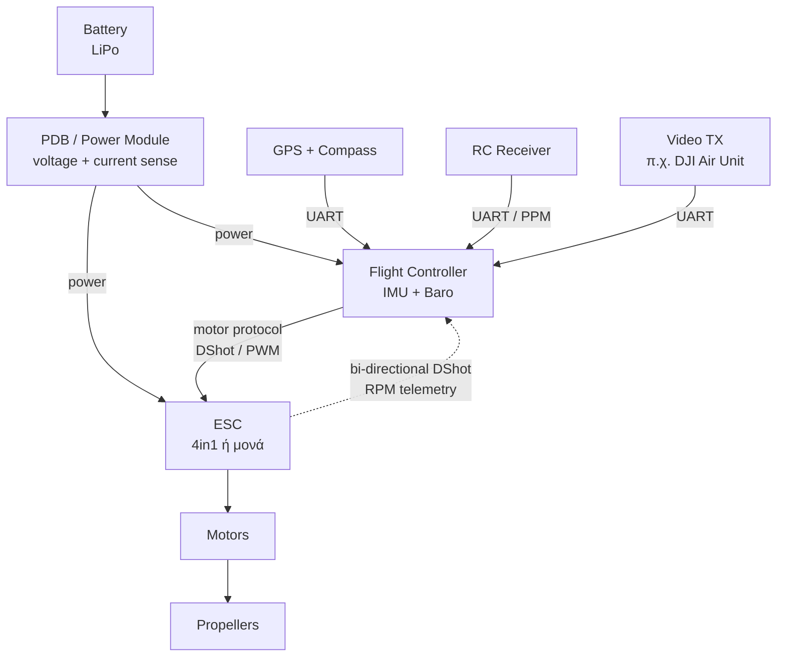
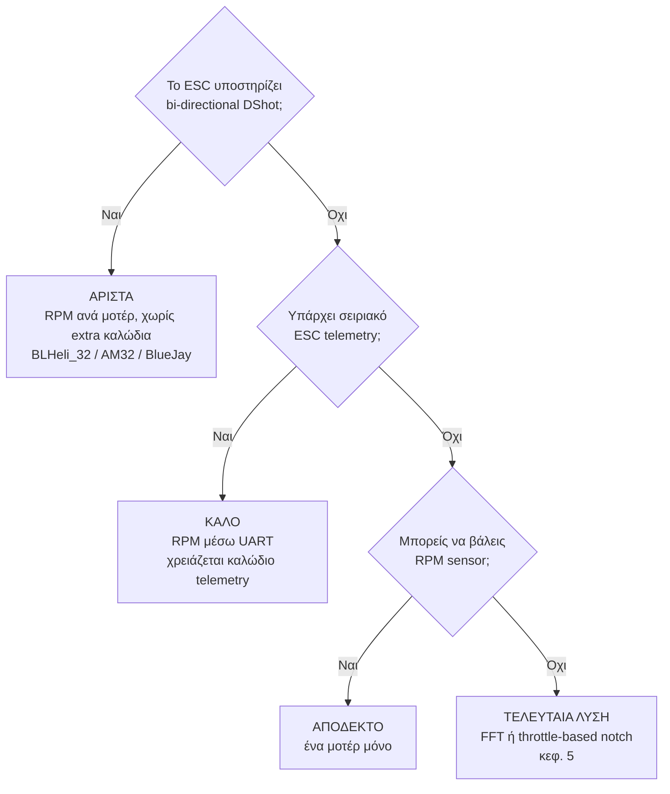

# 02 — Hardware Set Up

> **Στόχος κεφαλαίου:** να καταλάβεις τι υλικό χρειάζεται ένα multicopter με ArduPilot,
> πώς συνδέεται, και **γιατί οι επιλογές υλικού καθορίζουν τι tuning θα μπορέσεις να κάνεις
> αργότερα**.

Αυτό δεν είναι κεφάλαιο "κόλλα το καλώδιο εδώ". Είναι το κεφάλαιο που εξηγεί ποιες
αποφάσεις υλικού θα σε ταλαιπωρήσουν ή θα σε γλιτώσουν στα κεφάλαια 5 και 6.

---

## 2.1 Τα βασικά εξαρτήματα

| Εξάρτημα | Ρόλος | Επίδραση στο tuning |
|---|---|---|
| **Flight Controller (FC)** | Τρέχει το ArduPilot. Περιέχει IMU (gyro + accelerometer) και barometer | Η ποιότητα και η στήριξη του IMU καθορίζει πόσο θόρυβο θα δεις (κεφ. 5) |
| **ESC** | Οδηγεί τα μοτέρ | Το πρωτόκολλο και το firmware καθορίζουν αν θα έχεις **RPM telemetry** (κεφ. 5) |
| **Motors / Props** | Παράγουν ώση και ροπή | Καθορίζουν συχνότητα θορύβου και ταχύτητα απόκρισης (κεφ. 5, 6, 11) |
| **GPS + Compass** | Θέση και κατεύθυνση | Απαραίτητα για Loiter/Auto (κεφ. 9, 10). Άσχετα με Rate/Angle tuning |
| **Power Module** | Μετρά τάση και ρεύμα | Χρειάζεται για battery compensation και failsafe (κεφ. 3) |
| **RC Receiver** | Εντολές πιλότου | Το πρωτόκολλο επηρεάζει latency των εντολών |

---

## 2.2 Η κρίσιμη απόφαση: motor protocol και RPM telemetry

Αυτή είναι **η πιο σημαντική απόφαση υλικού για το tuning**. Στο κεφάλαιο 5 θα δούμε ότι
τα καλύτερα filters χρειάζονται να ξέρουν την **πραγματική ταχύτητα περιστροφής των μοτέρ**.

Οι επιλογές, σε σειρά προτίμησης:

**Τι είναι το bi-directional DShot:** το DShot είναι ψηφιακό πρωτόκολλο εντολών προς το ESC.
Στην **bi-directional** παραλλαγή του, το ESC απαντά πίσω στο ίδιο καλώδιο σήματος με την
ταχύτητα περιστροφής (eRPM). Δεν χρειάζεται δεύτερο καλώδιο. Απαιτεί:

- ESC με κατάλληλο firmware (BLHeli_32, AM32, ή BlueJay για BLHeli_S hardware)
- Flight controller του οποίου τα outputs υποστηρίζουν bi-directional DShot
- Τα μοτέρ **στα πρώτα outputs** του FC (συνήθως μόνο συγκεκριμένες ομάδες outputs το υποστηρίζουν)

> **Πρακτικά:** αν αγοράζεις υλικό τώρα και σκοπεύεις να κάνεις σωστό tuning, διάλεξε ESC
> με bi-directional DShot. Θα σου γλιτώσει ώρες στο κεφάλαιο 5.

---

## 2.3 Καλωδίωση ESC ↔ Flight Controller

Ένα 4-in-1 ESC συνδέεται συνήθως με ένα ενιαίο βύσμα:

| Γραμμή | Τι είναι |
|---|---|
| **VBAT / GND** | Τροφοδοσία από την μπαταρία προς το ESC |
| **Signal 1-4** | Το σήμα εντολής προς κάθε μοτέρ (εδώ ταξιδεύει και το bi-directional DShot) |
| **Current** | Αναλογικό σήμα ρεύματος προς τον FC |
| **Telemetry (προαιρετικό)** | Σειριακή τηλεμετρία ESC — μόνο αν δεν έχεις bi-dir DShot |

**Σημαντικό:** το **GND** πρέπει να είναι κοινό μεταξύ ESC και FC, αλλιώς τα σήματα DShot
δεν είναι αξιόπιστα. Ένα ξεχασμένο ground είναι η νούμερο ένα αιτία για "το DShot δεν
δουλεύει".

### JST-SH 1.0 — re-pinning

Τα περισσότερα σύγχρονα FC χρησιμοποιούν βύσματα **JST-SH 1.0 mm**. Συχνά η σειρά των pin
στο ESC δεν ταιριάζει με τον FC. Αντί να κόψεις και να κολλήσεις:

1. Σήκωσε προσεκτικά το πλαστικό γλωσσίδι του housing με μια λεπτή βελόνα.
2. Τράβα το pin έξω από πίσω.
3. Ίσιωσε ελαφρά το μεταλλικό αγκιστράκι.
4. Σπρώξε το στη σωστή θέση μέχρι να κουμπώσει.

Πάντα **επιβεβαίωσε με multimeter** πριν βάλεις μπαταρία: VBAT στη σωστή θέση, GND κοινό.

---

## 2.4 GPS και Compass

Το GPS module συνδέεται σε ένα **UART** του FC. Τα περισσότερα modules περιέχουν και
compass, που συνδέεται στο **I2C** (συχνά στο ίδιο βύσμα).

Δύο πρακτικοί κανόνες που θα σε σώσουν στο κεφάλαιο 3 (compass calibration) και στο 9 (Loiter):

1. **Το compass μακριά από ρεύμα.** Τα καλώδια μπαταρίας και τα ESC παράγουν μαγνητικά
   πεδία ανάλογα του ρεύματος. Ένα compass πάνω σε mast, 10-15 cm πάνω από το frame,
   έχει πολύ λιγότερη παρεμβολή από ένα κολλημένο δίπλα στο PDB.
2. **Το GPS με καθαρή θέα στον ουρανό**, μακριά από VTX και κεραίες.

---

## 2.5 RC Receiver

Ο δέκτης συνδέεται συνήθως σε **UART** με σειριακό πρωτόκολλο (CRSF/ELRS, SBUS, FPort,
GHST). Στο κεφάλαιο 3 θα ορίσεις το `SERIALn_PROTOCOL = 23` (RCIN) στη θύρα που τον έβαλες.

Σειριακοί δέκτες προτιμώνται από PPM: χαμηλότερο latency, περισσότερα κανάλια, και συνήθως
τηλεμετρία πίσω στο χειριστήριο.

---

## 2.6 Ψηφιακό VTX (π.χ. DJI Air Unit)

Ένα ψηφιακό VTX συνδέεται σε UART και μιλάει MSP DisplayPort ή το DJI FPV πρωτόκολλο, ώστε
να βλέπεις OSD μέσα στα γυαλιά. Στο κεφάλαιο 3 θα ορίσεις το ανάλογο `SERIALn_PROTOCOL`
(π.χ. `42` = DisplayPort, `33` = DJI FPV).

Πρακτικά για το tuning: **το VTX είναι πηγή θερμότητας και δονήσεων** αν το στηρίξεις άκαμπτα
πάνω στον FC. Κράτα το ξεχωριστά.

---

## 2.7 Στήριξη του Flight Controller — το πιο υποτιμημένο θέμα

Ο FC μετράει επιταχύνσεις και γωνιακές ταχύτητες. **Ό,τι δόνηση φτάνει σε αυτόν, μπαίνει
στο σήμα ελέγχου.** Στο κεφάλαιο 5 θα ξοδέψεις πολλή προσπάθεια για να καθαρίσεις αυτόν
τον θόρυβο με filters — αλλά το φίλτρο δεν φτιάχνει τη μηχανική.

Πρακτικά:

- **Μαλακή στήριξη** (soft-mount με gel pads ή O-rings) μειώνει τις υψηλές συχνότητες.
- **Πολύ μαλακή στήριξη** εισάγει δικές της χαμηλόσυχνες ταλαντώσεις — χειρότερο.
- **Ζυγοστάθμισε τις έλικες.** Μια αζυγοστάθμιτη έλικα δίνει θόρυβο ακριβώς στη συχνότητα
  περιστροφής, εκεί που πονάει περισσότερο.
- **Σφιχτές βίδες μοτέρ και σφιχτά arms.** Ένα χαλαρό arm δημιουργεί frame resonance που
  θα το κυνηγάς με FFT αντί να το σφίξεις.

> **Κανόνας:** πρώτα η μηχανική, μετά τα filters. Ένα filter δεν επαναφέρει πληροφορία που
> χάθηκε στον θόρυβο, και κάθε filter προσθέτει καθυστέρηση (**phase lag**) — κάτι που θα
> δούμε αναλυτικά στο κεφάλαιο 5.

---

## 2.8 Flashing του ArduPilot

Το firmware "φορτώνεται" στον FC μία φορά. Πρακτικά:

1. Σύνδεσε τον FC με USB (χωρίς μπαταρία).
2. Από το Mission Planner: **Setup → Install Firmware**, ή φόρτωσε custom `.apj`.
3. Διάλεξε το build που αντιστοιχεί **ακριβώς** στο board σου.
4. Μετά το flash, ο FC κάνει reboot και εμφανίζεται ως νέα σειριακή θύρα.

**Προσοχή στα builds:** διαφορετικά boards έχουν διαφορετικές δυνατότητες. Π.χ. αν το board
δεν έχει hardware για bi-directional DShot σε κάποια outputs, το firmware δεν θα σου το
προσφέρει, ανεξάρτητα από το τι ESC έχεις.

---

## Τι πρέπει να ισχύει πριν προχωρήσεις στο κεφάλαιο 3

- [ ] Όλα τα καλώδια ελεγμένα με multimeter, κοινό GND
- [ ] Έλικες **βγαλμένες** (θα μπουν μετά τα motor tests του κεφ. 3)
- [ ] FC σταθερά στηριγμένος, με γνωστό προσανατολισμό
- [ ] Compass μακριά από καλώδια ισχύος
- [ ] Ξέρεις σε ποιο UART μπήκε ο δέκτης, το GPS και το VTX
- [ ] Ξέρεις αν το ESC σου υποστηρίζει bi-directional DShot και σε ποια outputs
- [ ] ArduPilot flashed, ο FC συνδέεται στο Mission Planner

---

**Επόμενο:** [03 — Initial Configuration](03-Initial-Configuration.md)
