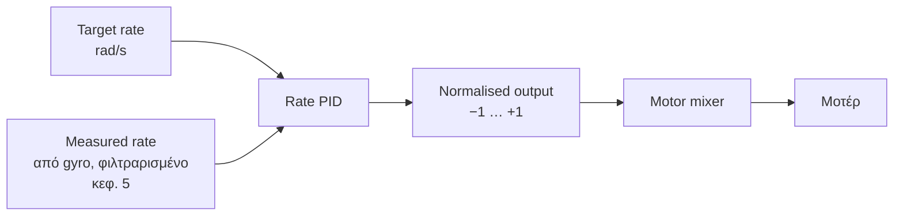
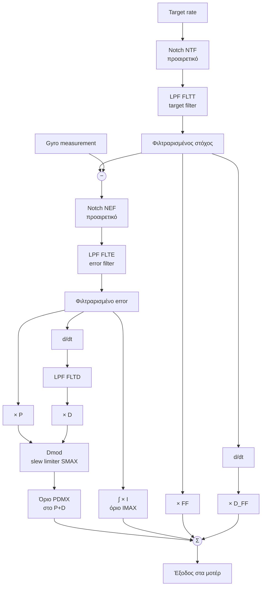
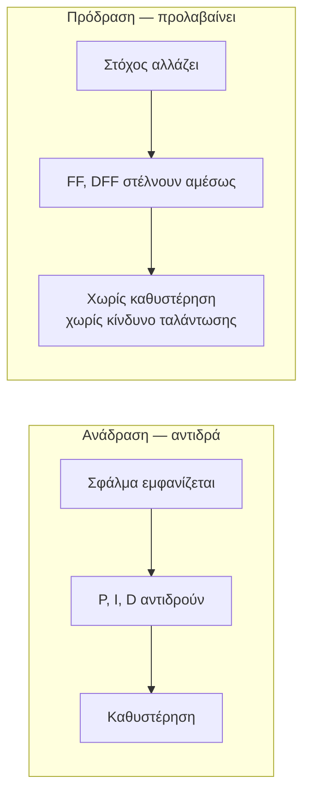
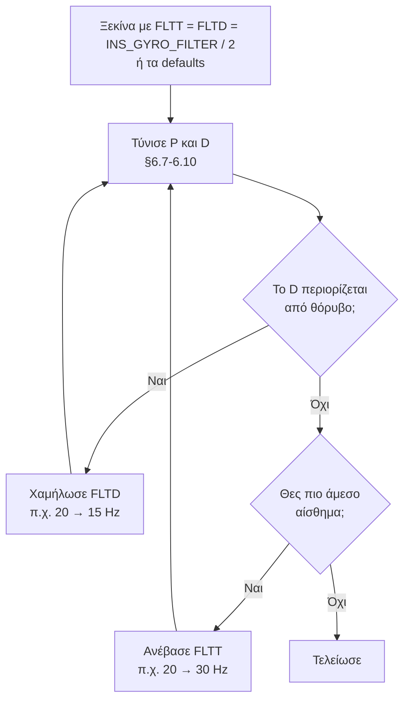
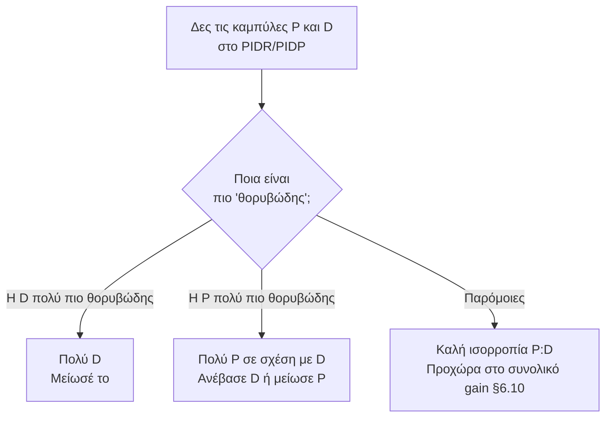
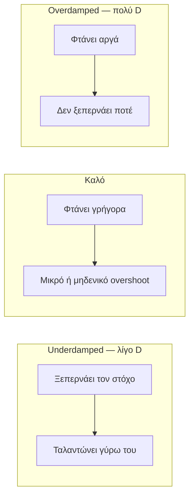
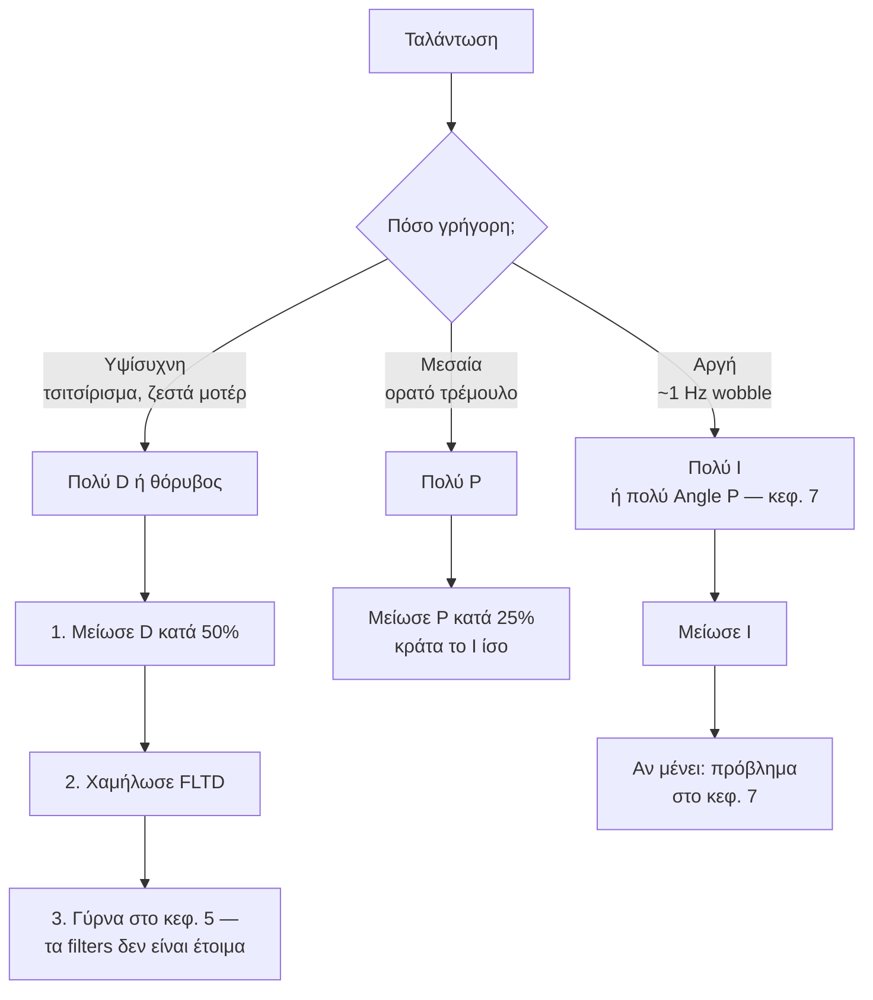

# 06 — Rate PID Tuning

> **Στόχος κεφαλαίου:** να συντονίσεις τον **rate controller** — τον πιο εσωτερικό και πιο
> γρήγορο βρόχο. Ό,τι χτίζεται από εδώ και πάνω στηρίζεται σε αυτόν.
>
> **Προϋπόθεση:** κεφάλαιο 5 ολοκληρωμένο, με καθαρό post-filter φάσμα.

Αν ο rate controller δεν είναι καλός, **κανένα** από τα επόμενα κεφάλαια δεν μπορεί να
δουλέψει σωστά.

---

## 6.1 Τι κάνει ο rate controller

Ο rate controller έχει έναν στόχο: **να κάνει την πραγματική γωνιακή ταχύτητα να ακολουθεί
τη ζητούμενη γωνιακή ταχύτητα.**

Υπάρχουν τρεις ανεξάρτητοι rate controllers, ένας ανά άξονα:

| Άξονας | Ομάδα παραμέτρων |
|---|---|
| Roll | `ATC_RAT_RLL_*` |
| Pitch | `ATC_RAT_PIT_*` |
| Yaw | `ATC_RAT_YAW_*` |

Roll και Pitch συντονίζονται **μαζί** (ίδιες τιμές) στα περισσότερα συμμετρικά frames.
Το Yaw είναι τελείως διαφορετικό και έρχεται τελευταίο (§6.12).

---

## 6.2 Ο controller PID-FF-DFF στο ArduPilot

Το ArduPilot **δεν** είναι σκέτο PID. Είναι **PID + FF + DFF**, με φίλτρα σε τρία σημεία.

Η ακριβής ροή, όπως υλοποιείται στο `AC_PID::update_all()`:

**Τρία πράγματα που πρέπει να προσέξεις σε αυτό το διάγραμμα:**

1. Το **D** υπολογίζεται από την παράγωγο του **error**, όχι της μέτρησης.
2. Το **DFF** υπολογίζεται από την παράγωγο του **φιλτραρισμένου στόχου** — γι' αυτό το
   `FLTT` επηρεάζει άμεσα το DFF (§6.14).
3. Ο **slew limiter** (`SMAX`) μειώνει δυναμικά P και D όταν ανιχνεύσει γρήγορες ταλαντώσεις.

---

## 6.3 Οι όροι, ένας-ένας

### P — Proportional

**Ανάλογο του τρέχοντος σφάλματος.** Είναι η κύρια δύναμη που κλείνει το κενό.

| Πολύ χαμηλό | Σωστό | Πολύ ψηλό |
|---|---|---|
| Νωθρό, δεν ακολουθεί | Καθαρή, γρήγορη απόκριση | Ταλάντωση, overshoot |

Παράμετροι: `ATC_RAT_RLL_P`, `ATC_RAT_PIT_P`, `ATC_RAT_YAW_P`.
Defaults (4.8): Roll/Pitch **0.135**, Yaw **0.180**.

### I — Integral

**Ανάλογο του αθροίσματος του σφάλματος στον χρόνο.** Εξαλείφει το **μόνιμο** σφάλμα: άνισο
κέντρο βάρους, λοξά μοτέρ, άνεμος.

| Πολύ χαμηλό | Σωστό | Πολύ ψηλό |
|---|---|---|
| Το drone "κάθεται" λοξά, drift | Ίσιο, σταθερό | Αργή ταλάντωση, wobble μετά από μανούβρα |

Παράμετροι: `ATC_RAT_*_I`. Defaults: Roll/Pitch **0.135**, Yaw **0.018**.

Το `ATC_RAT_*_IMAX` (default 0.5) περιορίζει πόσο μπορεί να "φουσκώσει" ο integrator —
προστασία από **integral windup**. Ο κώδικας επίσης παγώνει τον integrator όταν τα μοτέρ
έχουν κορεστεί.

> **Πρακτικός κανόνας ArduPilot:** για Roll/Pitch, `I = P`. Είναι το default και δουλεύει
> για τα περισσότερα multicopters (§6.11).

### D — Derivative

**Ανάλογο του ρυθμού μεταβολής του σφάλματος.** Είναι **απόσβεση** (damping): φρενάρει
πριν φτάσεις στον στόχο, ώστε να μην τον προσπεράσεις.

| Πολύ χαμηλό | Σωστό | Πολύ ψηλό |
|---|---|---|
| Overshoot, "αναπήδηση" | Καθαρό σταμάτημα στον στόχο | Υψίσυχνο τσιτσίρισμα, **ζεστά μοτέρ** |

Παράμετροι: `ATC_RAT_*_D`. Defaults: Roll/Pitch **0.0036**, Yaw **0.0**.

> **Το D είναι ο όρος που τιμωρεί τον θόρυβο.** Η παράγωγος ενισχύει τις υψηλές συχνότητες.
> Γι' αυτό το κεφάλαιο 5 προηγείται: **χωρίς καθαρό σήμα, δεν μπορείς να χρησιμοποιήσεις D.**

### FF — Feedforward

**Ανάλογο του στόχου, όχι του σφάλματος.** Δεν περιμένει να δημιουργηθεί σφάλμα — στέλνει
απευθείας εντολή στα μοτέρ μόλις ζητηθεί κάτι.

Παράμετρος: `ATC_RAT_*_FF`. Default **0**.

Θετικό μόνο του: **δεν προσθέτει καθόλου ταλάντωση**, γιατί δεν είναι μέρος του βρόχου
ανάδρασης. Αρνητικό: αν είναι λάθος, δεν διορθώνεται μόνο του.

### DFF — Derivative Feedforward

**Ανάλογο του ρυθμού μεταβολής του στόχου.** Είναι το πιο δυνατό εργαλείο για **άμεση
απόκριση χωρίς κόστος σε ευστάθεια**.

Παράμετρος: `ATC_RAT_*_D_FF`. Default **0**. Εύρος **0 – 0.02**.

Ιδέα: όταν ο πιλότος κουνάει απότομα το stick, ο στόχος αλλάζει γρήγορα. Το DFF το βλέπει
**αμέσως** και δίνει επιπλέον ώθηση, αντί να περιμένει να δημιουργηθεί σφάλμα και να
αντιδράσει το P.

---

## 6.4 Τα φίλτρα του PID

| Παράμετρος | Default (R/P) | Τι φιλτράρει |
|---|---|---|
| `ATC_RAT_*_FLTT` | 20 Hz | **Target** — τη ζητούμενη γωνιακή ταχύτητα |
| `ATC_RAT_*_FLTE` | 0 (R/P), 2.5 (Yaw) | **Error** — επηρεάζει P και I |
| `ATC_RAT_*_FLTD` | 20 Hz | **Derivative** — επηρεάζει μόνο το D |
| `ATC_RAT_*_NTF` | 0 | Δείκτης notch filter στο target (1–8) |
| `ATC_RAT_*_NEF` | 0 | Δείκτης notch filter στο error (1–8) |

Αυτά είναι **επιπλέον** των φίλτρων του gyro (κεφ. 5) και έχουν διαφορετική δουλειά:

- **`FLTT`** εξομαλύνει τις εντολές του πιλότου. Χαμηλό = απαλό αίσθημα, ψηλό = άμεσο.
  **Επηρεάζει άμεσα το DFF**, γιατί το DFF παράγεται από την παράγωγο του φιλτραρισμένου
  στόχου.
- **`FLTE`** φιλτράρει το σφάλμα. Στα Roll/Pitch το default είναι **0 (ανενεργό)** —
  ο θόρυβος έχει ήδη κοπεί στο gyro. Στο Yaw είναι 2.5 Hz.
- **`FLTD`** φιλτράρει **μόνο** την παράγωγο. Είναι το βασικό εργαλείο για να μπορέσεις να
  ανεβάσεις D χωρίς να ενισχύσεις θόρυβο.

### Προσέγγιση στο rate filter tuning

> **Πρακτικός κανόνας:** ξεκίνα με `FLTT` και `FLTD` περίπου στο **μισό** του
> `INS_GYRO_FILTER`. Αν το `INS_GYRO_FILTER` είναι 40 Hz, ξεκίνα με 20 Hz.

---

## 6.5 Οι προστασίες: SMAX και PDMX

| Παράμετρος | Default | Τι κάνει |
|---|---|---|
| `ATC_RAT_*_SMAX` | 0 (off) | **Slew rate limiter.** Αν ο ρυθμός μεταβολής της εξόδου P+D ξεπεράσει το όριο, τα κέρδη P και D μειώνονται δυναμικά |
| `ATC_RAT_*_PDMX` | 0 (off) | Ανώτατο όριο στο **άθροισμα** P+D |

Ο slew limiter είναι **δίχτυ ασφαλείας κατά της ταλάντωσης**: όταν ανιχνεύσει ταχύτατη
εναλλαγή, ρίχνει τα κέρδη μέχρι και στο 10 % της ονομαστικής τιμής.

**Πώς το βλέπεις στο log:** στα μηνύματα `PIDR`/`PIDP`/`PIDY`:

| Πεδίο | Σημασία |
|---|---|
| `Dmod` | Ο συντελεστής μείωσης. **1.0 = καμία μείωση.** Κάτω από 1 = ο limiter επεμβαίνει |
| `SRate` | Ο μετρούμενος slew rate |

> **Πώς να το χρησιμοποιήσεις:** άφησε `SMAX = 0` κατά τη διάρκεια του tuning ώστε να δεις
> την **πραγματική** συμπεριφορά. Ενεργοποίησέ το στο τέλος ως ασφάλεια. Αν το `Dmod`
> πέφτει συνέχεια κάτω από 1, τα κέρδη σου είναι πολύ ψηλά — δεν είναι λύση το να αφήσεις
> τον limiter να δουλεύει διαρκώς.

---

## 6.6 Test flight για rate tuning

### Προετοιμασία

- **Mode: Stabilize** (ή AltHold αν είσαι πιο άνετα). Όχι Loiter — θέλεις καθαρές εντολές.
- `LOG_BITMASK` με το **PID bit (4096)** ενεργό.
- Προαιρετικά: `RCn_OPTION = 219` και `TUNE` για να αλλάζεις μία παράμετρο με knob στον αέρα.

### Τι πετάς

Δεν πετάς "κανονικά". Κάνεις **συγκεκριμένες, επαναλήψιμες** κινήσεις:

1. **Hover 10 s** — βάση αναφοράς.
2. **Απότομα roll inputs**: γρήγορο stick δεξιά, κράτημα ~0.5 s, γρήγορη επαναφορά στο κέντρο.
   Επανάλαβε 4–5 φορές.
3. **Το ίδιο σε pitch.**
4. **Το ίδιο σε yaw**, αργότερα.

Το κρίσιμο είναι το **σταμάτημα**: τι κάνει το drone όταν αφήνεις το stick.

### Τι παρατηρείς

| Παρατήρηση | Τι σημαίνει |
|---|---|
| Συνεχίζει και επιστρέφει (overshoot) | Λίγο D |
| "Τρέμει" μετά το σταμάτημα | Πολύ P ή πολύ D |
| Αργεί να ξεκινήσει | Λίγο P ή λίγο FF/DFF |
| Ζεστά μοτέρ μετά από 2 λεπτά | Πολύ D ή θόρυβος (γύρνα στο κεφ. 5) |

> **Ασφάλεια:** αν το drone αρχίσει να ταλαντώνεται έντονα, **κατέβασε αμέσως το throttle
> και προσγειώσου**. Μη προσπαθήσεις να το "διορθώσεις" στον αέρα.

---

## 6.7 Φόρτωση του log στο PID Review

**Mission Planner → Setup → Advanced → PID Review** διαβάζει τα μηνύματα `PIDR`/`PIDP`/`PIDY`
και σου δείχνει τη συμπεριφορά του βρόχου.

Τα πεδία που θα κοιτάς:

| Πεδίο | Σημασία |
|---|---|
| `Tar` | Ο στόχος (φιλτραρισμένος) |
| `Act` | Η πραγματική τιμή |
| `Err` | Το σφάλμα |
| `P`, `I`, `D` | Η συνεισφορά κάθε όρου στην έξοδο |
| `FF`, `DFF` | Η συνεισφορά της πρόδρασης |
| `Dmod` | Μείωση από τον slew limiter |
| `SRate` | Slew rate |
| `Flags` | Bitmask κατάστασης |

Παράλληλα, το μήνυμα **`RATE`** δίνει `RDes`/`R`, `PDes`/`P`, `YDes`/`Y` — στόχος και
πραγματικότητα ανά άξονα, καθώς και τις εξόδους `ROut`/`POut`/`YOut`.

---

## 6.8 P:D balance από τα χρονικά δεδομένα

Αυτή είναι **η βασική τεχνική** του κεφαλαίου.

Η ιδέα: κοίτα τις **συνεισφορές** `P` και `D` στο log, όχι το αποτέλεσμα. Σε καλά
ισορροπημένο σύστημα, οι δύο καμπύλες έχουν **παρόμοιο πλάτος θορύβου**.

**Τι κοιτάς συγκεκριμένα:**

- Στα σημεία που το drone αιωρείται ήσυχα, οι όροι `P` και `D` πρέπει να είναι μικροί.
- Αν το `D` δείχνει συνεχή υψίσυχνη "τρίχα" ενώ το `P` είναι λείο, το D ενισχύει θόρυβο.
- Αν το `Dmod` πέφτει κάτω από 1, ο slew limiter ήδη σε προστατεύει από κάτι.

---

## 6.9 P:D balance με step response

Δεύτερη, πιο ποσοτική τεχνική.

Κοίτα ένα **απότομο βήμα** στον στόχο (γρήγορη κίνηση stick) και δες πώς το `Act` ακολουθεί
το `Tar` στο μήνυμα `RATE` ή `PIDR`.

**Στόχος:** ελάχιστο overshoot με τη γρηγορότερη δυνατή άνοδο. Ένα πολύ μικρό overshoot
(λίγα %) είναι συνήθως ο καλύτερος συμβιβασμός.

---

## 6.10 Πώς αλλάζεις P:D balance και συνολικό gain

Δύο ανεξάρτητες έννοιες:

| Έννοια | Τι σημαίνει |
|---|---|
| **P:D ratio** | Ο **λόγος** P προς D. Καθορίζει τον χαρακτήρα (overshoot vs νωθρότητα) |
| **Overall gain** | Το **μέγεθος** και των δύο μαζί. Καθορίζει πόσο δυνατά αντιδρά |

### Διαδικασία

**Βήμα 1 — βρες το P:D ratio.**
Κράτα σταθερό το ένα και άλλαξε το άλλο μέχρι να δεις καθαρό step response (§6.9) και
ισορροπημένες συνεισφορές (§6.8).

**Βήμα 2 — ανέβασε το συνολικό gain.**
Μόλις το ratio είναι σωστό, **πολλαπλασίασε P και D μαζί** με τον ίδιο συντελεστή
(π.χ. ×1.2), κρατώντας το ratio σταθερό.

Ανέβαινε μέχρι να εμφανιστεί ένα από:

- Ακουστό υψίσυχνο τσιτσίρισμα
- Ορατή ταλάντωση στο log
- Ζέστη στα μοτέρ
- `Dmod` που πέφτει σταθερά κάτω από 1

**Μετά κατέβα κατά ~20–30 %.** Αυτό είναι το περιθώριο ασφαλείας.

> **Γιατί περιθώριο:** το tune που κάνεις σήμερα με φουλ μπαταρία, κρύα μοτέρ και χωρίς
> άνεμο, θα πρέπει να δουλέψει και με άδεια μπαταρία, ζεστά μοτέρ και φορτίο.

---

## 6.11 P:I balance

Μόλις τα P και D είναι σωστά, το I είναι εύκολο.

**Ο κανόνας του ArduPilot: `I = P` για Roll και Pitch.** Είναι το default (0.135 = 0.135)
και δουλεύει για τη συντριπτική πλειοψηφία των multicopters.

Αν το `P` το άλλαξες, **άλλαξε το `I` μαζί** ώστε να μείνει ίσο.

Πότε να αποκλίνεις:

| Σύμπτωμα | Ενέργεια |
|---|---|
| Αργό wobble (~1 Hz) μετά από μανούβρες | Μείωσε το I |
| Το drone "κάθεται" λοξά σε άνεμο ή με άνισο φορτίο | Αύξησε το I |

Το `IMAX` (default 0.5) σπάνια χρειάζεται αλλαγή.

---

## 6.12 Yaw axis

Το Yaw είναι **θεμελιωδώς διαφορετικό** από Roll/Pitch:

| | Roll / Pitch | Yaw |
|---|---|---|
| Πηγή ροπής | Διαφορά **ώσης** μεταξύ μοτέρ | Διαφορά **ροπής αντίδρασης** |
| Ισχύς | Μεγάλη | Πολύ μικρότερη |
| Ταχύτητα | Πολύ γρήγορη | Αργή |
| Ανάγκη για D | Ναι | Σχεδόν ποτέ |

Πρακτικά:

| Παράμετρος | Default | Οδηγία |
|---|---|---|
| `ATC_RAT_YAW_P` | 0.180 | Ανέβασέ το μέχρι να εμφανιστεί ταλάντωση, μετά −25 % |
| `ATC_RAT_YAW_I` | 0.018 | Τυπικά **P/10** |
| `ATC_RAT_YAW_D` | 0.0 | **Άφησέ το 0** εκτός αν έχεις συγκεκριμένο πρόβλημα |
| `ATC_RAT_YAW_FLTE` | 2.5 Hz | Χαμηλό επίτηδες — το yaw είναι αργό |

Σχετικό: `MOT_YAW_HEADROOM` (default 200) κρατά περιθώριο PWM για εντολές yaw. Αν το drone
χάνει έλεγχο yaw σε δυνατά ανεβάσματα, αύξησέ το — με κόστος λίγο λιγότερη μέγιστη ώση.

> **Συχνό λάθος:** το να προσπαθείς να λύσεις "αργό yaw" με ψηλότερα κέρδη. Πολλές φορές το
> πρόβλημα είναι **μηχανικό**: λοξά μοτέρ, ή απλά ένα frame με μικρή ροπή αδράνειας
> διαθέσιμη στο yaw.

---

## 6.13 Derivative Feedforward στον rate controller

Το `ATC_RAT_*_D_FF` είναι ίσως ο λιγότερο κατανοητός και ο πιο χρήσιμος όρος.

**Τι λύνει:** το drone αντιδρά νωθρά σε γρήγορες εντολές, αλλά κάθε προσπάθεια να ανεβάσεις
P φέρνει ταλάντωση.

**Γιατί δουλεύει:** το DFF **δεν είναι στον βρόχο ανάδρασης**. Δεν μπορεί να προκαλέσει
ταλάντωση, όσο και να το ανεβάσεις — μπορεί μόνο να προκαλέσει **overshoot** αν το
παραξηλώσεις.

### Διαδικασία

1. Ξεκίνα από `ATC_RAT_RLL_D_FF = 0`.
2. Αύξησε σε βήματα των **0.001** (το εύρος είναι 0 – 0.02).
3. Πέτα με απότομα roll inputs.
4. Στο log, κοίτα το `RATE.RDes` έναντι `RATE.R`:
   - Το `Act` πρέπει να **ακολουθεί πιο κοντά** το `Tar` στην άνοδο.
   - Αν αρχίσει να **ξεπερνάει** τον στόχο στο ξεκίνημα, το DFF είναι πολύ ψηλά.
5. Σταμάτα λίγο πριν το overshoot.

Τυπικές τιμές: **0.002 – 0.008** για μικρά και μεσαία drones.

---

## 6.14 Target filtering για DFF

Επειδή το DFF είναι η **παράγωγος του φιλτραρισμένου στόχου**, το `FLTT` το επηρεάζει άμεσα:

| `FLTT` | Επίδραση στο DFF |
|---|---|
| **Χαμηλό** (π.χ. 10 Hz) | Ο στόχος αλλάζει αργά → μικρή παράγωγος → **αδύναμο DFF** αλλά ομαλό |
| **Ψηλό** (π.χ. 40 Hz) | Ο στόχος αλλάζει απότομα → μεγάλη παράγωγος → **δυνατό DFF** αλλά και θόρυβος από το RC |

> **Πρακτικά:** αν βάλεις DFF και το αίσθημα είναι "νευρικό" ή ακούς κλικ στα μοτέρ όταν
> κουνάς γρήγορα τα sticks, **χαμήλωσε το `FLTT`** αντί να μειώσεις το DFF.
>
> Πρόσεξε επίσης: πολύ ψηλό `FLTT` περνάει τον **βηματικό θόρυβο του δέκτη RC** (τα διακριτά
> βήματα του καναλιού) στο DFF.

---

## 6.15 Feedforward (FF)

Το `ATC_RAT_*_FF` (default 0) προσθέτει έξοδο **ανάλογη του στόχου**.

Για multicopters είναι λιγότερο χρήσιμο από το DFF, γιατί ο rate controller έχει ήδη πολύ
γρήγορη απόκριση. Χρησιμοποιείται όταν:

- Το drone δεν φτάνει ποτέ τον ζητούμενο ρυθμό σε σταθερή κατάσταση.
- Θέλεις να μειώσεις τη δουλειά που κάνει το I.

Διαδικασία: πέτα με **σταθερό** roll rate (κρατημένο stick). Στο `RATE`, αν το `R` μένει
σταθερά κάτω από το `RDes`, ένα μικρό FF κλείνει το κενό.

> **Μη μπερδεύεις** το `ATC_RAT_*_FF` (όρος μέσα στον rate PID) με το
> **`ATC_RATE_FF_ENAB`** (default 1), που είναι ο διακόπτης για το body-frame rate
> feedforward από τον **angle controller** — αυτό θα το δούμε στο κεφάλαιο 7.

---

## 6.16 Troubleshooting ταλαντώσεων

**Πάντα ρώτα πρώτα:** *εμφανίστηκε αφού άλλαξα κάτι;* Αν ναι, γύρνα πίσω αυτή την αλλαγή
πριν πειραματιστείς με άλλες.

Ένα ειδικό είδος ταλάντωσης: **ground resonance** — το drone τρέμει έντονα όσο ακουμπάει
στο έδαφος αλλά ηρεμεί στον αέρα. Οφείλεται σε αλληλεπίδραση με τα πόδια προσγείωσης. Το
ArduPilot έχει `ATC_LAND_R_MULT`, `ATC_LAND_P_MULT`, `ATC_LAND_Y_MULT` (default 1.0) που
μειώνουν τα κέρδη όσο το drone είναι προσγειωμένο. Τιμές γύρω στο 0.5 βοηθούν.

---

## 6.17 Χρήσιμα: AutoTune και transmitter tuning

**AutoTune** (flight mode 15) κάνει αυτόματα το μεγαλύτερο μέρος αυτής της δουλειάς. Είναι
εξαιρετικό σημείο εκκίνησης, αλλά:

- Απαιτεί **ήδη καθαρά filters** — αλλιώς θα βρει συντηρητικές τιμές.
- Δίνει συντηρητικό αποτέλεσμα σε μεγάλα drones.
- **Δεν** ρυθμίζει DFF, FF, ή τα φίλτρα.

> **Πρόταση:** τρέξε AutoTune μετά το κεφάλαιο 5, χρησιμοποίησε το αποτέλεσμα ως βάση, και
> μετά κάνε χειροκίνητη βελτίωση με τις τεχνικές αυτού του κεφαλαίου.

**Transmitter tuning:** `RCn_OPTION = 219` σε ένα κανάλι με knob, και `TUNE` για να διαλέξεις
ποια παράμετρος ρυθμίζεται, με `TUNE_MIN` / `TUNE_MAX` τα όρια. Επιτρέπει αλλαγή μιας
παραμέτρου **εν πτήσει**. Δεύτερο κανάλι διαθέσιμο με `TUNE2`.

---

## Λίστα ελέγχου πριν το κεφάλαιο 7

- [ ] P:D balance ισορροπημένο σε Roll και Pitch
- [ ] Συνολικό gain ανεβασμένο με ~25 % περιθώριο ασφαλείας
- [ ] `I = P` σε Roll/Pitch (ή τεκμηριωμένη απόκλιση)
- [ ] Yaw συντονισμένο, `D = 0`
- [ ] `FLTT` / `FLTD` ρυθμισμένα
- [ ] DFF δοκιμασμένο, χωρίς overshoot
- [ ] `Dmod` = 1.0 στο μεγαλύτερο μέρος της πτήσης
- [ ] Μοτέρ δροσερά μετά από 3 λεπτά πτήσης
- [ ] Log + param αποθηκευμένα ως νέο baseline

---

**Επόμενο:** [07 — Stabilisation Mode Tuning](07-Stabilisation-Mode-Tuning.md)
