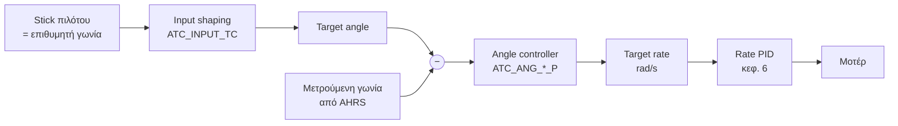
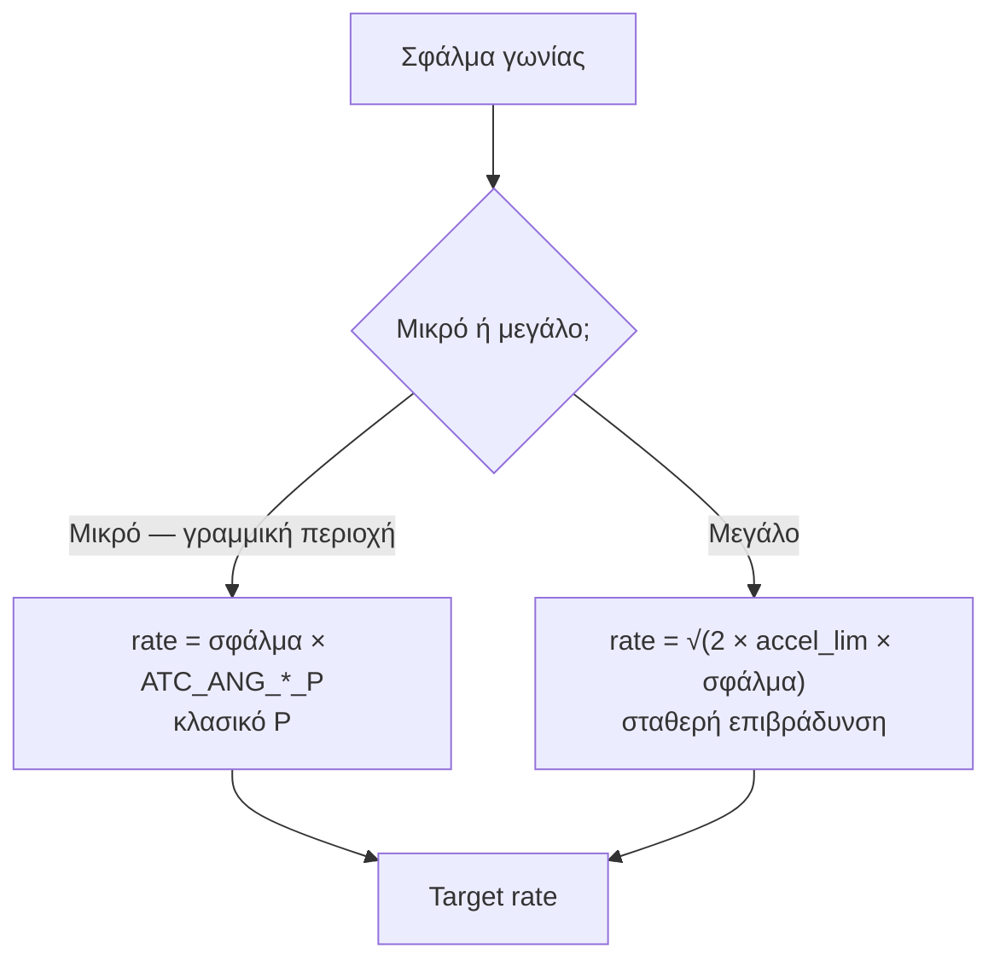
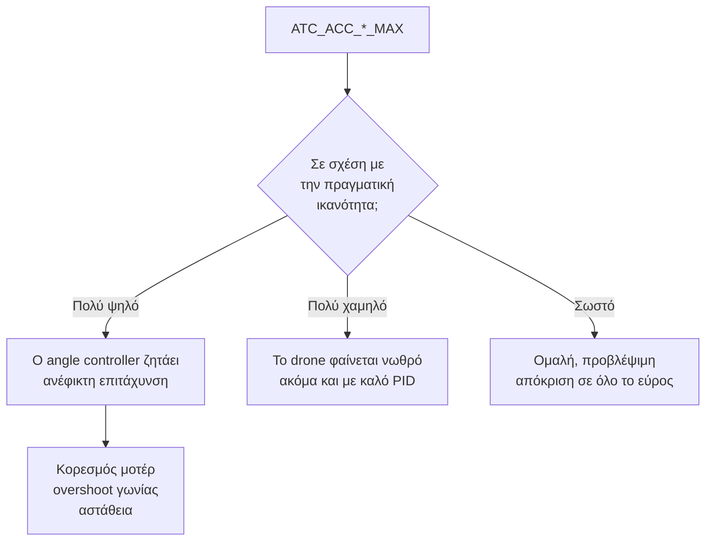
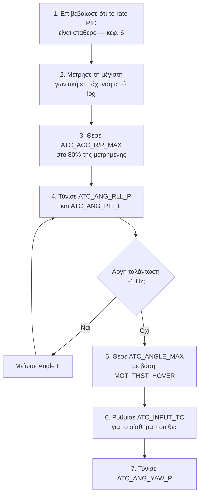

# 07 — Stabilisation Mode Tuning

> **Στόχος κεφαλαίου:** να συντονίσεις τον **angle controller** — τον βρόχο που μετατρέπει
> "θέλω αυτή τη γωνία" σε "θέλω αυτή τη γωνιακή ταχύτητα".
>
> **Προϋπόθεση:** κεφάλαιο 6 ολοκληρωμένο. Ο rate controller πρέπει να είναι σταθερός.

Αυτό είναι το πρώτο κεφάλαιο όπου δουλεύουμε σε **cascade**: ένας βρόχος που δίνει στόχο σε
έναν άλλο.

---

## 7.1 Πώς συνδέεται με το κεφάλαιο 6

Στο **Stabilize** mode, το stick του πιλότου ζητάει **γωνία** (lean angle), όχι γωνιακή
ταχύτητα.

Ο angle controller είναι **μόνο P** — δεν έχει I ή D. Το I και το D είναι δουλειά του
εσωτερικού βρόχου.

> **Γιατί μόνο P:** ο εσωτερικός βρόχος είναι πολύ πιο γρήγορος. Αν βάζαμε ολοκληρωτή και
> στους δύο, θα "τσακώνονταν" και θα ταλάντωναν.

---

## 7.2 Ο angle controller δεν είναι απλό P

Στην πραγματικότητα το ArduPilot χρησιμοποιεί έναν **sqrt controller** (υλοποίηση:
`sqrt_controller()` στο `AP_Math/control.cpp`), που συμπεριφέρεται διαφορετικά ανάλογα με
το μέγεθος του σφάλματος:

**Τι σημαίνει πρακτικά:**

- Για μικρές διορθώσεις (hover, ήπιες κινήσεις), το `ATC_ANG_*_P` καθορίζει τα πάντα.
- Για μεγάλες γωνίες (απότομη μανούβρα), η απόκριση περιορίζεται από τη **μέγιστη γωνιακή
  επιτάχυνση** — δηλαδή από το `ATC_ACC_R_MAX` / `ATC_ACC_P_MAX`.

Το σύνορο μεταξύ των δύο περιοχών είναι `accel_lim / P²`. Ψηλότερο P σημαίνει μικρότερη
γραμμική περιοχή.

> **Γιατί έχει σημασία:** αν το `ATC_ACC_*_MAX` είναι πολύ ψηλό (πάνω από ό,τι μπορεί
> πραγματικά το drone), ο angle controller ζητάει από τον rate controller κάτι ανέφικτο.
> Ο rate controller κορέννυται, ο integrator φουσκώνει, και το drone **ξεπερνάει τη γωνία**
> ή γίνεται ασταθές.

---

## 7.3 Angle P tuning

| Παράμετρος | Default | Εύρος |
|---|---|---|
| `ATC_ANG_RLL_P` | 4.5 | 3.0 – 12.0 |
| `ATC_ANG_PIT_P` | 4.5 | 3.0 – 12.0 |
| `ATC_ANG_YAW_P` | 4.5 | 3.0 – 12.0 |

### Τι κάνει

Μετατρέπει σφάλμα γωνίας (σε rad) σε ζητούμενη γωνιακή ταχύτητα (σε rad/s). Με `P = 4.5`,
ένα σφάλμα 10° ζητάει περίπου 45°/s.

| Πολύ χαμηλό | Σωστό | Πολύ ψηλό |
|---|---|---|
| Νωθρό. Το drone "παρασύρεται" και επιστρέφει αργά | Άμεσο, χωρίς αναπήδηση | **Αργή ταλάντωση** γύρω στο 1 Hz, wobble |

### Διαδικασία

1. Πέτα σε **Stabilize**.
2. Δώσε απότομο roll input και άφησε γρήγορα το stick στο κέντρο.
3. Παρατήρησε την **επιστροφή στο επίπεδο**:
   - Επιστρέφει και σταματάει καθαρά → σωστό
   - Επιστρέφει, ξεπερνάει, ταλαντώνει → πολύ ψηλό
   - Επιστρέφει αργά, "νωχελικά" → πολύ χαμηλό
4. Στο log, σύγκρινε `ATT.DesRoll` με `ATT.Roll`.

> **Προσοχή στη διάκριση από το κεφ. 6:** αν η ταλάντωση είναι **γρήγορη** (τσιτσίρισμα,
> ορατό τρέμουλο), το πρόβλημα είναι στο rate PID. Αν είναι **αργή** (~1 Hz, ολόκληρο το
> drone κουνιέται), τότε είναι το Angle P.

Τυπικές τελικές τιμές: **6 – 10** για μικρά ευέλικτα quad, **4 – 6** για μεγαλύτερα.

### Angle P για Yaw

Το `ATC_ANG_YAW_P` ρυθμίζεται με τον ίδιο τρόπο, αλλά το yaw είναι πολύ πιο αργό. Ξεκίνα από
το default 4.5 και άλλαξέ το μόνο αν το heading "παρασύρεται" ή ταλαντώνεται.

---

## 7.4 Setting Max Angular Acceleration

Αυτή είναι η **πιο παρεξηγημένη** ρύθμιση αυτού του κεφαλαίου.

| Παράμετρος | Default | Μονάδες | Εύρος |
|---|---|---|---|
| `ATC_ACC_R_MAX` | 1100 | deg/s² | 0 – 1800 |
| `ATC_ACC_P_MAX` | 1100 | deg/s² | 0 – 1800 |
| `ATC_ACC_Y_MAX` | 270 | deg/s² | 0 – 720 |

**Τι κάνουν:** περιορίζουν πόσο **γρήγορα μπορεί να αλλάξει** η ζητούμενη γωνιακή ταχύτητα.
Είναι το "πόσο απότομα φρενάρει και επιταχύνει" ο angle controller.

Ο κώδικας εφαρμόζει επιπλέον εσωτερικά όρια: για Roll/Pitch η τιμή που χρησιμοποιείται στον
sqrt controller περιορίζεται μεταξύ **40 και 720 deg/s²**, και για Yaw μεταξύ
**10 και 120 deg/s²**. Τιμή **0** σημαίνει "χωρίς όριο" και απενεργοποιεί τον sqrt controller.

### Γιατί πρέπει να ταιριάζει με το drone σου

### Πώς βρίσκεις τη σωστή τιμή από ένα log

1. Πέτα σε **Acro** ή **Stabilize** και κάνε **όσο πιο απότομες** roll/pitch εντολές αντέχεις.
2. Στο log, δες το `RATE.R` (πραγματική γωνιακή ταχύτητα roll, σε rad/s).
3. Βρες την **πιο απότομη κλίση** αυτής της καμπύλης — αυτή είναι η μέγιστη γωνιακή
   επιτάχυνση που πέτυχε πραγματικά το drone.
   - Παράδειγμα: το `RATE.R` πάει από 0 σε 3.5 rad/s μέσα σε 0.35 s
   - → 10 rad/s² → **≈ 573 deg/s²**
4. Θέσε το `ATC_ACC_R_MAX` **λίγο κάτω** από αυτή τη μετρημένη τιμή (π.χ. 80 %).

> **Γιατί λίγο κάτω:** θέλεις ο controller να ζητάει πάντα κάτι που το drone μπορεί να δώσει,
> ακόμα και με χαμηλή μπαταρία ή σε κλίση.

### Ενδεικτικές τιμές

| Μέγεθος | `ATC_ACC_R/P_MAX` | `ATC_ACC_Y_MAX` |
|---|---|---|
| 5" freestyle quad | 1100 – 1800 | 270 – 400 |
| 7"–10" | 700 – 1100 | 200 – 270 |
| 13"–15" | 400 – 700 | 100 – 200 |
| 20"+ (δες κεφ. 11) | 150 – 400 | 50 – 100 |

---

## 7.5 Max Lean Angle

| Παράμετρος | Default | Μονάδες |
|---|---|---|
| `ATC_ANGLE_MAX` | 30 | deg |

Η μέγιστη γωνία κλίσης σε **όλα** τα flight modes. Ο κώδικας το περιορίζει σε 10°–80°.

**Γιατί υπάρχει όριο:** όσο πιο πολύ γέρνει το drone, τόσο λιγότερη κάθετη ώση απομένει για
να κρατήσει υψόμετρο.

| Γωνία | Υπόλοιπο κάθετης ώσης | Απαιτούμενο throttle για σταθερό υψόμετρο |
|---|---|---|
| 0° | 100 % | `MOT_THST_HOVER` |
| 30° | 87 % | ≈ ×1.15 |
| 45° | 71 % | ≈ ×1.41 |
| 60° | 50 % | ≈ ×2 |

**Πώς επιλέγεις:** έστω `MOT_THST_HOVER = 0.35` (κεφ. 4). Στις 60° χρειάζεσαι 0.70 — υπάρχει
περιθώριο. Αν το `MOT_THST_HOVER` είναι 0.55, στις 60° χρειάζεσαι 1.10 — **αδύνατο**, και το
drone θα χάνει υψόμετρο.

Πρακτικά:

| `MOT_THST_HOVER` | Λογικό `ATC_ANGLE_MAX` |
|---|---|
| ≤ 0.30 | 45 – 55° |
| 0.35 – 0.45 | 30 – 45° |
| ≥ 0.50 | 20 – 30° |

### Σχετικές παράμετροι

| Παράμετρος | Default | Ρόλος |
|---|---|---|
| `ATC_ANGLE_BOOST` | 1 | Αυξάνει αυτόματα το throttle καθώς γέρνει το drone, για να μην χάνει ύψος |
| `ATC_ANG_LIM_TC` | 1.0 s | Χρονική σταθερά περιορισμού γωνίας ώστε να μη χαθεί υψόμετρο |
| `PSC_ANGLE_MAX` | 0 | Ξεχωριστό, χαμηλότερο όριο γωνίας **μόνο** για τους αυτόματους position controllers (κεφ. 9, 10). 0 = χρησιμοποιείται το `ATC_ANGLE_MAX` |

> Το `ATC_ANGLE_BOOST` πρέπει να μείνει **ενεργό**. Χωρίς αυτό, κάθε φορά που γέρνεις χάνεις
> ύψος και ο altitude controller (κεφ. 8) πρέπει να το κυνηγήσει.

---

## 7.6 Rate limits και input feel

| Παράμετρος | Default | Ρόλος |
|---|---|---|
| `ATC_RATE_R_MAX` | 0 (χωρίς όριο) | Μέγιστη γωνιακή ταχύτητα roll, deg/s |
| `ATC_RATE_P_MAX` | 0 | Το ίδιο για pitch |
| `ATC_RATE_Y_MAX` | 0 | Το ίδιο για yaw |
| `ATC_INPUT_TC` | 0.15 s | **Χρονική σταθερά εισόδου** — πόσο "απαλά" μεταφράζεται η κίνηση του stick |
| `ATC_RATE_FF_ENAB` | 1 | Body-frame rate feedforward από τον angle controller |

### `ATC_INPUT_TC` — το αίσθημα του drone

| Τιμή | Αίσθημα |
|---|---|
| 0.05 – 0.10 | Πολύ άμεσο, "sport" |
| **0.15** | Default, ισορροπημένο |
| 0.20 – 0.30 | Απαλό, καλό για κάμερα ή μεγάλα drones |

Αυτή η παράμετρος **δεν αλλάζει την ευστάθεια** — αλλάζει μόνο πόσο απότομα ο στόχος
ακολουθεί το stick. Αν το tune είναι καλό αλλά το drone "νιώθει" νευρικό, αύξησέ την.

### `ATC_RATE_FF_ENAB`

Όταν είναι ενεργό (default), ο angle controller στέλνει στον rate controller **και** την
προβλεπόμενη γωνιακή ταχύτητα, όχι μόνο τη διόρθωση του σφάλματος. Είναι η ίδια ιδέα με το
feedforward του κεφαλαίου 6, αλλά ένα επίπεδο πιο έξω.

**Άσε το στο 1.** Απενεργοποιείται μόνο για διαγνωστικούς λόγους.

---

## 7.7 Σειρά εργασιών

---

## 7.8 Troubleshooting

| Σύμπτωμα | Πιθανή αιτία | Ενέργεια |
|---|---|---|
| Αργό wobble ~1 Hz | Πολύ ψηλό `ATC_ANG_*_P` | Μείωσε κατά 20 % |
| Νωθρή επιστροφή στο επίπεδο | Πολύ χαμηλό `ATC_ANG_*_P` | Αύξησε κατά 20 % |
| Ξεπερνάει τη γωνία σε απότομες εντολές | `ATC_ACC_*_MAX` πολύ ψηλό | Μείωσέ το |
| Νωθρό ακόμα με ψηλό Angle P | `ATC_ACC_*_MAX` πολύ χαμηλό | Αύξησέ το |
| Χάνει ύψος όταν γέρνει | `ATC_ANGLE_MAX` πολύ ψηλό για το `MOT_THST_HOVER` | Μείωσε τη γωνία ή μείωσε βάρος |
| Νευρικό αίσθημα, καλό tune | `ATC_INPUT_TC` πολύ χαμηλό | Αύξησε σε 0.2 |
| Γρήγορη ταλάντωση | **Δεν είναι εδώ** | Γύρνα στο κεφ. 6 |

---

## Λίστα ελέγχου πριν το κεφάλαιο 8

- [ ] `ATC_ACC_R_MAX` / `ATC_ACC_P_MAX` βασισμένα σε **μετρημένη** τιμή από log
- [ ] `ATC_ANG_RLL_P` / `ATC_ANG_PIT_P` χωρίς αργή ταλάντωση
- [ ] `ATC_ANG_YAW_P` σταθερό
- [ ] `ATC_ANGLE_MAX` συμβατό με το `MOT_THST_HOVER`
- [ ] `ATC_ANGLE_BOOST = 1`
- [ ] `ATC_INPUT_TC` ρυθμισμένο στο αίσθημα που θέλεις
- [ ] Καθαρή επιστροφή στο επίπεδο μετά από απότομη εντολή
- [ ] Log + param αποθηκευμένα

---

**Επόμενο:** [08 — Altitude Hold Mode Tuning](08-Altitude-Hold-Mode-Tuning.md)
