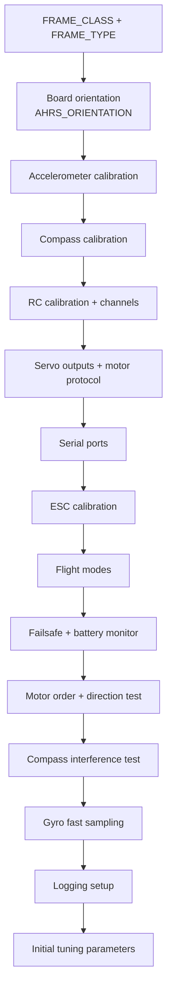

# 03 — ArduPilot (ArduCopter) Initial Configuration

> **Στόχος κεφαλαίου:** να φτάσεις από "φρέσκο firmware" σε ένα drone που είναι **ασφαλές
> να απογειωθεί** και που **καταγράφει σωστά logs** ώστε να μπορέσεις να κάνεις tuning.
>
> **Προϋπόθεση:** κεφάλαιο 2 ολοκληρωμένο.

Σε αυτό το κεφάλαιο **δεν κάνουμε tuning**. Κάνουμε *configuration*: λέμε στο ArduPilot τι
είναι το drone και πώς είναι συνδεδεμένο. Το tuning ξεκινάει στο κεφάλαιο 5.

---

## 3.1 Η έννοια της παραμέτρου

Το ArduPilot ρυθμίζεται εξ ολοκλήρου με **parameters**: ονόματα κεφαλαίων γραμμάτων με
αριθμητική τιμή, αποθηκευμένα στη μνήμη του FC. Παραδείγματα: `FRAME_CLASS`, `ATC_RAT_RLL_P`.

Πρακτικά:

- **Full Parameter List** στο Mission Planner σου δίνει άμεση πρόσβαση σε όλες.
- Κάποιες έχουν σημαία **RebootRequired**: δεν ισχύουν πριν κάνεις reboot.
- **Πάντα κάνε backup** των παραμέτρων πριν και μετά από κάθε σημαντική αλλαγή
  (`Save to file` → `.param`). Στο tuning θα θέλεις να γυρίσεις πίσω.

> **Σημείωση έκδοσης:** ο οδηγός χρησιμοποιεί ονόματα **ArduCopter 4.8**. Στην 4.7 πολλές
> παράμετροι μετονομάστηκαν και άλλαξαν μονάδες (cm → m). Δες το
> [Παράρτημα Α](A-Αντιστοίχιση-Παραμέτρων.md).

---

## 3.2 Σειρά εργασιών

Η σειρά έχει σημασία: το motor test (K) απαιτεί σωστό frame (A) και σωστό protocol (F).

---

## 3.3 Frame Class και Frame Type

Δύο παράμετροι λένε στο ArduPilot **πώς αναμειγνύονται οι εντολές στα μοτέρ** (το
*motor mixing*).

**`FRAME_CLASS`** — πόσα μοτέρ και τι γεωμετρία:

| Τιμή | Class |
|---|---|
| 1 | Quad |
| 2 | Hexa |
| 3 | Octa |
| 4 | OctaQuad |
| 5 | Y6 |
| 7 | Tri |
| 10 | BiCopter |
| 12 | DodecaHexa |
| 14 | Deca |

**`FRAME_TYPE`** — η διάταξη των βραχιόνων:

| Τιμή | Type |
|---|---|
| 0 | Plus |
| 1 | X |
| 2 | V |
| 3 | H |
| 4 | V-Tail |
| 5 | A-Tail |
| 12 | BetaFlightX |
| 13 | DJIX |
| 14 | ClockwiseX |
| 18 | BetaFlightXReversed |
| 19 | Y4 |

Και οι δύο απαιτούν **reboot**.

> **Γιατί υπάρχουν BetaFlightX / DJIX:** αλλάζουν μόνο τη **σειρά αρίθμησης** των μοτέρ, ώστε
> να ταιριάζει με τη σειρά που περιμένει ένα 4-in-1 ESC φτιαγμένο για Betaflight. Δεν αλλάζουν
> τη γεωμετρία. Αν το ESC σου είναι "Betaflight order", βάλε `FRAME_TYPE = 12` αντί να
> ξανακολλήσεις καλώδια.

---

## 3.4 Board orientation

Ο FC πρέπει να ξέρει πώς είναι τοποθετημένος. Η παράμετρος είναι **`AHRS_ORIENTATION`**
(0 = None, δηλαδή το βέλος του board δείχνει μπροστά και η ετικέτα προς τα πάνω).

**Έλεγχος:** στο Mission Planner, στο HUD, γείρε το drone μπροστά — ο ορίζοντας πρέπει να
γείρει σαν να το βλέπεις από πίσω. Γείρε δεξιά — ο ορίζοντας πρέπει να δείξει roll δεξιά.
Αν κάτι είναι ανάποδο, το `AHRS_ORIENTATION` είναι λάθος.

---

## 3.5 Accelerometer calibration

Το accelerometer μετράει επιτάχυνση, άρα και τη βαρύτητα — από εκεί βγαίνει η γωνία κλίσης.
Χρειάζεται βαθμονόμηση σε **6 θέσεις** (level, δεξιά, αριστερά, μύτη πάνω, μύτη κάτω, ανάποδα).

Πρακτικά:

- Κάν' το πάνω σε **πραγματικά επίπεδη** επιφάνεια — αυτή γίνεται το "μηδέν" σου.
- Κράτα κάθε θέση **ακίνητη** μέχρι να ζητηθεί η επόμενη.
- Μετά, με το drone στη θέση πτήσης του, κάνε **Level Horizon** (calibrate level) για να
  μηδενίσεις μικρή απόκλιση στήριξης.

Αν το drone "τραβάει" σταθερά προς μία κατεύθυνση σε Stabilise, σχεδόν πάντα φταίει το level,
όχι το PID.

---

## 3.6 Compass calibration

Το compass δίνει την **απόλυτη κατεύθυνση (yaw / heading)**. Χωρίς σωστό compass, τα
GPS modes (Loiter, Auto) θα κάνουν κύκλους ή θα φεύγουν — και θα νομίζεις ότι φταίει το tuning.

Διαδικασία (Onboard Calibration στο Mission Planner):

1. Μακριά από μέταλλα, αυτοκίνητα, μπετόν με οπλισμό.
2. Περίστρεψε το drone γύρω και από τους τρεις άξονες μέχρι να γεμίσουν οι μπάρες.
3. Reboot.

Χρήσιμες παράμετροι:

| Παράμετρος | Ρόλος |
|---|---|
| `COMPASS_USE` | Αν το πρώτο compass χρησιμοποιείται για yaw |
| `COMPASS_OFFS_MAX` | Ανώτατο επιτρεπτό offset — μεγάλα offsets σημαίνουν κακή τοποθέτηση |
| `COMPASS_LEARN` | Αυτόματη εκμάθηση offsets |

> **Κανόνας:** αν χρειάζεται πολύ μεγάλα offsets για να "περάσει", το πρόβλημα είναι
> **τοποθέτηση**, όχι βαθμονόμηση. Δες §3.13.

---

## 3.7 Radio calibration και κανάλια

1. **Radio Calibration**: κούνησε όλα τα sticks και switches στα άκρα ώστε το ArduPilot να
   μάθει min/max κάθε καναλιού.
2. Έλεγξε ότι κάθε κανάλι κινείται στη σωστή κατεύθυνση. Αντιστροφή με `RCn_REVERSED`.
3. **`THR_DZ`** ορίζει το deadzone γύρω από το μεσαίο throttle — χρησιμοποιείται σε AltHold,
   Loiter, PosHold ώστε να υπάρχει μια "νεκρή ζώνη" όπου το drone κρατά υψόμετρο.

**Χρήσιμα `RCn_OPTION`:**

| Τιμή | Λειτουργία |
|---|---|
| 31 | **Motor Emergency Stop** — βάλ' το, τώρα |
| 219 | Transmitter tuning knob (θα το χρησιμοποιήσουμε στο κεφ. 6) |

---

## 3.8 Servo outputs και motor protocol

Κάθε φυσικό output του FC έχει μια **λειτουργία** μέσω `SERVOn_FUNCTION`:

| Τιμή | Λειτουργία |
|---|---|
| 33 | Motor 1 |
| 34 | Motor 2 |
| … | … |
| 40 | Motor 8 |

Στα περισσότερα boards αυτά ορίζονται αυτόματα από το `FRAME_CLASS`.

**Το motor protocol** ορίζεται με **`MOT_PWM_TYPE`**:

| Τιμή | Protocol |
|---|---|
| 0 | Normal PWM |
| 1 | OneShot |
| 2 | OneShot125 |
| 3 | Brushed |
| 4 | DShot150 |
| 5 | DShot300 |
| **6** | **DShot600** ← συνήθης επιλογή |
| 7 | DShot1200 |

Για **bi-directional DShot** (κεφ. 5) χρειάζονται επιπλέον:

| Παράμετρος | Τι κάνει |
|---|---|
| `SERVO_BLH_BDMASK` | Bitmask των καναλιών που στέλνουν RPM telemetry πίσω. Bit 0 = κανάλι 1 |
| `SERVO_BLH_POLES` | Αριθμός μαγνητικών πόλων του μοτέρ. **Default 14.** Χρειάζεται για να μετατραπεί το eRPM σε πραγματικό RPM |
| `SERVO_DSHOT_RATE` | 0 = σταθερά 1 kHz, 1 = loop rate, 2 = διπλάσιο loop rate κ.ο.κ. |
| `SERVO_DSHOT_ESC` | 0:None, 1:BLHeli32/Kiss/AM32, 2:BLHeli_S/BlueJay, 3:…+EDT, 4:…+EDT |

> **`SERVO_BLH_POLES` — μη το ξεχάσεις.** Αν είναι λάθος, το RPM που βλέπει το ArduPilot
> είναι λάθος με σταθερό συντελεστή, και τα notch filters του κεφ. 5 θα κάθονται σε λάθος
> συχνότητα. Ο αριθμός πόλων είναι των **μαγνητών του ρότορα** (π.χ. ένα 2207 μοτέρ έχει
> συνήθως 14).

Και τα δύο `SERVO_BLH_*` απαιτούν **reboot**.

---

## 3.9 Serial ports

Κάθε UART ρυθμίζεται με δύο παραμέτρους: `SERIALn_PROTOCOL` και `SERIALn_BAUD`.

Συχνές τιμές `SERIALn_PROTOCOL`:

| Τιμή | Πρωτόκολλο |
|---|---|
| 1 / 2 | MAVLink1 / MAVLink2 (τηλεμετρία, GCS) |
| 5 | GPS |
| 16 | ESC Telemetry (σειριακή — εναλλακτική του bi-dir DShot) |
| 23 | RCIN (σειριακός δέκτης) |
| 28 | Scripting |
| 33 | DJI FPV |
| 42 | MSP DisplayPort |
| -1 | None |

**Baud rate:** το `SERIALn_BAUD` δέχεται συντομευμένες τιμές:
`9`=9600, `38`=38400, `57`=57600, `115`=115200, `230`=230400, `460`=460800, `921`=921600,
`1500`=1.5 MBaud. Λάθος baud = "το GPS δεν κλειδώνει" ή "ο δέκτης δεν διαβάζεται".

Αλλαγές εδώ απαιτούν **reboot**.

---

## 3.10 Τύποι ESC και ESC calibration

**Κατηγορίες ESC:**

| Τύπος | Χαρακτηριστικά |
|---|---|
| **Αναλογικά PWM** | Παλιά. Χρειάζονται calibration για να μάθουν το εύρος 1000–2000 µs |
| **BLHeli_S** (8-bit) | Υποστηρίζουν DShot. Με **BlueJay** firmware παίρνουν και bi-directional DShot |
| **BLHeli_32 / AM32** (32-bit) | Πλήρης υποστήριξη DShot, bi-directional, telemetry, EDT |

**ESC calibration** χρειάζεται **μόνο για αναλογικά PWM ESC**. Με DShot **δεν χρειάζεται
ποτέ** — το πρωτόκολλο είναι ψηφιακό και το εύρος είναι εξ ορισμού καθορισμένο.

Η παράμετρος είναι `ESC_CALIBRATION`:

| Τιμή | Σημασία |
|---|---|
| 0 | Κανονική εκκίνηση |
| 1 | Μπες σε calibration στο επόμενο boot αν το throttle είναι ψηλά |
| 2 | Μπες σε calibration ανεξαρτήτως throttle |
| 3 | Αυτόματο calibration στο επόμενο boot |
| 9 | Απενεργοποιημένο |

> **Μη τη ρυθμίζεις χειροκίνητα.** Ο ίδιος ο κώδικας το γράφει στην περιγραφή της
> παραμέτρου: *"Do not adjust this parameter manually"*. Τη θέτει το Mission Planner όταν
> τρέχεις τη διαδικασία ESC calibration, και ο FC την επαναφέρει μόνος του. Ο πίνακας είναι
> εδώ για να καταλαβαίνεις τι βλέπεις, όχι για να τη γράφεις.

> **ΠΑΝΤΑ χωρίς έλικες.**

---

## 3.11 Flight modes

Έξι θέσεις (`FLTMODE1` … `FLTMODE6`) αντιστοιχίζονται σε εύρη PWM του καναλιού `FLTMODE_CH`.

Συχνές τιμές:

| Τιμή | Mode | Τι κάνει |
|---|---|---|
| 0 | **Stabilize** | Ο πιλότος δίνει γωνία, το drone δεν κρατά υψόμετρο ή θέση |
| 1 | Acro | Ο πιλότος δίνει γωνιακή ταχύτητα |
| 2 | **AltHold** | Γωνία + αυτόματο υψόμετρο |
| 5 | **Loiter** | Γωνία + υψόμετρο + θέση GPS |
| 3 | Auto | Εκτέλεση mission |
| 6 | RTL | Επιστροφή στο σημείο απογείωσης |
| 9 | Land | Αυτόματη προσγείωση |
| 16 | PosHold | Σαν Loiter με πιο άμεσο "χειροκίνητο" αίσθημα |

**Πρόταση για tuning:** κράτα διαθέσιμα τουλάχιστον **Stabilize, AltHold, Loiter**. Θα τα
χρειαστείς ακριβώς με αυτή τη σειρά στα κεφάλαια 7, 8, 9.

---

## 3.12 Failsafe και battery monitoring

**Radio failsafe:**

| Παράμετρος | Ρόλος |
|---|---|
| `FS_THR_ENABLE` | 0:Off, 1:RTL, 3:Land, 4:SmartRTL ή RTL, 5:SmartRTL ή Land, 7:Brake ή Land |
| `FS_THR_VALUE` | Το PWM κάτω από το οποίο θεωρείται απώλεια σήματος |
| `FS_OPTIONS` | Bitmask για ειδικές περιπτώσεις (π.χ. συνέχιση σε Auto) |

**Battery monitor:**

| Παράμετρος | Ρόλος |
|---|---|
| `BATT_MONITOR` | 0:Disabled, 3:Voltage only, 4:Voltage + Current |
| `BATT_CAPACITY` | Χωρητικότητα σε mAh |
| `BATT_LOW_VOLT` / `BATT_LOW_MAH` | Κατώφλι low battery |
| `BATT_CRT_VOLT` | Κατώφλι critical |
| `BATT_FS_LOW_ACT` / `BATT_FS_CRT_ACT` | Τι κάνει σε κάθε επίπεδο |

Η μέτρηση **ρεύματος** δεν είναι πολυτέλεια: χρησιμοποιείται και για **battery voltage
compensation** των μοτέρ (`MOT_BAT_VOLT_MIN` / `MOT_BAT_VOLT_MAX`), που κρατά το tune
συνεπές από φουλ μέχρι άδεια μπαταρία. Θα το δούμε στο κεφάλαιο 11.

---

## 3.13 Σειρά και φορά μοτέρ

**ΧΩΡΙΣ ΕΛΙΚΕΣ.** Χρησιμοποίησε το **Motor Test** του Mission Planner.

Το Motor Test δουλεύει με **γράμματα (A, B, C, D…)** που αντιστοιχούν σε **θέση στο frame
με φορά ρολογιού ξεκινώντας από μπροστά-δεξιά**, όχι στον αριθμό του output.

Τι επιβεβαιώνεις:

1. **Θέση:** το μοτέρ που γυρίζει είναι αυτό που περιμένεις για το γράμμα.
2. **Φορά:** ταιριάζει με το διάγραμμα του `FRAME_CLASS`/`FRAME_TYPE`.

Αν η θέση είναι λάθος → άλλαξε καλωδίωση ή `FRAME_TYPE` (π.χ. σε Betaflight order).
Αν η φορά είναι λάθος → αντίστρεψε τη φορά **στο ESC firmware** (BLHeliSuite / AM32
configurator) ή με `SERVO_BLH_RVMASK`. Μην εναλλάσσεις καλώδια μοτέρ σε bi-dir DShot setup
χωρίς λόγο.

Δύο βοηθητικές παράμετροι εδώ:

| Παράμετρος | Default | Ρόλος |
|---|---|---|
| `MOT_SPIN_ARM` | 0.10 | Πόσο γυρίζουν τα μοτέρ μόλις γίνει arm |
| `MOT_SPIN_MIN` | 0.15 | Το ελάχιστο throttle που δίνει αξιόπιστη ώση |

Το `MOT_SPIN_ARM` πρέπει να είναι **μικρότερο** από το `MOT_SPIN_MIN`. Το `MOT_SPIN_MIN`
πρέπει να είναι αρκετά ψηλά ώστε **κανένα μοτέρ να μη σταματάει ποτέ στον αέρα** — ένα
μοτέρ που σβήνει στιγμιαία είναι απώλεια ελέγχου.

---

## 3.14 Compass interference testing

Το ρεύμα των μοτέρ παράγει μαγνητικό πεδίο που παραμορφώνει το compass. Το ArduPilot μπορεί
να μετρήσει πόσο.

Διαδικασία: **Compass/Motor calibration** στο Mission Planner, με το drone **δεμένο** και
έλικες μοντέ, ανεβάζοντας σταδιακά throttle.

**Πώς διαβάζεται:** το αποτέλεσμα δίνεται ως ποσοστό παρεμβολής.

| Παρεμβολή | Ερμηνεία |
|---|---|
| < 30 % | Καλό |
| 30–60 % | Οριακό — μετακίνησε το compass |
| > 60 % | Κακό — δεν θα εμπιστεύεσαι το yaw σε GPS modes |

> Η σωστή λύση είναι **μηχανική** (compass ψηλότερα / μακρύτερα από τα καλώδια ισχύος), όχι
> λογισμική αντιστάθμιση.

---

## 3.15 Gyro Fast Sampling

Αυτή είναι η πρώτη ρύθμιση που αφορά **άμεσα** το tuning των επόμενων κεφαλαίων.

Ο FC διαβάζει το gyro με κάποια συχνότητα δειγματοληψίας. Όσο πιο γρήγορα, τόσο πιο ψηλά
μπορούν να "δουλέψουν" τα filters χωρίς προβλήματα.

| Παράμετρος | Τι κάνει |
|---|---|
| `INS_FAST_SAMPLE` | Bitmask των IMU όπου ενεργοποιείται fast sampling. Bit 0 = 1ο IMU |
| `INS_GYRO_RATE` | 0:1 kHz, 1:2 kHz, 2:4 kHz, 3:8 kHz — **η συχνότητα στην οποία τρέχουν τα filters** |

**Κανόνας από τον κώδικα:** το gyro rate πρέπει να είναι τουλάχιστον **διπλάσιο** της
μέγιστης συχνότητας φίλτρου που θα χρησιμοποιήσεις. Αν δεν το υποστηρίζει ο αισθητήρας,
χρησιμοποιείται η αμέσως επόμενη υποστηριζόμενη τιμή.

Πρακτικά για τα περισσότερα σύγχρονα boards: `INS_FAST_SAMPLE = 1` (ή περισσότερα bits αν
έχεις πολλά IMU) και `INS_GYRO_RATE = 1` (2 kHz). Απαιτεί **reboot**.

Σχετικά:

| Παράμετρος | Ρόλος |
|---|---|
| `SCHED_LOOP_RATE` | Ρυθμός του κύριου βρόχου ελέγχου σε Hz. Default 400 για Copter. **Μην τον αλλάξεις** χωρίς λόγο |
| `FSTRATE_ENABLE` | Ξεχωριστό, γρηγορότερο νήμα για τον rate controller. 0:Off, 1:Enabled-Dynamic, 2/3:Fixed |

---

## 3.16 Στήσιμο του Logging

**Χωρίς σωστά logs δεν υπάρχει tuning.** Αυτή είναι η πιο σημαντική παράγραφος του κεφαλαίου.

### `LOG_BITMASK`

Bitmask του τι καταγράφεται. Χρήσιμα bits:

| Bit | Τιμή | Περιεχόμενο |
|---|---|---|
| 0 | 1 | Fast Attitude — `ATT` σε υψηλό ρυθμό |
| 2 | 4 | GPS |
| 4 | 16 | Control Tuning — **`CTUN`** (κεφ. 8) |
| 5 | 32 | Navigation Tuning |
| 7 | 128 | IMU |
| 12 | 4096 | **PID** — `PIDR`/`PIDP`/`PIDY` (κεφ. 6) |
| 17 | 131072 | Motors — `MOTB` |
| 18 | 262144 | Fast IMU |
| 19 | 524288 | **Raw IMU** — απαραίτητο για filter analysis |
| 21 | 2097152 | Fast harmonic notch logging |

Πρακτικά: για tuning ξεκίνα με **όλα τα βασικά ενεργά** (`LOG_BITMASK = 65535`) και πρόσθεσε
τα bits που χρειάζεσαι. Αν το log γίνεται πολύ μεγάλο, χρησιμοποίησε `LOG_FILE_RATEMAX` αντί
να σβήσεις κατηγορίες.

### Batch sampling — το κλειδί για το κεφάλαιο 5

Για να αναλύσεις τον **θόρυβο** χρειάζεσαι δείγματα του gyro σε πλήρη ρυθμό. Αυτό το κάνει
ο **BatchSampler**:

| Παράμετρος | Default | Ρόλος |
|---|---|---|
| `INS_LOG_BAT_MASK` | — | Ποια IMU καταγράφονται. Βάλε `1` για το πρώτο |
| `INS_LOG_BAT_CNT` | 1024 | Δείγματα ανά batch. Στρογγυλοποιείται σε πολλαπλάσιο του 32 |
| `INS_LOG_BAT_OPT` | 0 | Bit 0: sensor-rate logging · Bit 1: **post-filter** · Bit 2: **pre- και post-filter** |
| `INS_LOG_BAT_LGIN` | 20 | Διάστημα (ms) μεταξύ αποστολών στο log |
| `INS_LOG_BAT_LGCT` | 32 | Δείγματα ανά αποστολή |

**Για το κεφάλαιο 5 θέλεις:**
- `INS_LOG_BAT_MASK = 1`
- `INS_LOG_BAT_OPT = 4` (bit 2 — καταγράφει και **pre-** και **post-filter**, ώστε να δεις
  αν τα filters σου όντως δουλεύουν)

Και τα δύο απαιτούν **reboot**.

---

## 3.17 Initial tuning parameters

Πριν την πρώτη πτήση θέλεις τιμές PID που είναι **συντηρητικές αλλά ικανές να πετάξουν**.
Μη προσπαθήσεις να "μαντέψεις" καλό tune εδώ.

Τα defaults του ArduCopter 4.8 για τον rate controller είναι:

| Παράμετρος | Default |
|---|---|
| `ATC_RAT_RLL_P`, `ATC_RAT_PIT_P` | 0.135 |
| `ATC_RAT_RLL_I`, `ATC_RAT_PIT_I` | 0.135 |
| `ATC_RAT_RLL_D`, `ATC_RAT_PIT_D` | 0.0036 |
| `ATC_RAT_YAW_P` | 0.180 |
| `ATC_RAT_YAW_I` | 0.018 |
| `ATC_RAT_YAW_D` | 0.0 |
| `ATC_ANG_RLL_P`, `ATC_ANG_PIT_P`, `ATC_ANG_YAW_P` | 4.5 |

**Αυτά είναι συντονισμένα για ένα τυπικό 5" quad.** Για μεγαλύτερα drones χρειάζονται
μικρότερα κέρδη — δες το κεφάλαιο 11.

Το Mission Planner διαθέτει **Initial Parameter Setup** (Setup → Mandatory Hardware →
Initial Tune Parameters): δίνεις μέγεθος έλικας και τάση μπαταρίας, και προτείνει αρχικές
τιμές. **Χρησιμοποίησέ το** — είναι πολύ καλύτερο σημείο εκκίνησης από τα εργοστασιακά για
οτιδήποτε δεν είναι 5".

Επίσης, δύο παράμετροι μοτέρ που πρέπει να τεθούν σωστά **πριν** την πρώτη πτήση:

| Παράμετρος | Default | Σημασία |
|---|---|---|
| `MOT_THST_EXPO` | 0.65 | Γραμμικοποίηση της καμπύλης ώσης. 0 = γραμμικό, 1 = τετραγωνικό |
| `MOT_THST_HOVER` | 0.35 | Εκτίμηση του throttle στο hover. Μαθαίνεται αυτόματα (`MOT_HOVER_LEARN`) |

Το `MOT_THST_EXPO` έχει μεγάλη σημασία: αν είναι λάθος, το drone θα φαίνεται καλά
συντονισμένο στο hover και **υπερβολικά ή υπο-συντονισμένο** σε άλλα επίπεδα throttle.
Μεγαλύτερες έλικες τυπικά θέλουν χαμηλότερο expo. Θα το ξαναδούμε στο κεφάλαιο 11.

---

## Λίστα ελέγχου πριν το κεφάλαιο 4

- [ ] `FRAME_CLASS` / `FRAME_TYPE` σωστά, reboot έγινε
- [ ] Accel calibration + level ολοκληρωμένα
- [ ] Compass calibration ολοκληρωμένη, παρεμβολή < 30 %
- [ ] RC calibration OK, **Motor Emergency Stop σε switch**
- [ ] `MOT_PWM_TYPE` σωστό· αν bi-dir DShot: `SERVO_BLH_BDMASK` και `SERVO_BLH_POLES` σωστά
- [ ] Σειρά και φορά μοτέρ επιβεβαιωμένες με Motor Test, **χωρίς έλικες**
- [ ] Flight modes: Stabilize, AltHold, Loiter διαθέσιμα
- [ ] Failsafe και battery monitor ρυθμισμένα
- [ ] `INS_FAST_SAMPLE` και `INS_GYRO_RATE` ρυθμισμένα, reboot έγινε
- [ ] `LOG_BITMASK` πλήρες, `INS_LOG_BAT_MASK = 1`, `INS_LOG_BAT_OPT = 4`
- [ ] Backup παραμέτρων αποθηκευμένο σε αρχείο

---

**Επόμενο:** [04 — Maiden Test Flight](04-Maiden-Test-Flight.md)
