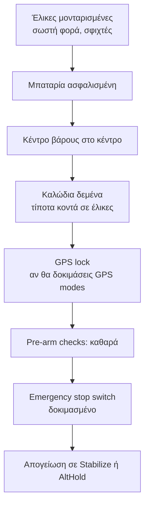
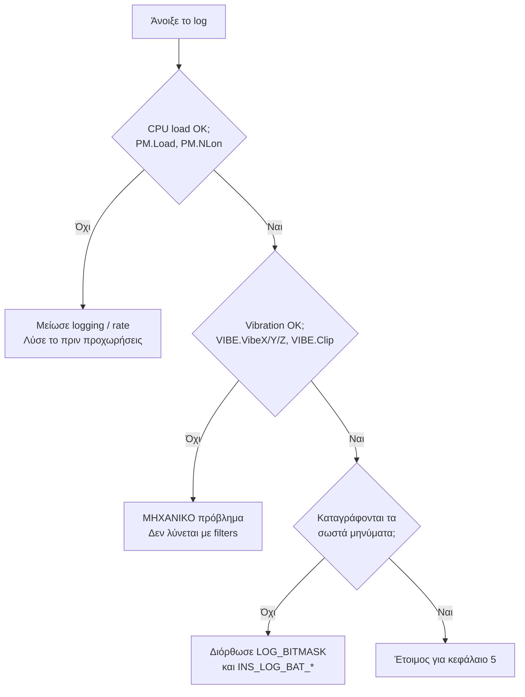

# 04 — Maiden Test Flight

> **Στόχος κεφαλαίου:** να κάνεις την πρώτη πτήση με ασφάλεια, να κατεβάσεις το log, και να
> επιβεβαιώσεις ότι το σύστημα είναι **υγιές** ώστε να μπορέσει να ξεκινήσει το tuning.
>
> **Προϋπόθεση:** κεφάλαια 2 και 3 ολοκληρωμένα.

Αν αυτό το κεφάλαιο δείξει πρόβλημα, **δεν προχωράς στο κεφάλαιο 5**. Το tuning πάνω σε
άρρωστο σύστημα είναι χαμένος χρόνος.

---

## 4.1 Pre-flight checks

**Pre-arm checks:** το ArduPilot τρέχει μια σειρά ελέγχων πριν επιτρέψει arm. Αν αρνηθεί,
σου λέει γιατί στο HUD. **Μη τους απενεργοποιήσεις.**

Η παράμετρος για παράκαμψη είναι `ARMING_SKIPCHK` (bitmask). Το default `0` σημαίνει
"κανένας έλεγχος δεν παρακάμπτεται" και εκεί πρέπει να μείνει. *(Σε 4.6 και παλιότερα η
παράμετρος λεγόταν `ARMING_CHECK` με αντίστροφη λογική — δες
[Παράρτημα Α](A-Αντιστοίχιση-Παραμέτρων.md).)*

---

## 4.2 Hover test

Η πρώτη πτήση έχει έναν και μόνο στόχο: **να δεις ότι το drone αιωρείται σταθερά και
προβλέψιμα**. Δεν κάνεις μανούβρες, δεν κρίνεις το tune, δεν αλλάζεις παραμέτρους στον αέρα.

Διαδικασία:

1. **Stabilize** ή **AltHold**. Ανέβασε throttle αργά μέχρι να ελαφρύνει το drone.
2. Πριν φύγει από το έδαφος, **παρατήρησε αν "χορεύει"** — αν τρέμει πάνω στο έδαφος, αυτό
   είναι *ground resonance* και σημαίνει πολύ ψηλά κέρδη. Κατέβασε αμέσως και μείωσε τα
   `ATC_RAT_RLL_P` / `ATC_RAT_PIT_P` κατά ~50 %.
3. Απογειώσου σε ύψος **2–3 m** (πάνω από το ground effect).
4. Αιωρήσου **60–90 δευτερόλεπτα** χωρίς εντολές πέρα από μικρές διορθώσεις.
5. Κάνε **αργά, ήπια** roll και pitch inputs δεξιά-αριστερά και μπρος-πίσω.
6. Προσγειώσου και **κάνε disarm — μην ξανα-απογειωθείς πριν δεις το log**.

### Τι ψάχνεις με τα μάτια και τα αυτιά

| Σύμπτωμα | Πιθανή αιτία | Ενέργεια |
|---|---|---|
| Υψίσυχνο "τσιτσίρισμα" / ζουζούνισμα | Πολύ ψηλό D ή θόρυβος | Μείωσε `ATC_RAT_*_D` κατά 50 %, ξαναπροσπάθησε |
| Αργή ταλάντωση (~1 Hz) | Πολύ ψηλό P ή I | Μείωσε `ATC_RAT_*_P` |
| Τραβάει σταθερά προς μία κατεύθυνση | Λάθος level ή μηχανικό trim | Επανάληψη Level Horizon (κεφ. 3) |
| Αργή περιστροφή yaw χωρίς εντολή | Λάθος φορά μοτέρ ή λοξά μοτέρ | Έλεγχος §3.13 και μηχανικά |
| Ζεστά μοτέρ μετά από 1 λεπτό hover | Υπερβολικό D ή θόρυβος | Θα το λύσεις στα κεφ. 5 και 6 |

> **Το "ζεστά μοτέρ" είναι σοβαρό σήμα.** Σημαίνει ότι ο controller στέλνει συνεχώς
> διορθώσεις υψηλής συχνότητας — δηλαδή συντονίζεται πάνω στον θόρυβο. Είναι ακριβώς αυτό
> που λύνει το κεφάλαιο 5.

---

## 4.3 Κατέβασμα των logs

Το ArduPilot γράφει **DataFlash logs** (`.bin`) στην SD κάρτα του FC.

Δύο τρόποι:

| Τρόπος | Πότε |
|---|---|
| **MAVLink download** (Mission Planner → DataFlash Logs → Download) | Γρήγορο για μικρά logs, δουλεύει με USB ή τηλεμετρία |
| **Απευθείας από την SD** | **Πάντα προτιμότερο** για tuning: πολύ πιο γρήγορο και δεν χάνει δεδομένα |

Πρακτικές συμβουλές:

- **Ονόμασε το κάθε log** αμέσως μόλις το κατεβάσεις: `01_maiden_hover.bin`,
  `02_rate_P_0.10.bin`. Θα έχεις δεκάδες μέχρι το τέλος.
- **Κράτα ένα `.param` δίπλα σε κάθε log.** Χωρίς τις παραμέτρους, το log είναι μισό.
- Το εργαλείο ανάλυσης που θα χρησιμοποιείς στα επόμενα κεφάλαια είναι το
  **Mission Planner → Setup → Advanced → Filter Review / PID Review**, ή ένα εργαλείο
  όπως το **UAVLogViewer** / **MAVExplorer**.

---

## 4.4 Πρώτοι έλεγχοι υγείας στο log

Πριν κοιτάξεις οτιδήποτε σχετικό με tuning, έλεγξε τρία πράγματα με αυτή τη σειρά.

### 4.4.1 CPU load — μήνυμα `PM`

Το μήνυμα **`PM`** (Performance Monitoring) περιέχει:

| Πεδίο | Σημασία |
|---|---|
| `LR` | Ρυθμός κύριου βρόχου (main loop rate) |
| `NLon` | **Αριθμός "long loops"** — φορές που ο βρόχος άργησε |
| `NL` | Αριθμός βρόχων που μετρήθηκαν σε αυτό το μήνυμα |
| `MaxT` | Μέγιστος χρόνος βρόχου |
| `Mem` | Ελεύθερη μνήμη |
| `Load` | **Φόρτος επεξεργαστή** |
| `Ex` | Μικροδευτερόλεπτα που προστίθενται σε κάθε βρόχο λόγω overrun |

**Τι θέλεις να δεις:**

- `LR` σταθερό και ίσο με το `SCHED_LOOP_RATE` (τυπικά 400 Hz).
- `NLon` **πολύ κοντά στο μηδέν**. Λίγα long loops στην εκκίνηση είναι φυσιολογικά· συνεχή
  long loops εν πτήσει σημαίνουν ότι ο επεξεργαστής δεν προλαβαίνει.
- `Load` σταθερά κάτω από το όριο του board.
- `Ex` μηδενικό ή σχεδόν.

**Αν ο φόρτος είναι υψηλός**, με σειρά προτεραιότητας:

1. Μείωσε το `LOG_BITMASK` σε ό,τι πραγματικά χρειάζεσαι.
2. Χρησιμοποίησε `LOG_FILE_RATEMAX` για να περιορίσεις τον ρυθμό εγγραφής.
3. Μείωσε `INS_GYRO_RATE` (π.χ. 2 kHz αντί 4 kHz).
4. Πρόσεξε πόσα notch filters θα ενεργοποιήσεις στο κεφάλαιο 5 — **κάθε notch κοστίζει CPU**.

> **Γιατί προηγείται:** ένας υπερφορτωμένος επεξεργαστής χάνει δείγματα gyro και εισάγει
> μεταβλητή καθυστέρηση. Κάθε μέτρηση που θα κάνεις μετά είναι αναξιόπιστη.

### 4.4.2 Vibration — μήνυμα `VIBE`

| Πεδίο | Σημασία |
|---|---|
| `IMU` | Ποιο IMU |
| `VibeX`, `VibeY`, `VibeZ` | Φιλτραρισμένη δόνηση ανά άξονα (m/s²) |
| `Clip` | **Αριθμός γεγονότων clipping** του επιταχυνσιόμετρου |

**Τι θέλεις να δεις:**

- `Clip` **σταθερά στο 0** καθ' όλη την πτήση. Clipping σημαίνει ότι ο αισθητήρας κορέστηκε —
  τα δεδομένα εκείνης της στιγμής είναι κυριολεκτικά κατεστραμμένα και **κανένα filter δεν
  τα επαναφέρει**.
- Οι τιμές `VibeX/Y/Z` χαμηλές και σταθερές, χωρίς κορυφές στα throttle transients.
  Πρακτικός κανόνας της κοινότητας ArduPilot: κάτω από ~30 m/s² είναι καλό, πάνω από ~60 m/s²
  είναι προβληματικό.

**Αν οι δονήσεις είναι υψηλές, η λύση είναι μηχανική:**

1. Ζυγοστάθμισε ή αντικατέστησε τις έλικες (η νούμερο ένα αιτία).
2. Έλεγξε για χτυπημένα ή στραβά μοτέρ, χαλαρά ρουλεμάν.
3. Σφίξε τα arms και τις βίδες του frame.
4. Βελτίωσε τη στήριξη του FC (§2.7).
5. Απομάκρυνε καλώδια που "τραβάνε" τον FC.

Το ArduPilot έχει και **vibration failsafe** (`FS_VIBE_ENABLE`, default 1) που αλλάζει
τον τρόπο εκτίμησης υψομέτρου σε υψηλές δονήσεις. Είναι δίχτυ ασφαλείας, **όχι λύση**.

### 4.4.3 Επιβεβαίωση logging

Άνοιξε το log και βεβαιώσου ότι υπάρχουν:

| Μήνυμα | Χρειάζεται για |
|---|---|
| `ATT` | Γωνίες — παντού |
| `RATE` | Γωνιακές ταχύτητες — κεφ. 6, 7 |
| `PIDR`, `PIDP`, `PIDY` | Ανάλυση PID — κεφ. 6 |
| `CTUN` | Throttle / υψόμετρο — κεφ. 8 |
| `VIBE` | Δονήσεις |
| `PM` | Φόρτος CPU |
| `ISBH` / `ISBD` | **Raw IMU batch samples — κεφ. 5** |
| `FTN1` | FFT (αν είναι ενεργό — κεφ. 5) |
| `ESC` | RPM από ESC telemetry — κεφ. 5 |

Αν λείπουν τα `ISBH`/`ISBD`, δεν θα μπορέσεις να κάνεις filter analysis. Γύρνα στο §3.16 και
ρύθμισε `INS_LOG_BAT_MASK = 1` και `INS_LOG_BAT_OPT = 4`, μετά reboot και νέα πτήση.

---

## 4.5 Το `MOT_THST_HOVER` που μαθαίνεται

Στο log, στο μήνυμα `CTUN`, το πεδίο **`ThH`** δείχνει το εκτιμώμενο hover throttle.

Με `MOT_HOVER_LEARN = 2` (default, "Learn and Save"), το ArduPilot μαθαίνει και αποθηκεύει
αυτόματα το `MOT_THST_HOVER` μετά από λίγο σταθερό hover.

**Τι σου λέει η τιμή:**

| `MOT_THST_HOVER` | Ερμηνεία |
|---|---|
| ~0.25–0.40 | Υγιής σχέση ώσης/βάρους (περίπου 2.5:1 έως 4:1) |
| > 0.50 | **Υπέρβαρο ή υποδιαστασιολογημένο**. Λίγο περιθώριο ελέγχου, δύσκολο tuning |
| < 0.20 | Πολύ υπερδιαστασιολογημένο. Πολύ ευαίσθητο throttle, θέλει προσοχή στο κεφ. 8 |

Αυτή η τιμή θα σε ακολουθεί σε όλα τα επόμενα κεφάλαια — ειδικά στο 8 (altitude) και στο 11
(large drones).

---

## 4.6 Καταγραφή βάσης

Πριν αλλάξεις οτιδήποτε, φύλαξε:

- Το `.bin` του maiden flight
- Το `.param` όπως ήταν εκείνη τη στιγμή
- Δύο γραμμές σημειώσεις: πώς ένιωσε, τι άκουσες, τι είδες

Αυτό είναι το **baseline** σου. Κάθε βελτίωση από εδώ και πέρα μετριέται σε σχέση με αυτό.

---

## Λίστα ελέγχου πριν το κεφάλαιο 5

- [ ] Ολοκληρωμένο hover 60–90 s χωρίς ανησυχητική συμπεριφορά
- [ ] `PM.NLon` ≈ 0, `PM.Load` υγιές, `PM.Ex` ≈ 0
- [ ] `VIBE.Clip` = 0 σε όλη την πτήση
- [ ] `VIBE.VibeX/Y/Z` σε αποδεκτά επίπεδα
- [ ] Υπάρχουν `ISBH`/`ISBD` στο log
- [ ] `MOT_THST_HOVER` γνωστό και λογικό
- [ ] Baseline log + param αποθηκευμένα και ονομασμένα

---

**Επόμενο:** [05 — Gyro Filter Tuning](05-Gyro-Filter-Tuning.md)
