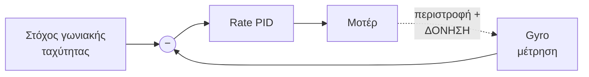
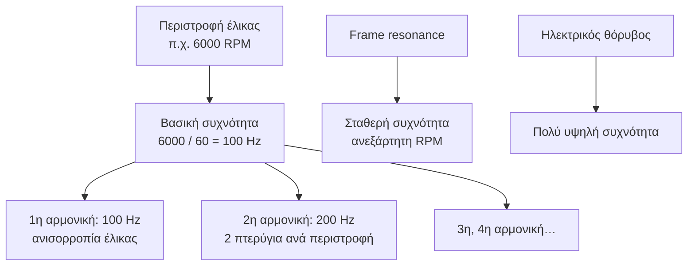
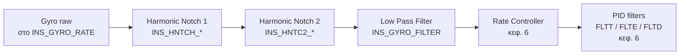
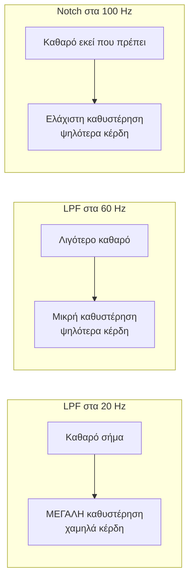
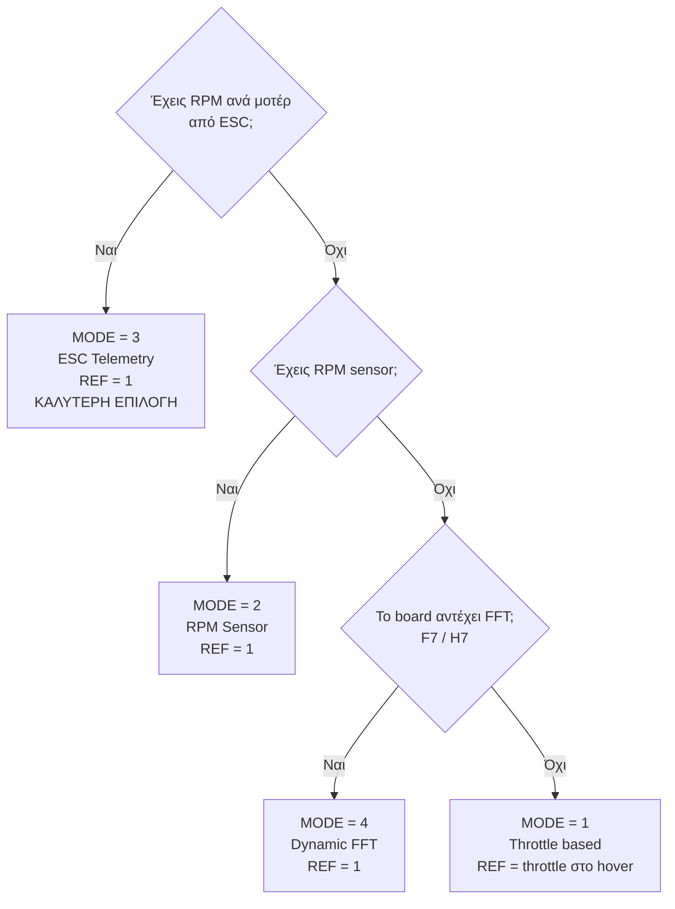
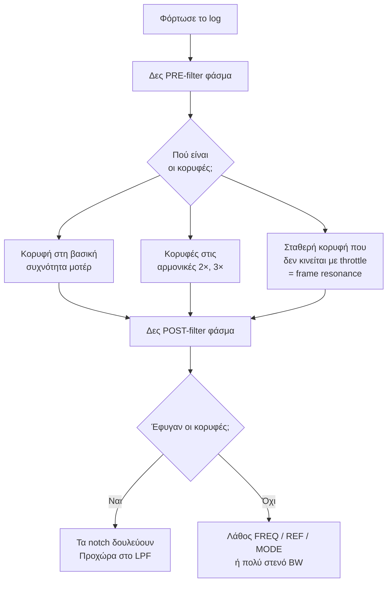
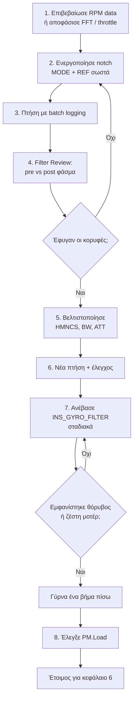

# 05 — Gyro Filter Tuning

> **Στόχος κεφαλαίου:** να καθαρίσεις το σήμα του gyro από τον θόρυβο των μοτέρ **με τη
> μικρότερη δυνατή καθυστέρηση**, ώστε στο κεφάλαιο 6 να μπορέσεις να ανεβάσεις κέρδη PID.
>
> **Προϋπόθεση:** κεφάλαια 2–4. Ειδικά: `VIBE.Clip = 0` και υπάρχουν `ISBH`/`ISBD` στο log.

Αυτό είναι το **πρώτο πραγματικό κεφάλαιο tuning**, και το πιο παρεξηγημένο. Γίνεται **πριν**
το PID, όχι μετά.

---

## 5.1 Γιατί τα filters είναι πρώτα

Ο rate controller (κεφ. 6) δουλεύει έτσι:



Το gyro μετράει **και** την πραγματική περιστροφή **και** τη δόνηση των μοτέρ. Ο controller
δεν ξεχωρίζει τα δύο: προσπαθεί να "διορθώσει" τη δόνηση.

Οι συνέπειες:

| Χωρίς filters | Με σωστά filters |
|---|---|
| Πρέπει να κρατήσεις χαμηλά τα κέρδη για να μην ταλαντώνει | Μπορείς να ανεβάσεις κέρδη |
| Τα μοτέρ ζεσταίνονται (συνεχείς διορθώσεις θορύβου) | Τα μοτέρ μένουν δροσερά |
| Το `D` term είναι πρακτικά άχρηστο | Το `D` term δουλεύει |
| Το tune είναι εύθραυστο | Το tune είναι σταθερό |

> **Ο κανόνας:** κάθε ώρα που ξοδεύεις στα filters σου γλιτώνει τρεις στο PID.

---

## 5.2 Από πού έρχεται ο θόρυβος



**Το κλειδί:** ο κύριος θόρυβος **μετακινείται με το throttle**. Στο hover τα μοτέρ γυρίζουν
π.χ. στα 100 Hz· σε επιθετική πτήση στα 180 Hz. Ένα σταθερό φίλτρο δεν μπορεί να τον
κυνηγήσει — γι' αυτό υπάρχει ο **dynamic harmonic notch**.

**Μετατροπή που θα χρησιμοποιείς συνέχεια:**

```
Συχνότητα (Hz) = RPM / 60
```

---

## 5.3 Η αλυσίδα φιλτραρίσματος του gyro



Δύο διαφορετικά είδη φίλτρου, με διαφορετική δουλειά:

| Τύπος | Τι κάνει | Κόστος |
|---|---|---|
| **Low-pass (LPF)** | Κόβει **όλα** πάνω από μια συχνότητα | Μεγάλο **phase lag** σε όλο το φάσμα |
| **Notch** | Κόβει **μόνο μια στενή ζώνη** | Μικρό phase lag εκτός της ζώνης |

### Phase lag — η έννοια-κλειδί

Κάθε φίλτρο **καθυστερεί** το σήμα. Ένας controller που βλέπει καθυστερημένη πληροφορία
αντιδρά αργά, και αν το κέρδος είναι ψηλό, **ταλαντώνει**.



> **Γι' αυτό υπάρχει το notch.** Επιτρέπει να αφήσεις το LPF ψηλά (λίγη καθυστέρηση) και να
> βγάλεις χειρουργικά μόνο τον θόρυβο των μοτέρ.

---

## 5.4 Gyro Low Pass Filter — `INS_GYRO_FILTER`

| Παράμετρος | Default | Ρόλος |
|---|---|---|
| `INS_GYRO_FILTER` | 20 Hz | Συχνότητα αποκοπής του LPF στο gyro |
| `INS_ACCEL_FILTER` | 20 Hz | Το ίδιο για το accelerometer |

Το default των 20 Hz είναι **πολύ συντηρητικό**: κρατάει ένα ατύνιστο drone στον αέρα, αλλά
περιορίζει σοβαρά το πόσο δυνατά μπορεί να αντιδράσει ο controller.

**Η στρατηγική:**

1. Στήσε πρώτα σωστά τα notch filters (§5.5 και μετά).
2. **Μετά** ανέβασε σταδιακά το `INS_GYRO_FILTER`.
3. Σε κάθε βήμα, δες αν εμφανίζεται θόρυβος στα PID logs ή ζεσταίνονται τα μοτέρ.

Τυπικές τελικές τιμές: **40–60 Hz** για ένα καλά φιλτραρισμένο 5" quad· **χαμηλότερες**
για μεγάλα drones (κεφ. 11), όπου ο θόρυβος και το χρήσιμο σήμα είναι και τα δύο χαμηλόσυχνα.

> **Περιορισμός:** `INS_GYRO_FILTER` δεν πρέπει να πλησιάζει το μισό του `INS_GYRO_RATE`.
> Με 2 kHz gyro rate έχεις άφθονο περιθώριο.

---

## 5.5 Harmonic Notch Filter — η καρδιά του κεφαλαίου

Ένα **harmonic notch** είναι μια ομάδα από στενά notch filters τοποθετημένα στη βασική
συχνότητα των μοτέρ **και στα πολλαπλάσιά της**, που **μετακινούνται μαζί** με τα μοτέρ.

Το ArduPilot διαθέτει **2 ανεξάρτητα harmonic notch** σε boards μέχρι 1 MB flash
(`INS_HNTCH_*`, `INS_HNTC2_*`), και **3** σε μεγαλύτερα (`INS_HNTC3_*`).

### Οι παράμετροι

| Παράμετρος | Default | Τι κάνει |
|---|---|---|
| `INS_HNTCH_ENABLE` | 0 | 0:Off, 1:On. **Απαιτεί reboot** |
| `INS_HNTCH_MODE` | 1 (Throttle) | Πηγή παρακολούθησης συχνότητας — δες πίνακα παρακάτω |
| `INS_HNTCH_REF` | 0 | **0 = στατικό**, θετικό = δυναμικό. Η σημασία εξαρτάται από το MODE |
| `INS_HNTCH_FREQ` | 80 Hz | Βασική συχνότητα (στατικά), ή **ελάχιστη** συχνότητα (δυναμικά) |
| `INS_HNTCH_BW` | 40 Hz | Εύρος ζώνης. Τυπικά **το μισό** του FREQ |
| `INS_HNTCH_ATT` | 40 dB | Βάθος αποκοπής |
| `INS_HNTCH_HMNCS` | 3 | Bitmask αρμονικών. Bit 0 = 1η (η βασική), bit 1 = 2η, κ.ο.κ. |
| `INS_HNTCH_OPTS` | 0 | Bitmask επιλογών — δες §5.9 |
| `INS_HNTCH_FM_RAT` | 1.0 | Ελάχιστος λόγος συχνότητας για throttle-based notch |

### Τα MODE

| Τιμή | Mode | Πηγή συχνότητας |
|---|---|---|
| 0 | **Fixed** | Σταθερή στο `FREQ` |
| 1 | **Throttle** | Εκτίμηση από το throttle |
| 2 | **RPM Sensor** | Φυσικός αισθητήρας RPM (`RPM1_*`) |
| 3 | **ESC Telemetry** | RPM από τα ESC — **bi-dir DShot ή σειριακή τηλεμετρία** |
| 4 | **Dynamic FFT** | Ανάλυση FFT του ίδιου του gyro |
| 5 | **Second RPM Sensor** | `RPM2_*` |

### Η απόφαση



### Τι σημαίνει το `REF` σε κάθε mode

Από τον κώδικα (`AP_Vehicle::update_dynamic_notch`):

| Mode | Πώς υπολογίζεται η συχνότητα |
|---|---|
| **REF = 0** (οποιοδήποτε mode) | Το notch μένει σταθερό στο `FREQ`. **Το δυναμικό tracking απενεργοποιείται εντελώς** |
| **RPM Sensor** | `freq = RPM × REF / 60` → βάλε `REF = 1` για ένα προς ένα |
| **ESC Telemetry** | `freq = μέση_συχνότητα_μοτέρ × REF` → βάλε `REF = 1` |
| **Throttle** | `freq = FREQ × √(throttle / REF)` |
| **FFT** | Η συχνότητα έρχεται απευθείας από την ανάλυση FFT |

> **Η νούμερο ένα παγίδα:** `INS_HNTCH_MODE = 3` αλλά `INS_HNTCH_REF = 0`. Το notch μένει
> κολλημένο στο `FREQ` και δεν παρακολουθεί τίποτα. **Βάλε `REF = 1`.**

---

## 5.6 Οδήγηση με bi-directional DShot (η καλύτερη επιλογή)

### Ρύθμιση

| Παράμετρος | Τιμή |
|---|---|
| `MOT_PWM_TYPE` | 6 (DShot600) |
| `SERVO_BLH_BDMASK` | Bitmask των καναλιών των μοτέρ. Για μοτέρ στα outputs 1-4: **15** |
| `SERVO_BLH_POLES` | Ο αριθμός πόλων του μοτέρ (τυπικά **14**) |
| `SERVO_DSHOT_ESC` | 1 (BLHeli32/Kiss/AM32) ή 2 (BLHeli_S/BlueJay) |

Reboot.

### Επαλήθευση — μη το παραλείψεις

Πριν στηρίξεις τα filters σε αυτά τα δεδομένα, **επιβεβαίωσε ότι φτάνουν**:

1. Στο Mission Planner, δες τα **ESC RPM** στο status ή στο `ESC` μήνυμα του log.
2. Με το drone δεμένο και έλικες μοντέ, ανέβασε λίγο throttle.
3. Έλεγξε ότι **και τα τέσσερα** (ή όσα) μοτέρ αναφέρουν RPM, όχι μηδέν.
4. Έλεγξε ότι το RPM είναι **λογικό**: για ένα 5" quad στο hover, τυπικά 5000–8000 RPM.

**Αν το RPM είναι λάθος με σταθερό συντελεστή** (π.χ. διπλάσιο ή μισό), το
`SERVO_BLH_POLES` είναι λάθος. Το ESC αναφέρει **eRPM** (ηλεκτρικές περιστροφές)· το
ArduPilot χρησιμοποιεί τον αριθμό πόλων για να το μετατρέψει σε μηχανικό RPM. Λάθος
`POLES` = σταθερά λάθος συχνότητα notch.

**Αν κάποια μοτέρ δεν αναφέρουν τίποτα:** ή το output δεν υποστηρίζει bi-dir DShot στο
συγκεκριμένο board, ή λείπει το `BDMASK` bit, ή το ESC firmware δεν το υποστηρίζει.

---

## 5.7 Οδήγηση με RPM sensor

Αν δεν έχεις ESC telemetry, ένας φυσικός αισθητήρας RPM (οπτικός ή μαγνητικός) σε **ένα**
μοτέρ είναι επόμενη επιλογή.

| Παράμετρος | Ρόλος |
|---|---|
| `RPM1_TYPE` | 2 = GPIO (παλμοί σε pin), 5 = ESC Telemetry Motors Bitmask |
| `RPM1_PIN` | Το pin (π.χ. 50 = AUX1) |
| `RPM1_SCALING` | Πολλαπλασιαστής για μετατροπή παλμών σε RPM |
| `RPM1_MIN` / `RPM1_MAX` | Έγκυρο εύρος |
| `RPM1_MIN_QUAL` | Ελάχιστη ποιότητα σήματος για να θεωρηθεί έγκυρο |

**Έλεγχος:** στο log, το μήνυμα `RPM` πρέπει να δείχνει σταθερή, λογική τιμή που ακολουθεί
το throttle. Μηδενικά ή σπασμωδικές τιμές = κακή τοποθέτηση αισθητήρα.

Μετά: `INS_HNTCH_MODE = 2`, `INS_HNTCH_REF = 1`.

> **Περιορισμός:** ένας αισθητήρας μετράει ένα μοτέρ. Αν τα μοτέρ γυρίζουν με διαφορετικές
> ταχύτητες (π.χ. λόγω άνισου κέντρου βάρους), το notch θα είναι σωστό μόνο για το ένα.

---

## 5.8 Ανάλυση με το Filter Review

Το **Mission Planner → Setup → Advanced → Filter Review** (ή τα αντίστοιχα εργαλεία σε
MAVExplorer) διαβάζει τα `ISBH`/`ISBD` batch samples και σου δείχνει το **φάσμα του θορύβου**.

### Πώς φορτώνεται

1. Πτήση με `INS_LOG_BAT_MASK = 1` και `INS_LOG_BAT_OPT = 4` (pre- **και** post-filter).
2. Κατέβασε το `.bin`.
3. Άνοιξε το Filter Review και φόρτωσε το log.

### Τι κοιτάς



### IMU Spectrogram

Το **spectrogram** δείχνει συχνότητα (κάθετα) έναντι χρόνου (οριζόντια), με χρώμα την ένταση.

Εκεί βλέπεις **αν το notch παρακολουθεί**:

- Στο **pre-filter** spectrogram, οι κορυφές είναι διαγώνιες γραμμές που ανεβοκατεβαίνουν
  με το throttle.
- Στο **post-filter**, αυτές οι γραμμές πρέπει να έχουν **εξαφανιστεί**.
- Αν μια γραμμή είναι ακόμα εκεί αλλά "σκισμένη" στη μέση, το notch παρακολουθεί με λάθος
  συντελεστή (τυπικά `POLES` ή `REF`).
- Μια **οριζόντια** γραμμή που δεν κινείται είναι **frame resonance** — δεν την πιάνει ο
  dynamic notch. Χρειάζεται δεύτερο, στατικό notch (§5.11) ή, καλύτερα, μηχανική λύση.

---

## 5.9 Ρύθμιση των notch: HMNCS, BW, ATT, OPTS

### `INS_HNTCH_HMNCS` — ποιες αρμονικές

Bitmask. Το bit 0 είναι η **βασική** συχνότητα.

| Τιμή | Αρμονικές |
|---|---|
| 1 | Μόνο η 1η (βασική) |
| **3** | 1η + 2η ← **default, καλή αφετηρία** |
| 7 | 1η + 2η + 3η |
| 15 | 1η έως 4η |

**Κανόνας:** ενεργοποίησε **μόνο** τις αρμονικές που βλέπεις πραγματικά στο spectrogram.
Κάθε επιπλέον αρμονική κοστίζει CPU και προσθέτει phase lag.

### `INS_HNTCH_BW` — εύρος ζώνης

Καθορίζει πόσο **στενό** είναι το notch. Ο κώδικας υπολογίζει τον συντελεστή ποιότητας Q
από τον λόγο `FREQ / BW`.

| Λόγος | Συμπεριφορά |
|---|---|
| BW ≈ FREQ / 2 | **Default.** Φαρδύ, συγχωρητικό, περισσότερο lag |
| BW ≈ FREQ / 3 έως / 4 | Στενότερο, λιγότερο lag. Απαιτεί **ακριβές tracking** |

> **Λογική:** αν έχεις **ακριβή** πηγή RPM (bi-dir DShot), μπορείς να στενέψεις το BW γιατί
> ξέρεις ακριβώς πού είναι ο θόρυβος. Αν βασίζεσαι σε throttle estimation, κράτα το φαρδύ.

### `INS_HNTCH_ATT` — βάθος

Default 40 dB. Πάνω από 40 dB παράγει "σκληρό" notch. Για τους περισσότερους, το 40
είναι σωστό. Χαμήλωσέ το (π.χ. 25–30) αν θέλεις πιο ήπια επίδραση με λιγότερο lag.

### `INS_HNTCH_OPTS` — οι επιλογές

| Bit | Τιμή | Επιλογή | Πότε |
|---|---|---|---|
| 0 | 1 | **Double notch** | Μεγαλύτερα drones — βαθύτερο, φαρδύτερο, λιγότερο lag από ένα φαρδύ single |
| 1 | 2 | **Multi-Source** | Δες παρακάτω |
| 2 | 4 | **Update at loop rate** | Ενημέρωση συχνότητας στο loop rate αντί για 200 Hz |
| 3 | 8 | **EnableOnAllIMUs** | Εφαρμογή σε όλα τα IMU |
| 4 | 16 | **Triple notch** | Ακόμα φαρδύτερο. *Αν οριστεί μαζί με double, υπερισχύει το double* |
| 5 | 32 | Use min freq on RPM source failure | Ασφάλεια αν χαθεί το RPM |
| 6 | 64 | **Quintuple notch** | Πολύ μεγάλα drones |

### Multi-Source (bit 1) — τι κάνει πραγματικά

Χωρίς Multi-Source, το notch τοποθετείται στη **μέση συχνότητα** όλων των μοτέρ.

Με Multi-Source, το ArduPilot τοποθετεί **ξεχωριστό notch σε κάθε πηγή**:

| Mode | Τι γίνεται με Multi-Source |
|---|---|
| **ESC Telemetry** | Ένα notch **ανά μοτέρ** (μέχρι το όριο του υλικού) |
| **FFT** | Ένα notch σε καθεμιά από τις **3 ανιχνευμένες κορυφές** |
| **Throttle** | Ένα notch ανά μοτέρ, με βάση την ώση του καθενός |

**Πότε βοηθάει:** όταν τα μοτέρ γυρίζουν με **αισθητά διαφορετικές** ταχύτητες — άνισο
κέντρο βάρους, μεγάλο drone, ασύμμετρο φορτίο.

**Πότε δεν αξίζει:** σε ένα ισορροπημένο quad όπου όλα τα μοτέρ είναι εντός λίγων Hz.
Πολλαπλασιάζει το κόστος CPU χωρίς όφελος.

> **Προσοχή στο CPU:** ο συνολικός αριθμός φίλτρων είναι
> `αρμονικές × πηγές × composite notches`. Με 3 αρμονικές, Multi-Source σε 4 μοτέρ και
> double notch, αυτό είναι 3 × 4 × 2 = **24 φίλτρα** ανά άξονα. Ξαναδές το `PM.Load`
> μετά (κεφ. 4).

---

## 5.10 Dynamic FFT — όταν δεν υπάρχει RPM

Το ArduPilot μπορεί να αναλύσει **σε πραγματικό χρόνο** το φάσμα του gyro και να βρει μόνο
του τις κορυφές θορύβου.

### FFT vs RPM

| | RPM (ESC/sensor) | FFT |
|---|---|---|
| **Ακρίβεια** | Απόλυτη — ξέρει την πραγματική ταχύτητα | Εκτίμηση |
| **Καθυστέρηση** | Άμεση | Καθυστέρηση ενός παραθύρου FFT |
| **Κόστος CPU** | Ελάχιστο | Σημαντικό |
| **Πιάνει frame resonance;** | Όχι | **Ναι** |
| **Πιάνει θόρυβο μοτέρ;** | Ναι | Ναι |

> **Συμπέρασμα:** αν έχεις RPM, χρησιμοποίησέ το για τον θόρυβο των μοτέρ. Το FFT είναι
> η εναλλακτική όταν δεν υπάρχει RPM — ή, σε μεγάλα drones, ένα **δεύτερο** notch για
> frame resonance.

### Ρύθμιση

| Παράμετρος | Default | Ρόλος |
|---|---|---|
| `FFT_ENABLE` | 0 | 1 = ενεργό. **Reboot** |
| `FFT_MINHZ` | 50 Hz | Κάτω όριο ανίχνευσης. **Χαμήλωσέ το για μεγάλα drones** |
| `FFT_MAXHZ` | 450 Hz | Άνω όριο |
| `FFT_WINDOW_SIZE` | 64 σε H7, αλλιώς 32 | Μέγεθος παραθύρου. Δύναμη του 2, 32–512. **256 μόνο για F7+, 512 για H7** |
| `FFT_WINDOW_OLAP` | 0.75 σε H7, αλλιώς 0.5 | Επικάλυψη παραθύρων. 0.5 (50 %) είναι καλή τιμή |
| `FFT_SAMPLE_MODE` | 0 | 0 = gyro rate sampling |
| `FFT_SNR_REF` | 25 dB | Κατώφλι SNR (dB) πάνω από το οποίο θεωρείται ότι υπάρχει σήμα |
| `FFT_ATT_REF` | 15 dB | Επίπεδο για υπολογισμό εύρους ζώνης της κορυφής |
| `FFT_HMNC_FIT` | **10** | Ποσοστό ανοχής για να θεωρηθεί μια κορυφή αρμονική άλλης. 0 = απενεργοποιημένο — **προσοχή: το default 10 το αφήνει ενεργό** |
| `FFT_HMNC_PEAK` | 0 | 0:Auto, 1:Center, 2:Lower-Shoulder, 3:Upper-Shoulder, 4:Roll-Axis, 5:Pitch-Axis |
| `FFT_NUM_FRAMES` | 0 | Πλήθος frames προς μέσο όρο. Μειώνει τον θόρυβο, αυξάνει την καθυστέρηση |
| `FFT_OPTIONS` | 0 | Bit 0: post-filter FFT · Bit 1: έλεγχος θορύβου μοτέρ με ESC δεδομένα |
| `FFT_FREQ_HOVER` | 80 Hz | **Μαθαίνεται αυτόματα** — η συχνότητα θορύβου στο hover |
| `FFT_THR_REF` | 0.35 | **Μαθαίνεται αυτόματα** — το throttle αναφοράς |
| `FFT_BW_HOVER` | 20 Hz | **Μαθαίνεται αυτόματα** — το εύρος ζώνης στο hover |

> Τα defaults των `FFT_WINDOW_SIZE` και `FFT_WINDOW_OLAP` εξαρτώνται από το board: τα H7
> ξεκινούν με μεγαλύτερο παράθυρο και μεγαλύτερη επικάλυψη, γιατί αντέχουν το κόστος σε CPU.
> Οι τρεις τελευταίες τιμές γράφονται από το ίδιο το firmware μετά από hover — δεν τις
> ρυθμίζεις εσύ, αλλά **τις διαβάζεις** για να δεις τι βρήκε το FFT.

### Διαδικασία

1. `FFT_ENABLE = 1`, reboot.
2. **Πρώτα πέτα με το FFT ενεργό αλλά χωρίς να οδηγεί notch** (`INS_HNTCH_MODE ≠ 4`), για
   να δεις τι ανιχνεύει.
3. Στο log, δες το μήνυμα **`FTN1`**:

| Πεδίο | Σημασία |
|---|---|
| `PkAvg` | Η ανιχνευμένη κορυφή (σταθμισμένος μέσος roll/pitch) |
| `BwAvg` | Το εύρος ζώνης της κορυφής |
| `SnX`, `SnY`, `SnZ` | Signal-to-noise ανά άξονα |
| `FtX`, `FtY`, `FtZ` | Harmonic fit |
| `FHX`, `FHY`, `FHZ` | Υγεία του FFT ανά άξονα |
| `Tc` | Χρόνος κύκλου FFT |

4. Αν το `PkAvg` ακολουθεί λογικά το throttle και το SNR είναι υγιές, θέσε
   `INS_HNTCH_MODE = 4` και `INS_HNTCH_REF = 1`.
5. Αν το `FFT_MINHZ` είναι πάνω από την πραγματική συχνότητα των μοτέρ σου, το FFT δεν θα
   δει τίποτα. Για ένα μεγάλο drone με 60 Hz στο hover, βάλε `FFT_MINHZ = 30` ή χαμηλότερα.

### FFT για frame resonance

Αν έχεις **και** RPM **και** frame resonance, η καλύτερη διάταξη είναι:

| Filter | Mode | Στόχος |
|---|---|---|
| `INS_HNTCH_*` | 3 (ESC Telemetry) | Θόρυβος μοτέρ και αρμονικές |
| `INS_HNTC2_*` | 4 (FFT) ή 0 (Fixed) | Frame resonance |

---

## 5.11 Static και throttle-based notches

### Προειδοποίηση πρώτα

> **Τα throttle-based και static notches είναι λύσεις τελευταίας επιλογής.**
>
> - Ένα **static notch** δεν κινείται. Αν ο θόρυβος μετακινηθεί, το notch χάνει τον στόχο και
>   το μόνο που έμεινε είναι το phase lag — δηλαδή **καθαρή ζημιά**.
> - Ένα **throttle-based notch** μαντεύει τη συχνότητα από το throttle με τη σχέση
>   `freq = FREQ × √(throttle / REF)`. Είναι σωστό γύρω από το σημείο αναφοράς και όλο και
>   πιο λάθος όσο απομακρύνεσαι.

### Static notch

Χρήσιμο **μόνο** για θόρυβο που πραγματικά δεν κινείται: frame resonance, θόρυβος από
πτερύγιο ανεμιστήρα, ηλεκτρικός θόρυβος σταθερής συχνότητας.

| Παράμετρος | Τιμή |
|---|---|
| `INS_HNTC2_ENABLE` | 1 |
| `INS_HNTC2_MODE` | 0 (Fixed) |
| `INS_HNTC2_REF` | 0 |
| `INS_HNTC2_FREQ` | Η συχνότητα που είδες στο spectrogram |
| `INS_HNTC2_BW` | Στενό — π.χ. FREQ/4 |
| `INS_HNTC2_HMNCS` | 1 (μόνο η βασική) |

### Throttle-based notch

Όταν δεν υπάρχει ούτε RPM ούτε επαρκές CPU για FFT.

Διαδικασία:

1. Πέτα και βρες τη **συχνότητα θορύβου στο hover** από το Filter Review — π.χ. 110 Hz.
2. Σημείωσε το **throttle στο hover** — αυτό είναι το `MOT_THST_HOVER` (κεφ. 4), π.χ. 0.35.
3. Θέσε:

| Παράμετρος | Τιμή |
|---|---|
| `INS_HNTCH_MODE` | 1 |
| `INS_HNTCH_FREQ` | 110 (η συχνότητα στο hover) |
| `INS_HNTCH_REF` | 0.35 (το throttle στο hover) |
| `INS_HNTCH_BW` | 55 (φαρδύ — η εκτίμηση είναι ανακριβής) |

4. **`INS_HNTCH_FM_RAT`**: με default 1.0, το notch **δεν κατεβαίνει ποτέ** κάτω από το
   `FREQ`. Αν θέλεις να ακολουθεί και σε χαμηλό throttle μέχρι 30 % κάτω από το `FREQ`,
   βάλε `0.7`.

> **Προσοχή στο `INS_HNTCH_FM_RAT`:** χαμηλότερες συχνότητες σημαίνουν **περισσότερο phase lag**.
> Μην το κατεβάσεις άσκοπα.

---

## 5.12 Η σειρά εργασιών — συνολικά



---

## 5.13 Συχνά λάθη

| Λάθος | Αποτέλεσμα |
|---|---|
| `MODE = 3` αλλά `REF = 0` | Το notch δεν παρακολουθεί. Σταθερό στο `FREQ` |
| Λάθος `SERVO_BLH_POLES` | Το notch κάθεται σε σταθερά λάθος συχνότητα |
| Πολλές αρμονικές "για σιγουριά" | CPU overload, περιττό phase lag |
| Static notch σε θόρυβο που κινείται | Μόνο lag, καθόλου όφελος |
| `INS_GYRO_FILTER` ψηλά **πριν** τα notch | Ο θόρυβος περνάει στον controller |
| `FFT_MINHZ` πάνω από τη συχνότητα των μοτέρ | Το FFT δεν βλέπει τίποτα |
| Δεν κοιτάχτηκε το post-filter spectrogram | Δεν ξέρεις αν κάτι δούλεψε |
| Filters αντί για μηχανική επισκευή | Το πρόβλημα επιστρέφει |

---

## Λίστα ελέγχου πριν το κεφάλαιο 6

- [ ] Πηγή συχνότητας επιλεγμένη και **επαληθευμένη** (RPM ή FFT)
- [ ] `INS_HNTCH_MODE` και `INS_HNTCH_REF` σωστά μαζί
- [ ] Post-filter spectrogram **καθαρό** στη ζώνη των μοτέρ
- [ ] Ενεργές μόνο οι αρμονικές που χρειάζονται
- [ ] `INS_GYRO_FILTER` ανεβασμένο όσο αντέχει καθαρά
- [ ] `PM.Load` και `PM.NLon` ακόμα υγιή μετά τα filters
- [ ] Log + param αποθηκευμένα ως νέο baseline

---

**Επόμενο:** [06 — Rate PID Tuning](06-Rate-PID-Tuning.md)
