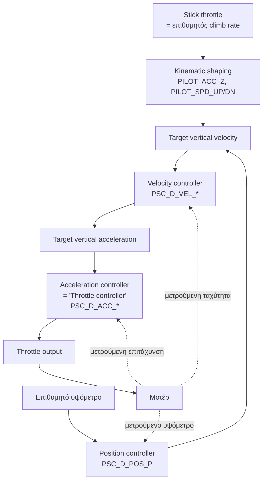
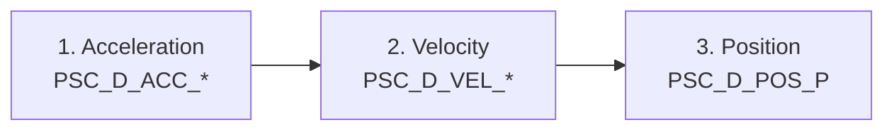
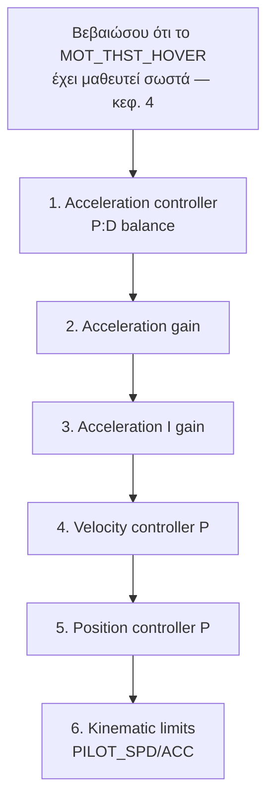
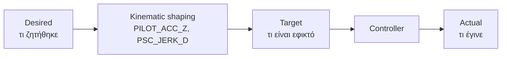
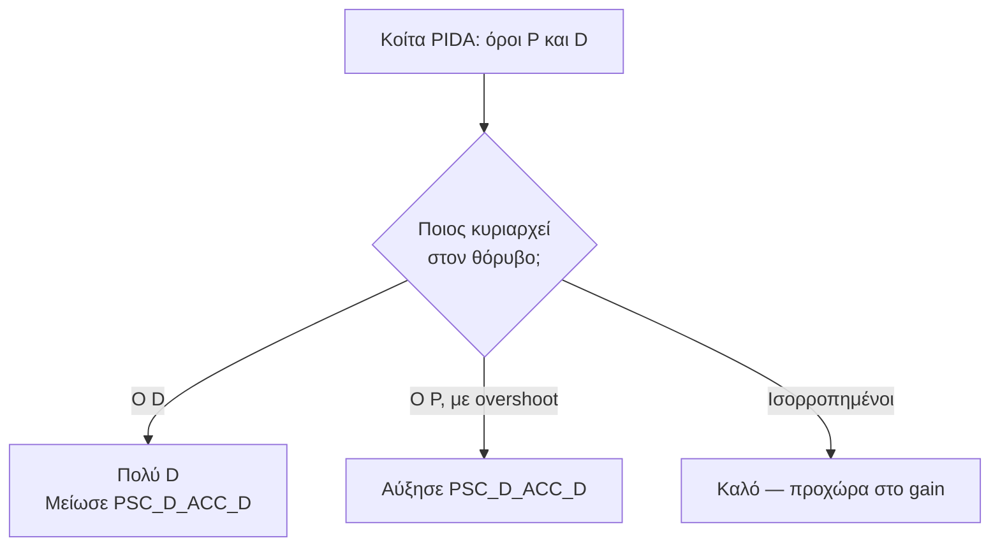

# 08 — Altitude Hold Mode Tuning

> **Στόχος κεφαλαίου:** να συντονίσεις τον **κάθετο έλεγχο** — τρεις εμφωλευμένους βρόχους
> που κρατούν υψόμετρο.
>
> **Προϋπόθεση:** κεφάλαια 6 και 7 ολοκληρωμένα.

Εδώ συναντάς για πρώτη φορά **τριπλό cascade**. Η λογική είναι ίδια με το κεφάλαιο 7, αλλά
με ένα ακόμα επίπεδο.

---

## 8.1 Η αλυσίδα του κάθετου ελέγχου

**Το tuning γίνεται από μέσα προς τα έξω:**

> **Ορολογία:** αυτό που ο κόσμος λέει "**throttle controller**" είναι ο **acceleration
> controller** (`PSC_D_ACC_*`). Είναι ο πιο εσωτερικός και ο πιο σημαντικός.
>
> **Σημείωση έκδοσης:** στην 4.6 και παλιότερα αυτά λέγονταν `PSC_ACCZ_*`, `PSC_VELZ_*`,
> `PSC_POSZ_P`, και οι μονάδες ήταν σε cm. Δες το
> [Παράρτημα Α](A-Αντιστοίχιση-Παραμέτρων.md).

---

## 8.2 Οι παράμετροι

### Acceleration controller — `PSC_D_ACC_*`

Πλήρες PID με όλα τα φίλτρα (ίδια δομή με το κεφ. 6).

| Παράμετρος | Default (Copter) | Ρόλος |
|---|---|---|
| `PSC_D_ACC_P` | 0.05 | Κύριο κέρδος |
| `PSC_D_ACC_I` | 0.1 | Αντισταθμίζει βάρος και τάση μπαταρίας |
| `PSC_D_ACC_D` | 0.0 | Απόσβεση |
| `PSC_D_ACC_IMAX` | 0.8 | Όριο ολοκληρωτή |
| `PSC_D_ACC_FF` | 0 | Feedforward |
| `PSC_D_ACC_D_FF` | 0 | Derivative feedforward |
| `PSC_D_ACC_FLTT` | 0 | Φίλτρο στόχου |
| `PSC_D_ACC_FLTE` | 20 Hz | Φίλτρο σφάλματος |
| `PSC_D_ACC_FLTD` | 0 | Φίλτρο παραγώγου |
| `PSC_D_ACC_SMAX` | 0 | Slew rate limiter |
| `PSC_D_ACC_PDMX` | 0 | Όριο P+D |
| `PSC_D_ACC_NTF` / `NEF` | 0 | Δείκτες notch filter |

### Velocity controller — `PSC_D_VEL_*`

Απλούστερο PID (`AC_PID_Basic`, χωρίς FLTT/SMAX/DFF).

| Παράμετρος | Default | Ρόλος |
|---|---|---|
| `PSC_D_VEL_P` | 5.0 | Κύριο κέρδος |
| `PSC_D_VEL_I` | 0 | |
| `PSC_D_VEL_D` | 0 | |
| `PSC_D_VEL_FF` | 0 | |
| `PSC_D_VEL_IMAX` | 10.0 | |
| `PSC_D_VEL_FLTE` | 5 Hz | Φίλτρο σε P και I |
| `PSC_D_VEL_FLTD` | 5 Hz | Φίλτρο σε D |

### Position controller — `PSC_D_POS_P`

| Παράμετρος | Default | Ρόλος |
|---|---|---|
| `PSC_D_POS_P` | 1.0 | Μετατρέπει σφάλμα υψομέτρου σε ζητούμενο climb rate |

### Kinematic limits — τι επιτρέπεται στον πιλότο

| Παράμετρος | Default | Μονάδες |
|---|---|---|
| `PILOT_SPD_UP` | 2.5 | m/s — μέγιστη άνοδος από το stick |
| `PILOT_SPD_DN` | 0 (= χρησιμοποιεί το `PILOT_SPD_UP`) | m/s |
| `PILOT_ACC_Z` | 2.5 | m/s² — πόσο απότομα αλλάζει ο climb rate |
| `PSC_JERK_D` | 5.0 | m/s³ — ρυθμός μεταβολής της επιτάχυνσης |
| `THR_DZ` | — | Deadzone throttle γύρω από το κέντρο |

---

## 8.3 Προσέγγιση στο tuning

> **Κρίσιμη προϋπόθεση:** το `MOT_THST_HOVER` πρέπει να είναι σωστό. Ολόκληρος ο κάθετος
> έλεγχος δουλεύει ως **διόρθωση γύρω από το hover throttle**. Λάθος τιμή = ο ολοκληρωτής
> δουλεύει διαρκώς για να καλύψει σταθερό σφάλμα.

---

## 8.4 Test flight για τον throttle controller

- **Mode: AltHold.**
- Ύψος 5–10 m (μακριά από ground effect και από το έδαφος).
- `LOG_BITMASK` με το **Control Tuning bit (16)** ενεργό, ώστε να καταγράφεται το `CTUN`.

**Τι πετάς:**

1. **Hover 20 s** χωρίς εντολή throttle — δες αν κρατά υψόμετρο.
2. **Βηματική άνοδος**: γρήγορο throttle up, κράτημα 2 s, γρήγορη επαναφορά στο κέντρο.
3. **Βηματική κάθοδος**: το ίδιο προς τα κάτω.
4. Επανάλαβε 3–4 φορές.
5. **Απότομες γωνίες** roll/pitch — δες αν χάνει ύψος (έλεγχος `ATC_ANGLE_BOOST`, κεφ. 7).

---

## 8.5 Πώς διαβάζονται τα logs του throttle controller

### Μήνυμα `CTUN`

| Πεδίο | Σημασία |
|---|---|
| `ThI` | Throttle input από τον πιλότο |
| `ABst` | Angle boost — επιπλέον throttle λόγω κλίσης |
| `ThO` | **Throttle output** στα μοτέρ |
| `ThH` | Υπολογισμένο hover throttle |
| `DAlt` | **Επιθυμητό** υψόμετρο |
| `Alt` | **Πραγματικό** υψόμετρο |
| `BAlt` | Βαρομετρικό υψόμετρο |
| `DCRt` | **Επιθυμητός** climb rate |
| `CRt` | **Πραγματικός** climb rate |

### Μήνυμα `PSCD` — Position Control Down

| Πεδίο | Σημασία |
|---|---|
| `DPD`, `TPD`, `PD` | Desired / Target / actual θέση (Down) |
| `DVD`, `TVD`, `VD` | Desired / Target / actual ταχύτητα (Down) |
| `DAD`, `TAD`, `AD` | Desired / Target / actual επιτάχυνση (Down) |

Η διάκριση **Desired** vs **Target** είναι σημαντική:

- **Desired** = αυτό που ζητήθηκε αρχικά (π.χ. από τον πιλότο).
- **Target** = αυτό που προκύπτει μετά το **kinematic shaping** (όρια ταχύτητας, επιτάχυνσης,
  jerk).
- **Actual** = τι έγινε στην πραγματικότητα.

> **Πώς διαγιγνώσκεις:**
> - `Target` δεν ακολουθεί το `Desired` → τα **kinematic limits** είναι πολύ σφιχτά.
> - `Actual` δεν ακολουθεί το `Target` → πρόβλημα **tuning** στον controller.

### Μήνυμα `PIDA`

Δίνει την ανάλυση PID του **acceleration controller** (τα ίδια πεδία `Tar`, `Act`, `Err`,
`P`, `I`, `D`, `FF`, `DFF`, `Dmod`, `SRate` του κεφ. 6).

---

## 8.6 P:D balance του acceleration controller

Ίδια τεχνική με το κεφάλαιο 6, εφαρμοσμένη στον κάθετο άξονα.

**Το default `PSC_D_ACC_D = 0` δουλεύει για τα περισσότερα multicopters.** Ο κάθετος άξονας
έχει φυσική απόσβεση από την αεροδυναμική. Πρόσθεσε D μόνο αν βλέπεις overshoot υψομέτρου
που δεν λύνεται αλλιώς.

---

## 8.7 Acceleration gain

**Διαδικασία:**

1. Ξεκίνα από το default `PSC_D_ACC_P = 0.05`.
2. Πέτα σε AltHold, κάνε βηματικές αλλαγές throttle.
3. Στο `CTUN`, σύγκρινε `DCRt` με `CRt`.
4. Αύξησε το `P` κατά **20 %** κάθε φορά, μέχρι να εμφανιστεί:
   - Ακουστό "παλμικό" ανεβοκατέβασμα στα μοτέρ, ή
   - Ταλάντωση του `CRt` γύρω από το `DCRt`
5. **Κατέβα κατά 30 %.**

| Σύμπτωμα | Ενέργεια |
|---|---|
| Το `CRt` καθυστερεί πολύ σε σχέση με το `DCRt` | Αύξησε `PSC_D_ACC_P` |
| Το `CRt` ταλαντώνεται γύρω από το `DCRt` | Μείωσε `PSC_D_ACC_P` |
| Παλμός στα μοτέρ στο hover | Μείωσε `PSC_D_ACC_P` |

---

## 8.8 Acceleration I gain

Το `PSC_D_ACC_I` (default 0.1) καλύπτει **μόνιμα** σφάλματα: αλλαγή βάρους, πτώση τάσης
μπαταρίας, λάθος `MOT_THST_HOVER`.

| Σύμπτωμα | Ενέργεια |
|---|---|
| Σταθερή απόκλιση υψομέτρου που δεν κλείνει | Αύξησε το I |
| Αργό ανεβοκατέβασμα (~0.5 Hz) | Μείωσε το I |

**Πρακτικός κανόνας ArduPilot:** `PSC_D_ACC_I ≈ 2 × PSC_D_ACC_P`. Με `P = 0.05` → `I = 0.1`,
ακριβώς τα defaults. Αν αλλάξεις το P, άλλαξε και το I ώστε να διατηρηθεί ο λόγος.

Το `PSC_D_ACC_IMAX` (default 0.8) περιορίζει πόσο throttle μπορεί να προσθέσει ο ολοκληρωτής.

---

## 8.9 Advanced: θόρυβος στο D-term

Ο κάθετος άξονας παίρνει τη μέτρησή του από το **accelerometer**, που είναι πολύ πιο
θορυβώδες από το gyro (και δεν το καθάρισαν τα notch filters του κεφ. 5 — αυτά αφορούν το
gyro).

Αν χρειαστείς D και δεις θόρυβο:

| Παράμετρος | Ενέργεια |
|---|---|
| `PSC_D_ACC_FLTD` | Ενεργοποίησέ το (default 0 = ανενεργό). Ξεκίνα από 10 Hz |
| `PSC_D_ACC_FLTE` | Default 20 Hz. Χαμήλωσέ το αν το `P` περιορίζεται από θόρυβο |
| `INS_ACCEL_FILTER` | Default 20 Hz — φιλτράρει το accelerometer πριν φτάσει εδώ |
| `PSC_D_ACC_NTF` / `NEF` | Δείκτες σε notch filter, αν υπάρχει συγκεκριμένη ενοχλητική συχνότητα |

> **Πρώτα όμως:** αν υπάρχει σοβαρός θόρυβος στο accelerometer, το πραγματικό πρόβλημα είναι
> **δονήσεις**. Γύρνα στο §4.4.2 και έλεγξε το `VIBE`.

---

## 8.10 Advanced: FF και DFF του throttle controller

Ίδια λογική με το κεφάλαιο 6, εφαρμοσμένη εδώ.

### `PSC_D_ACC_FF`

Προσθέτει throttle **ανάλογο του στόχου επιτάχυνσης**, χωρίς να περιμένει σφάλμα.

Χρήσιμο όταν το drone αντιδρά νωθρά σε εντολές climb rate αλλά το `P` δεν μπορεί να ανέβει
άλλο χωρίς ταλάντωση.

### `PSC_D_ACC_D_FF`

Προσθέτει throttle ανάλογο του **ρυθμού μεταβολής** του στόχου επιτάχυνσης. Δίνει άμεση
απόκριση στην αρχή μιας εντολής.

**Διαδικασία και για τα δύο:** μικρά βήματα, έλεγχος στο `PIDA` ότι το `Act` ακολουθεί
καλύτερα το `Tar` χωρίς να το ξεπερνάει.

> Για τα περισσότερα drones **δεν χρειάζονται**. Είναι εργαλεία για μεγάλα ή βαριά drones
> με αργή απόκριση κινητήρα (κεφ. 11).

---

## 8.11 Vertical velocity controller

Αφού ο acceleration controller είναι σταθερός, προχωράς στον επόμενο βρόχο.

| Παράμετρος | Default | Οδηγία |
|---|---|---|
| `PSC_D_VEL_P` | 5.0 | Το κύριο κέρδος |
| `PSC_D_VEL_I` | 0 | Σπάνια χρειάζεται |
| `PSC_D_VEL_D` | 0 | Σπάνια χρειάζεται |
| `PSC_D_VEL_FLTE` | 5 Hz | Φίλτρο |

**Διαδικασία:**

1. Πέτα σε AltHold, κάνε βηματικές αλλαγές climb rate.
2. Στο `PSCD`, σύγκρινε `TVD` με `VD` (target vs actual κάθετη ταχύτητα).
3. Αν το `VD` καθυστερεί, αύξησε το `PSC_D_VEL_P`.
4. Αν ταλαντώνεται γύρω από το `TVD`, μείωσέ το.

Τυπικές τιμές: **4 – 8**.

> **Κανόνας cascade:** ο εξωτερικός βρόχος πρέπει να είναι **αρκετά πιο αργός** από τον
> εσωτερικό. Αν βάλεις πολύ ψηλό `PSC_D_VEL_P`, ο velocity controller ζητάει αλλαγές
> γρηγορότερα από όσο μπορεί να δώσει ο acceleration controller — και το σύστημα ταλαντώνει.

---

## 8.12 Vertical position controller

Ο πιο εξωτερικός και ο πιο απλός: ένα μόνο P.

| Παράμετρος | Default | Οδηγία |
|---|---|---|
| `PSC_D_POS_P` | 1.0 | Μετατρέπει σφάλμα υψομέτρου σε ζητούμενο climb rate |

Με `P = 1.0`, σφάλμα 1 m ζητάει climb rate 1 m/s.

**Διαδικασία:**

1. Hover σε AltHold. Σπρώξε ελαφρά το drone προς τα κάτω (ή περίμενε φυσική απόκλιση).
2. Στο `CTUN`, σύγκρινε `DAlt` με `Alt`.
3. Επιστρέφει γρήγορα και σταματά καθαρά → σωστό.
4. Επιστρέφει και ξεπερνάει, ανεβοκατεβαίνει → μείωσε.
5. Επιστρέφει πολύ αργά → αύξησε.

Τυπικές τιμές: **0.8 – 2.0**.

---

## 8.13 Kinematic limits — το αίσθημα του throttle

Αυτά **δεν** είναι κέρδη. Καθορίζουν τι επιτρέπεται να ζητήσει ο πιλότος.

| Παράμετρος | Default | Επίδραση |
|---|---|---|
| `PILOT_SPD_UP` | 2.5 m/s | Μέγιστη άνοδος |
| `PILOT_SPD_DN` | 0 (= `PILOT_SPD_UP`) | Μέγιστη κάθοδος |
| `PILOT_ACC_Z` | 2.5 m/s² | Πόσο απότομα αλλάζει ο climb rate |
| `PSC_JERK_D` | 5.0 m/s³ | Πόσο απότομα αλλάζει η επιτάχυνση |
| `THR_DZ` | — | Νεκρή ζώνη γύρω από το μεσαίο throttle |

**Πρακτικά:**

- Θέσε `PILOT_SPD_DN` **χαμηλότερα** από το `PILOT_SPD_UP`. Η γρήγορη κάθοδος φέρνει το drone
  μέσα στο δικό του downwash — προκαλεί **vortex ring state**, όπου το drone χάνει ώση.
  Τυπικά: `PILOT_SPD_DN = 1.5` όταν `PILOT_SPD_UP = 2.5`.
- Χαμηλότερο `PILOT_ACC_Z` δίνει πιο απαλό αίσθημα — καλό για κάμερα.
- Αν το `Target` δεν ακολουθεί το `Desired` στο `PSCD`, τα όρια είναι πολύ σφιχτά.

---

## 8.14 Troubleshooting

| Σύμπτωμα | Πιθανή αιτία | Ενέργεια |
|---|---|---|
| Αργό ανεβοκατέβασμα ~0.5 Hz | Πολύ `PSC_D_ACC_I` ή λάθος `MOT_THST_HOVER` | Μείωσε I· ξανα-μάθε το hover throttle |
| Γρήγορος παλμός στα μοτέρ | Πολύ `PSC_D_ACC_P` | Μείωσε κατά 30 % |
| Σταθερή απόκλιση υψομέτρου | Λίγο I | Αύξησε `PSC_D_ACC_I` |
| Χάνει ύψος όταν γέρνει | `ATC_ANGLE_BOOST` απενεργό, ή λίγο περιθώριο ώσης | Έλεγξε κεφ. 7 και `MOT_THST_HOVER` |
| Χάνει ύψος σε γρήγορη κάθοδο | Vortex ring state | Μείωσε `PILOT_SPD_DN` |
| Νωθρή απόκριση throttle | Σφιχτά kinematic limits | Αύξησε `PILOT_ACC_Z` |
| Υψόμετρο "σκαλοπατάκια" | Θόρυβος barometer ή δονήσεις | Έλεγξε `VIBE`· προστάτεψε το baro από ρεύμα αέρα |

> **Ειδικό:** το barometer επηρεάζεται από **ρεύματα αέρα και φως**. Ένα κομμάτι ανοιχτόχρωμο
> αφρώδες υλικό πάνω από τον αισθητήρα λύνει τα περισσότερα προβλήματα "θορυβώδους υψομέτρου".

---

## Λίστα ελέγχου πριν το κεφάλαιο 9

- [ ] `MOT_THST_HOVER` σωστό και σταθερό
- [ ] `PSC_D_ACC_P` και `PSC_D_ACC_I` συντονισμένα με ~30 % περιθώριο
- [ ] `PSC_D_VEL_P` συντονισμένο, χωρίς ταλάντωση
- [ ] `PSC_D_POS_P` συντονισμένο
- [ ] Κρατά υψόμετρο ±0.5 m σε hover
- [ ] Δεν χάνει ύψος σε απότομες γωνίες
- [ ] `PILOT_SPD_DN` < `PILOT_SPD_UP`
- [ ] Log + param αποθηκευμένα

---

**Επόμενο:** [09 — Loiter Mode Tuning](09-Loiter-Mode-Tuning.md)
