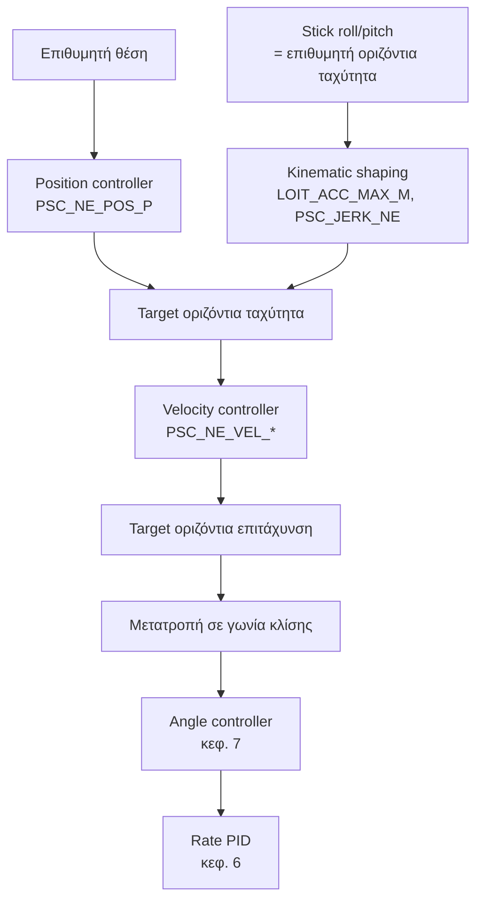
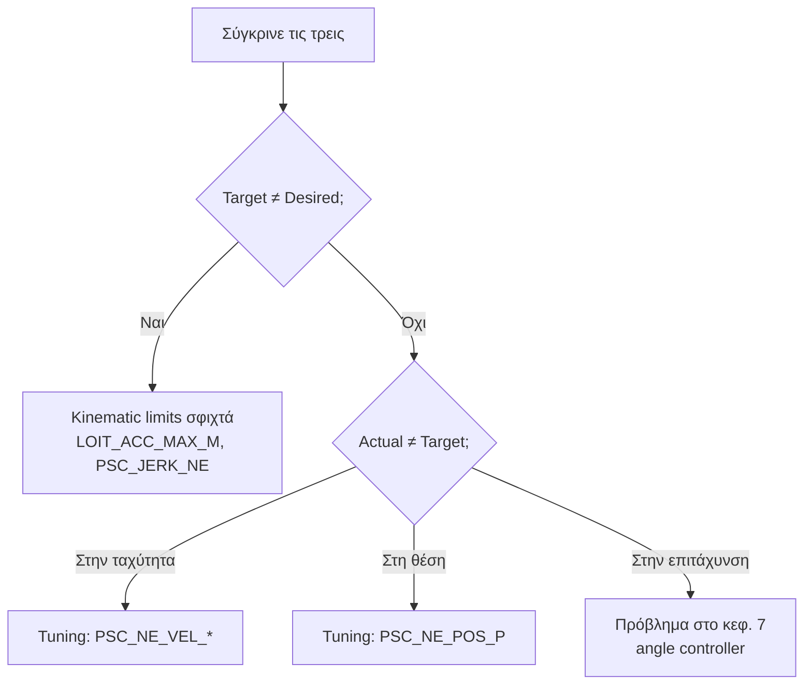
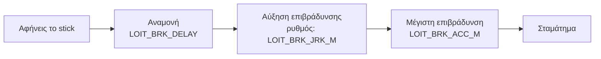
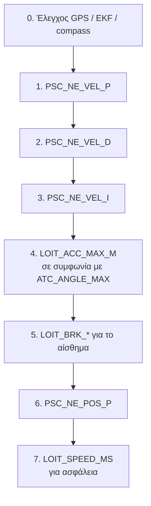

# 09 — Loiter Mode Tuning

> **Στόχος κεφαλαίου:** να συντονίσεις τον **οριζόντιο έλεγχο** — ταχύτητα και θέση στο
> επίπεδο North/East.
>
> **Προϋπόθεση:** κεφάλαια 6, 7 και 8 ολοκληρωμένα.

Η δομή είναι **ακριβώς ίδια** με το κεφάλαιο 8, αλλά στο οριζόντιο επίπεδο. Αν κατάλαβες
το προηγούμενο κεφάλαιο, αυτό είναι εύκολο.

---

## 9.1 Η αλυσίδα του οριζόντιου ελέγχου



**Η κρίσιμη διαφορά από το κεφάλαιο 8:** ο οριζόντιος έλεγχος **δεν έχει δικό του
acceleration controller**. Η ζητούμενη οριζόντια επιτάχυνση μετατρέπεται απευθείας σε
**γωνία κλίσης**, και παραδίδεται στον angle controller του κεφαλαίου 7.

> **Άμεση συνέπεια:** αν το Loiter συμπεριφέρεται άσχημα, το πρόβλημα είναι **πολύ συχνά**
> στο κεφάλαιο 7 ή 6, όχι εδώ. Πάντα επιβεβαίωσε πρώτα το Stabilize.

Η φυσική πίσω από τη μετατροπή:

```
tan(γωνία) = οριζόντια_επιτάχυνση / g
```

Δηλαδή για 2 m/s² χρειάζεσαι περίπου 11.5° κλίση.

---

## 9.2 Οι παράμετροι

### Velocity controller — `PSC_NE_VEL_*`

| Παράμετρος | Default (Copter) | Ρόλος |
|---|---|---|
| `PSC_NE_VEL_P` | 2.0 | Κύριο κέρδος |
| `PSC_NE_VEL_I` | 1.0 | Αντισταθμίζει άνεμο και σταθερή απόκλιση |
| `PSC_NE_VEL_D` | 0.25 | Απόσβεση |
| `PSC_NE_VEL_IMAX` | 10.0 | Όριο ολοκληρωτή (m/s²) |
| `PSC_NE_VEL_FF` | 0 | Feedforward |
| `PSC_NE_VEL_FLTE` | 5 Hz | Φίλτρο σε P και I |
| `PSC_NE_VEL_FLTD` | 5 Hz | Φίλτρο σε D |

### Position controller — `PSC_NE_POS_P`

| Παράμετρος | Default | Ρόλος |
|---|---|---|
| `PSC_NE_POS_P` | 1.0 | Μετατρέπει σφάλμα θέσης (m) σε ζητούμενη ταχύτητα (m/s) |

### Kinematic παράμετροι Loiter — `LOIT_*`

| Παράμετρος | Default | Μονάδες | Ρόλος |
|---|---|---|---|
| `LOIT_SPEED_MS` | 12.5 | m/s | Μέγιστη οριζόντια ταχύτητα σε Loiter |
| `LOIT_ACC_MAX_M` | 5.0 | m/s² | Μέγιστη επιτάχυνση διόρθωσης |
| `LOIT_BRK_ACC_M` | 2.5 | m/s² | Επιτάχυνση φρεναρίσματος όταν αφήνεις τα sticks |
| `LOIT_BRK_JRK_M` | 5.0 | m/s³ | Πόσο απότομα ξεκινά το φρενάρισμα |
| `LOIT_BRK_DELAY` | 1.0 | s | Καθυστέρηση πριν αρχίσει το φρενάρισμα |
| `LOIT_ANG_MAX` | 0 | deg | Μέγιστη γωνία από εντολή πιλότου. 0 = χρησιμοποιεί `PSC_ANGLE_MAX` ή `ATC_ANGLE_MAX` |
| `LOIT_OPTIONS` | 1 | bitmask | Bit 0: Coordinated turns |

### Κοινές kinematic παράμετροι

| Παράμετρος | Default | Ρόλος |
|---|---|---|
| `PSC_JERK_NE` | 5.0 m/s³ | Οριζόντιο jerk για το input shaping |
| `PSC_ANGLE_MAX` | 0 | Όριο γωνίας **μόνο** για τους position controllers. 0 = `ATC_ANGLE_MAX` |

> **Σημείωση έκδοσης:** στην 4.6 και παλιότερα: `PSC_VELXY_*`, `PSC_POSXY_P`, `PSC_JERK_XY`,
> `LOIT_SPEED` (cm/s), `LOIT_ACC_MAX`, `LOIT_BRK_ACCEL`, `LOIT_BRK_JERK`. Δες το
> [Παράρτημα Α](A-Αντιστοίχιση-Παραμέτρων.md).

---

## 9.3 Προϋπόθεση: υγιής εκτίμηση θέσης

Πριν συντονίσεις οτιδήποτε εδώ, **βεβαιώσου ότι το GPS και το EKF είναι υγιή**. Ένα κακό
Loiter οφείλεται πιο συχνά σε κακή εκτίμηση θέσης παρά σε κακά κέρδη.

Την εκτίμηση θέσης την κάνει το **EKF** (Extended Kalman Filter) — ο αλγόριθμος που
συνδυάζει GPS, IMU, barometer και compass σε μία ενιαία εκτίμηση θέσης, ταχύτητας και
προσανατολισμού. Στο log καταγράφει, μεταξύ άλλων, **variances**: πόσο "διαφωνούν" οι
αισθητήρες μεταξύ τους. Χαμηλά variances = εμπιστεύσιμη εκτίμηση.

Έλεγξε στο log:

| Μήνυμα / πεδίο | Τι θέλεις |
|---|---|
| `GPS.NSats` | ≥ 12 σταθερά |
| `GPS.HDop` | < 1.0 |
| `XKF4.SV` (velocity), `XKF4.SP` (position) | Χαμηλά variances, χωρίς κορυφές |
| `VIBE.Clip` | 0 |
| Compass interference | < 30 % (κεφ. 3) |

> **Το πιο συχνό αίτιο "toilet bowl"** (το drone κάνει διευρυνόμενους κύκλους σε Loiter)
> είναι **λάθος yaw από το compass**, όχι κακό PID. Αν το compass δείχνει λάθος κατεύθυνση,
> το drone διορθώνει προς λάθος πλευρά και το σφάλμα μεγαλώνει.

---

## 9.4 Test flight για Loiter

- **Mode: Loiter**, ύψος 5–10 m, όσο πιο άπνοια γίνεται.
- `LOG_BITMASK` με Navigation Tuning και PID bits ενεργά.

**Τι πετάς:**

1. **Hover 30 s** χωρίς εντολές — δες πόσο κρατά τη θέση.
2. **Βηματική εντολή**: γρήγορο roll δεξιά, κράτημα 2 s, γρήγορη επαναφορά στο κέντρο.
   Παρατήρησε το **φρενάρισμα**.
3. **Το ίδιο σε pitch.**
4. **Σπρώξε** ελαφρά το drone με τον αέρα ή με ήπια εντολή και άφησέ το — δες πόσο καθαρά
   επιστρέφει.

---

## 9.5 Πώς διαβάζονται τα logs

### Μηνύματα `PSCN` και `PSCE`

Ένα ανά άξονα (North / East), με την ίδια δομή που είδες στο `PSCD`:

| Πεδίο | Σημασία |
|---|---|
| `DPN` / `TPN` / `PN` | Desired / Target / actual **θέση** |
| `DVN` / `TVN` / `VN` | Desired / Target / actual **ταχύτητα** |
| `DAN` / `TAN` / `AN` | Desired / Target / actual **επιτάχυνση** |

(Το `PSCE` έχει τα ίδια με `E` αντί `N`.)

Η ίδια διαγνωστική λογική με το κεφάλαιο 8:



### Μηνύματα `PIDN` και `PIDE`

Η ανάλυση PID του velocity controller ανά άξονα (North / East), με τα γνωστά πεδία
`Tar`, `Act`, `Err`, `P`, `I`, `D`, `FF`, `Dmod`.

---

## 9.6 Tuning του horizontal velocity controller

Ξεκινάς πάντα από τον **εσωτερικό** βρόχο.

**Διαδικασία:**

1. Ξεκίνα από τα defaults (`P = 2.0`, `I = 1.0`, `D = 0.25`).
2. Πέτα σε Loiter, κάνε βηματικές εντολές roll/pitch.
3. Στο `PSCN`/`PSCE`, σύγκρινε `TVN` με `VN`.

| Παρατήρηση | Ενέργεια |
|---|---|
| Το `VN` καθυστερεί πολύ | Αύξησε `PSC_NE_VEL_P` |
| Το `VN` ταλαντώνεται γύρω από το `TVN` | Μείωσε `PSC_NE_VEL_P` |
| Overshoot στο σταμάτημα | Αύξησε `PSC_NE_VEL_D` |
| Ορατό τρέμουλο κατά την κίνηση | Μείωσε `PSC_NE_VEL_D` |
| Δεν φτάνει ποτέ την ταχύτητα σε άνεμο | Αύξησε `PSC_NE_VEL_I` |
| Αργό wobble κατά την επιτάχυνση | Μείωσε `PSC_NE_VEL_I` |

**Κανόνας ισορροπίας:** `PSC_NE_VEL_I ≈ PSC_NE_VEL_P / 2` (τα defaults: 2.0 και 1.0).
Αν αλλάξεις το `P`, κράτα τον λόγο.

Τυπικές τιμές: `P` **1.5 – 3.0**, `D` **0.1 – 0.5**.

> **Το `D` εδώ έχει μεγαλύτερη σημασία** από ό,τι στον κάθετο άξονα, γιατί το drone έχει
> ορμή στο οριζόντιο επίπεδο και πρέπει να φρενάρει γέρνοντας προς την αντίθετη κατεύθυνση.

---

## 9.7 Οριζόντιες kinematic παράμετροι

Πριν πας στον position controller, ρύθμισε **τι επιτρέπεται** να ζητηθεί.

### `LOIT_SPEED_MS`

Η μέγιστη ταχύτητα σε Loiter. Το default των 12.5 m/s (45 km/h) είναι υψηλό για πολλά
drones. Μείωσέ το για ασφαλέστερο, πιο ελεγχόμενο αίσθημα.

### `LOIT_ACC_MAX_M`

Πόσο δυνατά επιταχύνει και διορθώνει. Επηρεάζει άμεσα τη γωνία που θα πάρει το drone:

| `LOIT_ACC_MAX_M` | Απαιτούμενη γωνία |
|---|---|
| 2.5 m/s² | ≈ 14° |
| 5.0 m/s² | ≈ 27° |
| 7.0 m/s² | ≈ 36° |

**Το `LOIT_ACC_MAX_M` δεν πρέπει να απαιτεί γωνία μεγαλύτερη από το `ATC_ANGLE_MAX`**
(κεφ. 7). Αν το κάνει, ο controller ζητάει κάτι που θα κοπεί, και το φρενάρισμα γίνεται
απρόβλεπτο.

### `LOIT_BRK_ACC_M`, `LOIT_BRK_JRK_M`, `LOIT_BRK_DELAY`

Καθορίζουν το **φρενάρισμα** όταν αφήνεις τα sticks:



| Θέλεις | Ρύθμισε |
|---|---|
| Πιο άμεσο σταμάτημα | Μεγαλύτερο `LOIT_BRK_ACC_M`, μικρότερο `LOIT_BRK_DELAY` |
| Πιο απαλό, κινηματογραφικό | Μικρότερο `LOIT_BRK_ACC_M`, μικρότερο `LOIT_BRK_JRK_M` |

> **Πρόσεξε:** πολύ μεγάλο `LOIT_BRK_ACC_M` κάνει το drone να "τσιμπάει" απότομα και να
> χάνει ύψος (γιατί γέρνει πολύ). Πρέπει να ταιριάζει με το `ATC_ANGLE_MAX`.

### `PSC_JERK_NE`

Το πόσο απότομα αλλάζει η επιτάχυνση. Χαμηλότερο = πιο ομαλό, πιο "βαρύ" αίσθημα.
Default 5.0 m/s³.

---

## 9.8 Tuning του horizontal position controller

Ο τελευταίος και απλούστερος βρόχος: ένα P.

| Παράμετρος | Default | Οδηγία |
|---|---|---|
| `PSC_NE_POS_P` | 1.0 | Σφάλμα 1 m → ζητούμενη ταχύτητα 1 m/s |

**Διαδικασία:**

1. Hover σε Loiter. Σπρώξε ήπια το drone εκτός θέσης και άφησέ το.
2. Στο `PSCN`/`PSCE`, σύγκρινε `TPN` με `PN`.

| Παρατήρηση | Ενέργεια |
|---|---|
| Επιστρέφει αργά, "τεμπέλικα" | Αύξησε `PSC_NE_POS_P` |
| Επιστρέφει, ξεπερνάει, ταλαντώνεται | Μείωσε `PSC_NE_POS_P` |
| Επιστρέφει καθαρά και σταματά | Σωστό |

Τυπικές τιμές: **0.8 – 2.0**.

> **Κανόνας cascade, ξανά:** ο position controller πρέπει να είναι πιο αργός από τον
> velocity controller. Αν το `PSC_NE_POS_P` είναι πολύ ψηλό σε σχέση με το `PSC_NE_VEL_P`,
> παίρνεις αργή ταλάντωση γύρω από τη θέση.

---

## 9.9 Σειρά εργασιών



---

## 9.10 Troubleshooting

| Σύμπτωμα | Πιθανή αιτία | Ενέργεια |
|---|---|---|
| **Toilet bowl** — διευρυνόμενοι κύκλοι | Λάθος yaw από compass | Επανάληψη compass cal· έλεγχος παρεμβολής (§3.14) |
| Αργή ταλάντωση γύρω από τη θέση | Πολύ `PSC_NE_POS_P` | Μείωσέ το |
| Το drone "παρασύρεται" και δεν επιστρέφει | Λίγο `PSC_NE_POS_P` ή κακό GPS | Έλεγξε πρώτα το GPS |
| Τρέμουλο κατά την κίνηση | Πολύ `PSC_NE_VEL_D` | Μείωσέ το |
| Σταθερή απόκλιση σε άνεμο | Λίγο `PSC_NE_VEL_I` | Αύξησέ το |
| Απότομο "τσίμπημα" στο σταμάτημα | Πολύ `LOIT_BRK_ACC_M` | Μείωσέ το |
| Χάνει ύψος όταν φρενάρει | Πολύ μεγάλη γωνία φρεναρίσματος | Μείωσε `LOIT_BRK_ACC_M` ή `ATC_ANGLE_MAX` |
| Γρήγορη ταλάντωση σε Loiter αλλά όχι σε Stabilize | **Δεν είναι εδώ** | Το πρόβλημα εμφανίζεται λόγω μεγαλύτερων γωνιών — κεφ. 7 |
| Ξαφνικά τινάγματα | GPS glitch | Δες `GPS.NSats`, `GPS.HDop`, EKF innovations |

---

## Λίστα ελέγχου πριν το κεφάλαιο 10

- [ ] GPS και EKF υγιή, compass καθαρό
- [ ] `PSC_NE_VEL_P/I/D` συντονισμένα
- [ ] `PSC_NE_POS_P` συντονισμένο, χωρίς ταλάντωση
- [ ] `LOIT_ACC_MAX_M` συμβατό με `ATC_ANGLE_MAX`
- [ ] Φρενάρισμα ομαλό, χωρίς απώλεια ύψους
- [ ] Κρατά θέση εντός ~1 m σε άπνοια
- [ ] Log + param αποθηκευμένα

---

**Επόμενο:** [10 — Waypoint Navigation Tuning](10-Waypoint-Navigation-Tuning.md)
