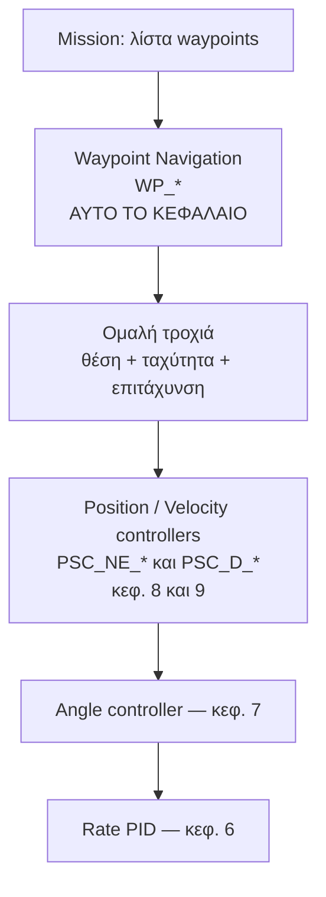
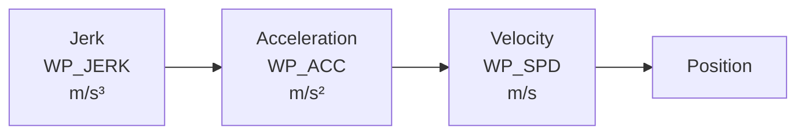
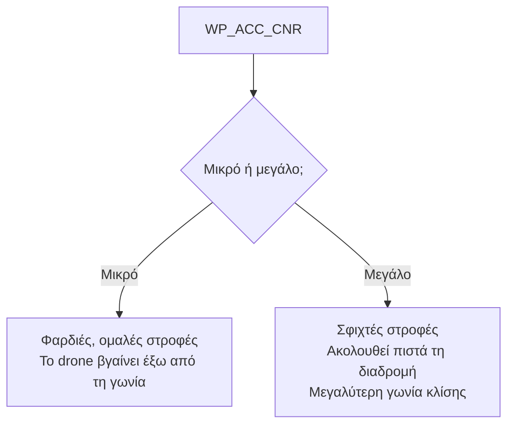
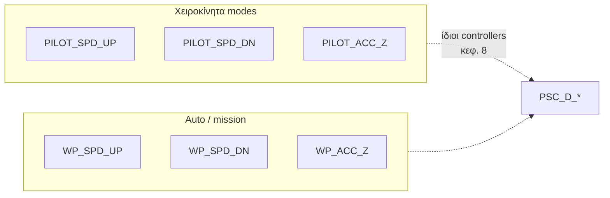
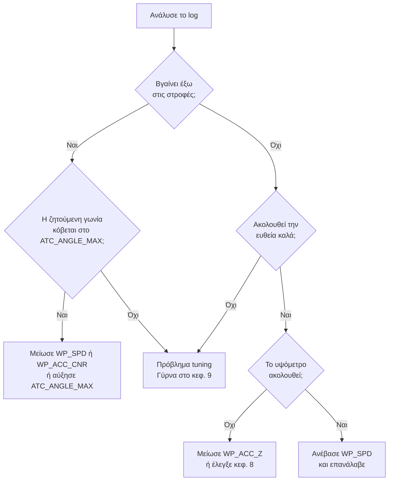
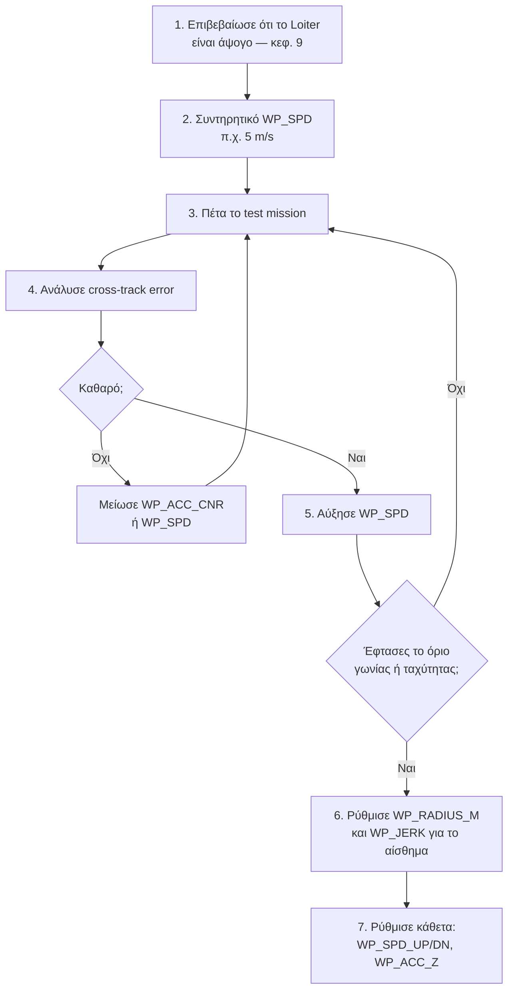

# 10 — Waypoint Navigation Tuning

> **Στόχος κεφαλαίου:** να ρυθμίσεις πώς το drone κινείται **μεταξύ waypoints** σε αυτόνομη
> αποστολή.
>
> **Προϋπόθεση:** κεφάλαια 6–9 ολοκληρωμένα, ειδικά το 9.

Εδώ **δεν προσθέτεις νέους PID controllers**. Το waypoint navigation χρησιμοποιεί τους
**ίδιους** position και velocity controllers που συντόνισες στα κεφάλαια 8 και 9. Αυτό που
ρυθμίζεις είναι η **τροχιά** που τους δίνεται.

---

## 10.1 Πού μπαίνει το waypoint navigation

> **Συνέπεια:** αν το drone δεν ακολουθεί καλά την τροχιά, το πρόβλημα είναι σχεδόν πάντα
> στο κεφάλαιο 9. Ρύθμισε πρώτα το Loiter τέλεια.

---

## 10.2 Τι είναι το "kinematic shaping" στα waypoints

Ο ArduPilot **δεν** στέλνει το drone σε ευθεία γραμμή προς κάθε waypoint με απότομες
στροφές. Παράγει μια **ομαλή τροχιά** (χρησιμοποιεί S-curves) που σέβεται τρία όρια:

Κάθε επίπεδο είναι το **ολοκλήρωμα** του προηγούμενου:

| Μέγεθος | Τι είναι | Παράμετρος |
|---|---|---|
| **Jerk** | Ρυθμός μεταβολής της επιτάχυνσης | `WP_JERK` |
| **Acceleration** | Ρυθμός μεταβολής της ταχύτητας | `WP_ACC` |
| **Velocity** | Ταχύτητα | `WP_SPD` |

Περιορίζοντας το jerk, οι εντολές επιτάχυνσης είναι **ομαλές**, άρα οι εντολές γωνίας είναι
ομαλές, άρα η κάμερα δεν "τινάζεται".

> **Σημείωση έκδοσης:** στην 4.6 και παλιότερα το πρόθεμα ήταν `WPNAV_` και οι μονάδες cm/s
> (π.χ. `WPNAV_SPEED = 500` για 5 m/s). Στην 4.7+ είναι `WP_` σε m/s. Δες το
> [Παράρτημα Α](A-Αντιστοίχιση-Παραμέτρων.md).

---

## 10.3 Οριζόντιες παράμετροι waypoint

| Παράμετρος | Default | Μονάδες | Ρόλος |
|---|---|---|---|
| `WP_SPD` | 10.0 | m/s | Ταχύτητα που προσπαθεί να κρατήσει οριζόντια |
| `WP_ACC` | 2.5 | m/s² | Μέγιστη οριζόντια επιτάχυνση |
| `WP_ACC_CNR` | 0 | m/s² | Επιτάχυνση στις **στροφές**. Αν 0, χρησιμοποιείται **2 × `WP_ACC`** |
| `WP_JERK` | 1.0 | m/s³ | Οριζόντιο jerk |
| `WP_RADIUS_M` | 2.0 | m | Απόσταση από το waypoint που το θεωρεί "φτασμένο" |

### Πώς επιλέγεις `WP_SPD`

Δεν είναι "όσο πιο γρήγορα γίνεται". Περιορισμοί:

| Περιορισμός | Γιατί |
|---|---|
| `LOIT_SPEED_MS` | Λογικό να μην είναι πολύ μεγαλύτερο από ό,τι δοκίμασες σε Loiter |
| Γωνία κλίσης | Μεγαλύτερη ταχύτητα → μεγαλύτερη αεροδυναμική αντίσταση → μεγαλύτερη γωνία |
| Απόσταση φρεναρίσματος | Με `WP_ACC = 2.5 m/s²`, από 10 m/s χρειάζονται ~20 m για να σταματήσει |

**Πρακτικά:** ξεκίνα με κάτι συντηρητικό (π.χ. 5 m/s) και ανέβα σταδιακά, ελέγχοντας κάθε
φορά το log.

### `WP_ACC` και `WP_ACC_CNR`

Το `WP_ACC` καθορίζει πόσο δυνατά επιταχύνει και φρενάρει σε ευθεία.
Το `WP_ACC_CNR` καθορίζει πόσο σφιχτά κόβει τις **στροφές**.

**Ο περιορισμός είναι πάλι η γωνία:** μια στροφή με επιτάχυνση `a` απαιτεί κλίση
`atan(a/g)`. Με `WP_ACC_CNR = 5 m/s²` χρειάζονται ~27°.

**Αυτή η γωνία δεν πρέπει να ξεπερνά το `ATC_ANGLE_MAX`** (ή το `PSC_ANGLE_MAX` αν είναι
ορισμένο) — αλλιώς το drone δεν μπορεί να κάνει τη στροφή που ζητήθηκε και βγαίνει έξω.

### `WP_RADIUS_M`

Πόσο κοντά πρέπει να φτάσει για να θεωρηθεί ότι πέρασε το waypoint.

| Τιμή | Συμπεριφορά |
|---|---|
| Μικρή (π.χ. 0.5 m) | Ακριβής διέλευση, αλλά μπορεί να χρειαστεί να επιβραδύνει |
| Default (2 m) | Ισορροπημένο |
| Μεγάλη (π.χ. 5 m) | Ομαλή, γρήγορη διαδρομή που "κόβει" τις γωνίες |

Για mapping / survey θέλεις μικρή τιμή. Για γρήγορη μετάβαση, μεγαλύτερη.

---

## 10.4 Κάθετες παράμετροι waypoint

| Παράμετρος | Default | Μονάδες | Ρόλος |
|---|---|---|---|
| `WP_SPD_UP` | 2.5 | m/s | Μέγιστη άνοδος σε mission |
| `WP_SPD_DN` | 1.5 | m/s | Μέγιστη κάθοδος σε mission |
| `WP_ACC_Z` | 1.0 | m/s² | Κάθετη επιτάχυνση |

Παρατήρησε ότι το `WP_SPD_DN` είναι **μικρότερο** από το `WP_SPD_UP` στα defaults — για τον
ίδιο λόγο που εξηγήθηκε στο §8.13 (**vortex ring state**).

Αυτά είναι τα αντίστοιχα των `PILOT_SPD_UP` / `PILOT_SPD_DN` / `PILOT_ACC_Z`, αλλά για
**αυτόνομες** πτήσεις αντί για χειροκίνητες.

> **Πρακτικά:** αν το drone "τραντάζεται" σε αλλαγές υψομέτρου κατά τη διάρκεια mission,
> μείωσε το `WP_ACC_Z`, όχι τα κέρδη του κεφαλαίου 8.

---

## 10.5 Παράμετροι που επηρεάζουν τη συμπεριφορά

| Παράμετρος | Ρόλος |
|---|---|
| `WP_YAW_BEHAVIOR` | 0: Ποτέ αλλαγή yaw · 1: Κοίτα το επόμενο WP · 2: Κοίτα το επόμενο WP εκτός RTL · 3: Κοίτα κατά μήκος της πορείας GPS |
| `ATC_RATE_WPY_MAX` | Μέγιστος ρυθμός αλλαγής του στόχου yaw σε Auto/Guided/RTL κ.λπ. Default 60 deg/s |
| `WP_RFND_USE` | 1 = χρήση rangefinder για terrain following |
| `WP_TER_MARGIN` | Περιθώριο υψομέτρου σε terrain following. Default 10 m |
| `WP_NAVALT_MIN` | Ελάχιστο υψόμετρο πριν ξεκινήσει η οριζόντια πλοήγηση σε takeoff |

**`ATC_RATE_WPY_MAX`** έχει σημασία για κάμερα: αν είναι πολύ ψηλό, το drone στρίβει
απότομα το yaw φτάνοντας σε waypoint. Χαμήλωσέ το (π.χ. 20–30 deg/s) για ομαλό βίντεο.

---

## 10.6 Test flight και ανάλυση

### Το mission δοκιμής

Φτιάξε ένα απλό mission:

1. Takeoff στα 15 m
2. Ένα **τετράγωνο** με πλευρά 50–80 m — δοκιμάζει ευθείες και **γωνίες 90°**
3. Ένα waypoint με **αλλαγή υψομέτρου** (π.χ. +10 m) — δοκιμάζει τον κάθετο έλεγχο
4. RTL

Πέτα το με **αυξανόμενο** `WP_SPD` σε διαδοχικές πτήσεις.

### Τι κοιτάς στο log

| Έλεγχος | Πού |
|---|---|
| Ακολουθεί την ευθεία; | `PSCN`/`PSCE`: `TPN` vs `PN` |
| Φτάνει την ταχύτητα; | `PSCN`/`PSCE`: `TVN` vs `VN` |
| Βγαίνει έξω στις στροφές; | Cross-track error στο χάρτη· `TPN` vs `PN` στη στροφή |
| Ακολουθεί το υψόμετρο; | `CTUN`: `DAlt` vs `Alt` |
| Οι γωνίες μένουν εντός ορίου; | `ATT`: `DesRoll` vs `Roll`, σε σχέση με `ATC_ANGLE_MAX` |

---

## 10.7 Σειρά εργασιών

---

## 10.8 Troubleshooting

| Σύμπτωμα | Πιθανή αιτία | Ενέργεια |
|---|---|---|
| Βγαίνει έξω στις στροφές | `WP_ACC_CNR` πολύ χαμηλό ή `WP_SPD` πολύ ψηλό | Αύξησε το πρώτο ή μείωσε το δεύτερο |
| Απότομες στροφές, τίναγμα κάμερας | `WP_ACC_CNR` πολύ ψηλό, `WP_JERK` πολύ ψηλό | Μείωσέ τα |
| Δεν φτάνει ποτέ το `WP_SPD` | Η ζητούμενη γωνία κόβεται | Αύξησε `ATC_ANGLE_MAX` ή μείωσε `WP_SPD` |
| Ταλαντώνεται κατά μήκος της διαδρομής | Πρόβλημα στο κεφ. 9 | Γύρνα στο `PSC_NE_*` |
| Χάνει υψόμετρο σε γρήγορες ευθείες | Μεγάλη γωνία, λίγο περιθώριο ώσης | Μείωσε `WP_SPD`· έλεγξε `MOT_THST_HOVER` |
| Απότομες αλλαγές υψομέτρου | `WP_ACC_Z` πολύ ψηλό | Μείωσέ το |
| Απότομη περιστροφή yaw στα waypoints | `ATC_RATE_WPY_MAX` πολύ ψηλό | Μείωσέ το σε 20–30 deg/s |
| "Ζιγκ-ζαγκ" γύρω από την ευθεία | Κακό GPS ή `PSC_NE_POS_P` ψηλό | Έλεγξε GPS πρώτα |

---

## Λίστα ελέγχου

- [ ] Test mission ολοκληρωμένο χωρίς σημαντικό cross-track error
- [ ] `WP_SPD` σε τιμή που το drone πραγματικά πετυχαίνει
- [ ] `WP_ACC_CNR` συμβατό με `ATC_ANGLE_MAX`
- [ ] `WP_SPD_DN` < `WP_SPD_UP`
- [ ] Υψόμετρο σταθερό σε όλη τη διαδρομή
- [ ] `ATC_RATE_WPY_MAX` ρυθμισμένο για ομαλό yaw
- [ ] Log + param αποθηκευμένα

---

**Επόμενο:** [11 — Tips for Tuning Large Drones](11-Tips-for-Tuning-Large-Drones.md)
