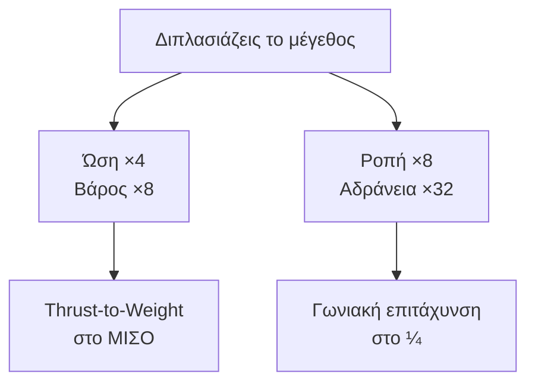
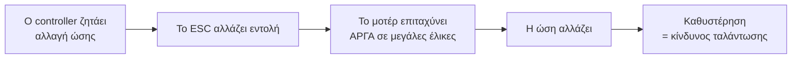
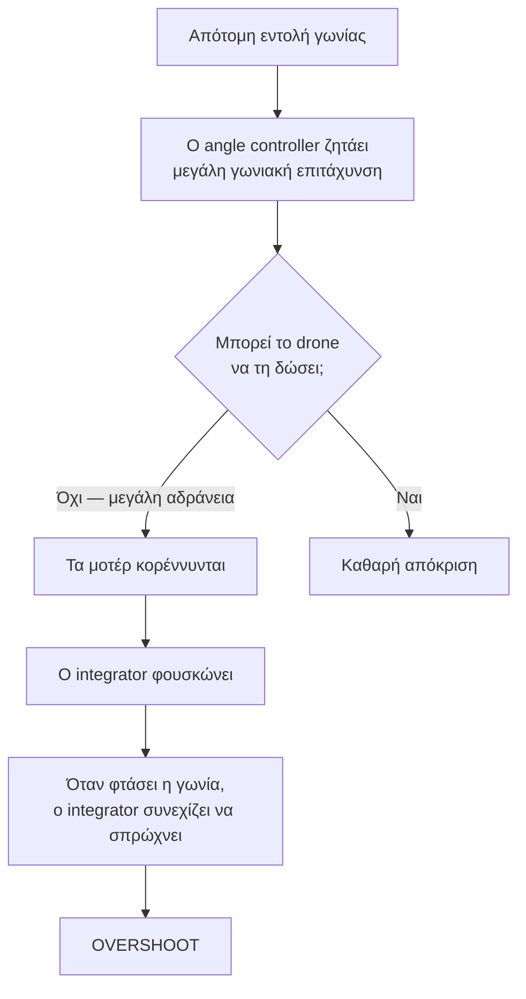
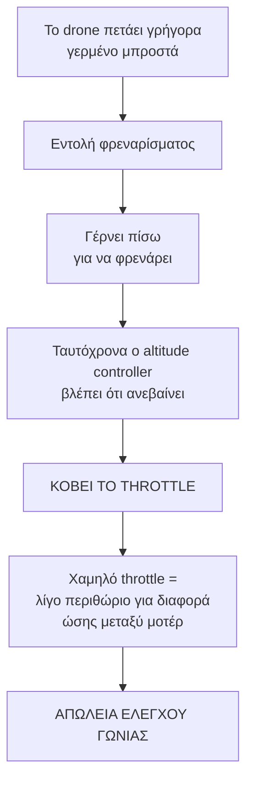
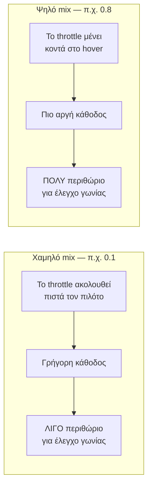
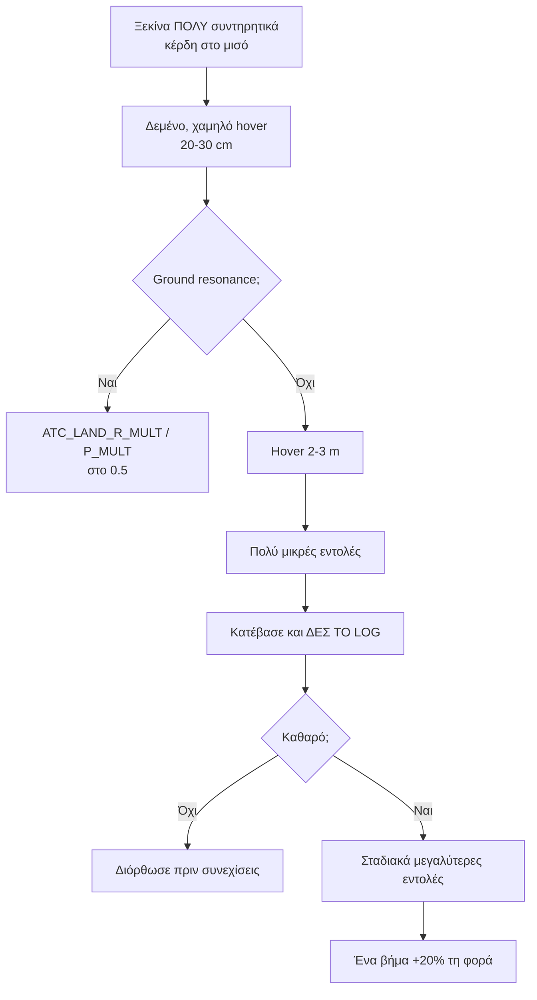

# 11 — Tips for Tuning Large Drones

> **Στόχος κεφαλαίου:** να καταλάβεις **τι αλλάζει** όταν το drone μεγαλώνει, και ποιες
> ρυθμίσεις χρειάζονται διαφορετική προσέγγιση.
>
> **Προϋπόθεση:** κεφάλαια 5–10. Αυτό το κεφάλαιο δεν αντικαθιστά τα προηγούμενα — τα
> προσαρμόζει.

"Μεγάλο" εδώ σημαίνει πρακτικά **έλικες 15" και πάνω**, ή βάρος πάνω από ~5 kg.

---

## 11.1 Η φυσική της κλίμακας

Όταν μεγαλώνεις ένα drone **αναλογικά** κατά συντελεστή `L`, τα διάφορα μεγέθη **δεν**
μεγαλώνουν το ίδιο:

| Μέγεθος | Πώς κλιμακώνεται | Γιατί |
|---|---|---|
| **Ώση** | ∝ L² | Επιφάνεια δίσκου έλικας |
| **Μάζα** | ∝ L³ | Όγκος υλικού |
| **Ροπή** (roll/pitch) | ∝ L³ | Ώση × μήκος βραχίονα |
| **Ροπή αδράνειας** | ∝ L⁵ | Μάζα × απόσταση² |

Από αυτά προκύπτουν **δύο θεμελιώδεις συνέπειες**:

> **Με μια πρόταση:** τα μεγάλα drones έχουν **λιγότερο περιθώριο ώσης** και είναι
> **πολύ πιο αργά** στην περιστροφή.

---

## 11.2 Χαμηλότερος λόγος ώσης προς βάρος

Ένα 5" quad έχει τυπικά thrust-to-weight 6:1 ή 8:1. Ένα 20" drone μπορεί να έχει 2:1.

**Το `MOT_THST_HOVER` (κεφ. 4) το δείχνει άμεσα:**

| `MOT_THST_HOVER` | Thrust-to-weight | Χαρακτήρας |
|---|---|---|
| 0.15 | ≈ 6.7 : 1 | Πολύ ευέλικτο |
| 0.35 | ≈ 2.9 : 1 | Τυπικό |
| 0.50 | ≈ 2.0 : 1 | Οριακό |
| 0.60+ | < 1.7 : 1 | **Επικίνδυνο** |

**Τι πρέπει να αλλάξεις:**

| Παράμετρος | Ενέργεια | Γιατί |
|---|---|---|
| `ATC_ANGLE_MAX` | Μείωσε (20–30°) | Στις 45° χρειάζεσαι 41 % περισσότερο throttle |
| `PILOT_SPD_UP`, `WP_SPD_UP` | Μείωσε | Δεν υπάρχει περιθώριο για γρήγορη άνοδο |
| `MOT_YAW_HEADROOM` | Πρόσεξε το | Τρώει από το ήδη λίγο περιθώριο |
| `LOIT_ACC_MAX_M`, `WP_ACC_CNR` | Μείωσε | Απαιτούν μεγάλες γωνίες |

---

## 11.3 Χαμηλότερος λόγος ροπής προς αδράνεια

Ένα μεγάλο drone **δεν μπορεί** να επιταχύνει γωνιακά όσο ένα μικρό. Αυτό δεν λύνεται με
tuning — είναι φυσική.

**Τι πρέπει να αλλάξεις:**

| Παράμετρος | Ενδεικτικές τιμές για μεγάλα drones | Σύγκριση με 5" |
|---|---|---|
| `ATC_ACC_R_MAX` / `ATC_ACC_P_MAX` | 150 – 400 deg/s² | 1100 – 1800 |
| `ATC_ACC_Y_MAX` | 50 – 100 deg/s² | 270 – 400 |
| `ATC_RATE_R_MAX` / `ATC_RATE_P_MAX` | 90 – 180 deg/s | συχνά 0 (χωρίς όριο) |
| `ATC_INPUT_TC` | 0.2 – 0.35 s | 0.10 – 0.15 |

> **Μέτρησέ το, μη το μαντέψεις.** Χρησιμοποίησε τη μέθοδο του §7.4: βρες τη μέγιστη κλίση
> του `RATE.R` σε ένα log με απότομες εντολές.

**Στο rate PID (κεφ. 6):** τα μεγάλα drones χρειάζονται τυπικά **μικρότερο P** και
**μεγαλύτερο D** σε σχέση με τα μικρά, γιατί η μεγάλη αδράνεια δημιουργεί εγγενή
καθυστέρηση που θέλει περισσότερη απόσβεση.

---

## 11.4 Πιο αργή απόκριση του συστήματος ισχύος

Ένα μεγάλο μοτέρ με μεγάλη έλικα έχει **πολύ μεγαλύτερη ροπή αδράνειας ρότορα**. Χρειάζεται
πολύ περισσότερο χρόνο για να αλλάξει ταχύτητα.

**Πρακτικές συνέπειες:**

| Θέμα | Ενέργεια |
|---|---|
| Χαμηλότερο μέγιστο κέρδος | Μη προσπαθείς να φτάσεις τα κέρδη ενός μικρού quad |
| **Το DFF είναι πολύ πιο χρήσιμο** | `ATC_RAT_*_D_FF` δίνει άμεση εντολή, παρακάμπτοντας την καθυστέρηση της ανάδρασης |
| `MOT_SLEW_UP_TIME` / `MOT_SLEW_DN_TIME` | Default 0 (χωρίς όριο). Μικρές τιμές (π.χ. 0.02–0.05 s) μπορούν να προστατέψουν τα ESC από απότομες εντολές |
| `MOT_SPOOL_TIME` | Default 0.5 s. Μεγαλύτερο (1.0–1.5 s) για ομαλότερο spool-up |

**Στα filters (κεφ. 5):** ο θόρυβος είναι σε **πολύ χαμηλότερη συχνότητα**.

| Παράμετρος | Μεγάλα drones | Γιατί |
|---|---|---|
| `INS_HNTCH_FREQ` | 30 – 70 Hz | Τα μοτέρ γυρίζουν πιο αργά |
| `FFT_MINHZ` | 20 – 30 Hz | Το default των 50 Hz μπορεί να είναι **πάνω** από τη συχνότητα των μοτέρ |
| `INS_GYRO_FILTER` | 20 – 40 Hz | Χρήσιμο σήμα και θόρυβος είναι κοντά |
| `INS_HNTCH_OPTS` | bit 0 (Double) ή bit 4 (Triple) | Φαρδύτερη κάλυψη με λιγότερο lag από ένα φαρδύ single notch |

> **Προσοχή στο `FFT_MINHZ`:** είναι από τα πιο συχνά λάθη σε μεγάλα drones. Αν το drone
> κάνει hover με τα μοτέρ στις 40 Hz και το `FFT_MINHZ` είναι 50, το FFT **δεν βλέπει
> τίποτα** και ο dynamic notch δεν έχει πηγή.

---

## 11.5 Pitch/Roll overshoot: το πρόβλημα και η λύση

**Το πρόβλημα:** το drone ζητάει γωνία 20°, φτάνει στις 25°, και μετά επιστρέφει. Το tuning
φαίνεται σωστό σε μικρές κινήσεις αλλά αστοχεί σε μεγάλες.

**Η λύση, με σειρά:**

1. **Μείωσε το `ATC_ACC_R_MAX` / `ATC_ACC_P_MAX`** στο πραγματικό όριο του drone (§11.3).
   Αυτό είναι το **βασικό** διορθωτικό: ο angle controller σταματά να ζητάει το ανέφικτο.

2. **Αύξησε το `ATC_INPUT_TC`** (π.χ. από το default 0.10 σε 0.25). Οι εντολές γίνονται πιο
   ομαλές, άρα η ζητούμενη επιτάχυνση μικρότερη.

3. **Πρόσθεσε `ATC_RAT_*_D_FF`.** Δίνει άμεση εντολή στην αρχή της κίνησης, μειώνοντας το
   σφάλμα που πρέπει να καλύψει ο ολοκληρωτής.

4. **Έλεγξε το `ATC_RAT_*_IMAX`.** Αν είναι πολύ ψηλό, ο ολοκληρωτής φουσκώνει περισσότερο.

5. **Αύξησε το `ATC_RAT_*_D`** για περισσότερη απόσβεση — αλλά μόνο αν τα filters (κεφ. 5)
   το επιτρέπουν.

---

## 11.6 Μεγάλη αδράνεια έναντι αεροδυναμικής επιφάνειας

Ένα μεγάλο drone έχει **και** μεγάλη αδράνεια **και** μεγάλη επιφάνεια στον αέρα. Τα δύο
δρουν σε διαφορετικές κατευθύνσεις:

| Χαρακτηριστικό | Επίδραση |
|---|---|
| **Μεγάλη αδράνεια** | Αργεί να ξεκινήσει, αργεί να σταματήσει· ευνοεί χαμηλά κέρδη |
| **Μεγάλη αεροδυναμική επιφάνεια** | Φυσική απόσβεση από τον αέρα· βοηθά την ευστάθεια |

Το καθαρό αποτέλεσμα:

- **Σε χαμηλή ταχύτητα:** κυριαρχεί η αδράνεια. Το drone είναι νωθρό.
- **Σε υψηλή ταχύτητα:** η αεροδυναμική αντίσταση γίνεται σημαντική. Το drone αντιστέκεται
  στην επιτάχυνση αλλά και φρενάρει μόνο του.
- **Σε άνεμο:** η μεγάλη επιφάνεια σημαίνει μεγάλη διαταραχή. Χρειάζεσαι **επαρκές I** στους
  velocity controllers (`PSC_NE_VEL_I`, κεφ. 9).

> **Πρακτικά:** ένα tune που δουλεύει σε άπνοια στα 2 m/s μπορεί να είναι ανεπαρκές στα
> 15 m/s με πλάγιο άνεμο. **Δοκίμασε σε όλο το εύρος ταχυτήτων.**

---

## 11.7 Υψηλή τελική ταχύτητα

Τα μεγάλα drones φτάνουν συχνά υψηλές ταχύτητες, γιατί η μάζα τους τα κάνει λιγότερο
ευαίσθητα στον αέρα. Αυτό δημιουργεί προβλήματα που δεν υπάρχουν σε μικρά drones.

| Θέμα | Ενέργεια |
|---|---|
| Ενέργεια σε σύγκρουση | Περιόρισε το `WP_SPD` και το `LOIT_SPEED_MS` σε ό,τι μπορείς να σταματήσεις |
| Απόσταση φρεναρίσματος | Με `WP_ACC = 2.5 m/s²` από 15 m/s χρειάζονται **45 m** |
| Γωνία σε ταχύτητα | Η αεροδυναμική αντίσταση απαιτεί μόνιμη κλίση για να διατηρηθεί η ταχύτητα |

---

## 11.8 Φρενάρισμα σε υψηλή ταχύτητα: το πρόβλημα

Αυτό είναι το **πιο επικίνδυνο** σενάριο για ένα μεγάλο drone.

**Γιατί συμβαίνει:** ο έλεγχος γωνίας γίνεται με **διαφορά ώσης** μεταξύ μοτέρ. Αν όλα τα
μοτέρ είναι σχεδόν σβηστά, δεν υπάρχει περιθώριο να τα μειώσεις άλλο — και ο controller
χάνει την εξουσία του.

Σε ένα μικρό quad με thrust-to-weight 8:1 αυτό σπάνια είναι πρόβλημα. Σε ένα drone με 2:1
είναι το πιο συχνό αίτιο απώλειας ελέγχου.

---

## 11.9 Φρενάρισμα σε υψηλή ταχύτητα: η λύση

### `ATC_THR_MIX_MAX` και `ATC_THR_MIX_MAN`

> **Σημείωση ονοματολογίας:** η σωστή ονομασία είναι `ATC_THR_MIX_*` (Attitude Control).
> Παράμετρος `ACT_THR_MIX_MAX` **δεν υπάρχει**. Οι τρεις παράμετροι είναι
> `ATC_THR_MIX_MIN`, `ATC_THR_MIX_MAX`, `ATC_THR_MIX_MAN`.

Αυτές οι τρεις παράμετροι ελέγχουν την **προτεραιότητα μεταξύ throttle και ελέγχου γωνίας**.

| Παράμετρος | Default | Πότε ισχύει | Εύρος |
|---|---|---|---|
| `ATC_THR_MIX_MIN` | 0.1 | Κατά την **προσγείωση** | 0.1 – 0.25 |
| `ATC_THR_MIX_MAX` | 0.5 | Κατά την **ενεργή πτήση** με αυτόματο throttle | 0.5 – 0.9 |
| `ATC_THR_MIX_MAN` | 0.1 | Κατά τη **χειροκίνητη** πτήση throttle (Stabilize, Acro) | 0.1 – 0.9 |

**Τι κάνουν στην πράξη:** ο mixer παίρνει την εντολή throttle και τη "σπρώχνει" προς το
hover throttle, με βάρος ίσο με το mix. Όσο **μεγαλύτερο** το mix, τόσο **περισσότερο
περιθώριο** κρατιέται για διαφορά ώσης — δηλαδή για έλεγχο γωνίας — με κόστος λιγότερη
ικανότητα να μειωθεί πραγματικά η συνολική ώση.

**Για μεγάλα drones:**

| Παράμετρος | Πρόταση | Γιατί |
|---|---|---|
| `ATC_THR_MIX_MAX` | **0.7 – 0.9** | Διατηρεί έλεγχο γωνίας σε επιθετικό φρενάρισμα σε Loiter/Auto |
| `ATC_THR_MIX_MAN` | **0.3 – 0.5** | Το ίδιο για χειροκίνητη πτήση, όπου το default 0.1 είναι πολύ χαμηλό |
| `ATC_THR_MIX_MIN` | Άφησέ το | Θέλεις να μπορεί να "κάτσει" στην προσγείωση |

> **Το κόστος:** πιο υψηλό mix σημαίνει ότι το drone **δεν κατεβαίνει τόσο γρήγορα** όταν
> κόβεις throttle. Αυτό είναι συνήθως αποδεκτό — και συχνά επιθυμητό.

### Συμπληρωματικά μέτρα

| Παράμετρος | Ενέργεια |
|---|---|
| `LOIT_BRK_ACC_M` | Μείωσε — λιγότερο βίαιο φρενάρισμα |
| `LOIT_BRK_JRK_M` | Μείωσε — πιο ομαλή έναρξη φρεναρίσματος |
| `WP_ACC` | Μείωσε |
| `PSC_ANGLE_MAX` | Θέσε χαμηλότερα από το `ATC_ANGLE_MAX` για να περιορίσεις μόνο τους αυτόματους controllers |
| `PILOT_SPD_DN`, `WP_SPD_DN` | Μείωσε — αποφυγή vortex ring state |

### `ATC_THR_G_BOOST`

| Παράμετρος | Default | Ρόλος |
|---|---|---|
| `ATC_THR_G_BOOST` | 0 (ανενεργό) | Ενισχύει προσωρινά τα Angle P και PD σε **πολύ γρήγορες αλλαγές throttle** |

Στο 0 δεν κάνει τίποτα· στο 1 εφαρμόζεται πλήρης ενίσχυση. Είναι εργαλείο για drones που
χάνουν έλεγχο γωνίας ακριβώς τη στιγμή μιας απότομης αλλαγής throttle. Δοκίμασέ το **μόνο**
αφού έχεις ρυθμίσει σωστά τα `ATC_THR_MIX_*`.

---

## 11.10 Battery compensation

Ένα μεγάλο drone με χαμηλό thrust-to-weight επηρεάζεται πολύ από την **πτώση τάσης** κατά
τη διάρκεια της πτήσης. Με άδεια μπαταρία, τα ίδια κέρδη PID παράγουν λιγότερη ώση.

| Παράμετρος | Default | Ενέργεια |
|---|---|---|
| `MOT_BAT_VOLT_MAX` | 0 (ανενεργό) | Θέσε την τάση **φουλ** μπαταρίας (π.χ. 25.2 V για 6S) |
| `MOT_BAT_VOLT_MIN` | 0 | Θέσε την τάση **άδειας** μπαταρίας (π.χ. 19.8 V για 6S) |
| `MOT_BAT_CURR_MAX` | — | Όριο ρεύματος· 0 = ανενεργό |
| `MOT_BAT_IDX` | 0 | Ποια μπαταρία χρησιμοποιείται για την αντιστάθμιση |

Με αυτά ενεργά, το ArduPilot **κλιμακώνει τα κέρδη** ανάλογα με την τρέχουσα τάση, ώστε το
tune να μένει συνεπές από την αρχή ως το τέλος της πτήσης.

> **Προϋπόθεση:** χρειάζεται σωστά ρυθμισμένο `BATT_MONITOR` με μέτρηση τάσης (κεφ. 3).

---

## 11.11 `MOT_THST_EXPO` σε μεγάλες έλικες

Η σχέση εντολής προς ώση δεν είναι γραμμική. Το `MOT_THST_EXPO` (default **0.65**) τη
γραμμικοποιεί.

| Τιμή | Σημασία |
|---|---|
| 0 | Γραμμική σχέση |
| 0.65 | Default — καλό για μικρές/μεσαίες έλικες |
| 1.0 | Καθαρά τετραγωνική |

**Για μεγάλες έλικες η σωστή τιμή είναι συνήθως χαμηλότερη** (τυπικά 0.2 – 0.5), γιατί οι
μεγάλες έλικες με χαμηλό KV έχουν πιο γραμμική συμπεριφορά.

**Το σύμπτωμα λάθους `MOT_THST_EXPO`:** το drone είναι καλά συντονισμένο στο hover αλλά
γίνεται ασταθές σε ψηλό throttle (πολύ ψηλό expo) ή νωθρό σε χαμηλό throttle (πολύ χαμηλό
expo).

> Η ακριβής τιμή προκύπτει από δεδομένα ώσης του κατασκευαστή του μοτέρ. Αν δεν τα έχεις,
> δοκίμασε 0.5 και συγκρίνε τη συμπεριφορά σε διαφορετικά επίπεδα throttle.

---

## 11.12 Συμβουλές για τις δοκιμαστικές πτήσεις

Στα μεγάλα drones το κόστος ενός λάθους είναι πολύ υψηλότερο.

**Κανόνες:**

| Κανόνας | Γιατί |
|---|---|
| **Μία αλλαγή τη φορά** | Αλλιώς δεν ξέρεις τι έκανε τι |
| **Δες το log μετά από κάθε πτήση** | Το log δείχνει προβλήματα πριν γίνουν ορατά |
| **Ξεκίνα από το 50 % των υπολογισμένων κερδών** | Το overshoot σε ένα 10 kg drone δεν συγχωρείται |
| **Πάντα διαθέσιμο Stabilize** | Απλούστερο mode = λιγότερα να πάνε στραβά |
| **Δοκίμασε με το πραγματικό φορτίο** | Ένα drone με κάμερα/φορτίο έχει άλλη αδράνεια |
| **Δοκίμασε με άδεια μπαταρία** | Εκεί το tune είναι πιο αδύναμο |
| **Σεβάσου τον άνεμο** | Η μεγάλη επιφάνεια σημαίνει μεγάλη διαταραχή |

**AutoTune σε μεγάλα drones:** δούλεψε, αλλά:

- Χρειάζεται **πολύ** ανοιχτό χώρο.
- Δίνει συντηρητικό αποτέλεσμα.
- Εκτέλεσέ το **έναν άξονα τη φορά** και έλεγξε το αποτέλεσμα ενδιάμεσα.
- **Πάντα** μετά από σωστό filter tuning (κεφ. 5).

---

## 11.13 Συγκεντρωτικός πίνακας προσαρμογών

| Παράμετρος | 5" quad | Μεγάλο drone (15"+) |
|---|---|---|
| `ATC_ACC_R/P_MAX` | 1100 – 1800 | 150 – 400 |
| `ATC_ACC_Y_MAX` | 270 – 400 | 50 – 100 |
| `ATC_ANGLE_MAX` | 35 – 45° | 20 – 30° |
| `ATC_INPUT_TC` | 0.10 (default) – 0.15 | 0.20 – 0.35 |
| `ATC_THR_MIX_MAX` | 0.5 (default) | 0.7 – 0.9 |
| `ATC_THR_MIX_MAN` | 0.1 (default) | 0.3 – 0.5 |
| `ATC_RAT_*_D_FF` | προαιρετικό | **σημαντικό** |
| `INS_GYRO_FILTER` | 40 – 60 Hz | 20 – 40 Hz |
| `INS_HNTCH_FREQ` | 80 – 150 Hz | 30 – 70 Hz |
| `INS_HNTCH_OPTS` | 0 | Double ή Triple notch |
| `FFT_MINHZ` | 50 (default) | 20 – 30 |
| `MOT_THST_EXPO` | 0.65 (default) | 0.2 – 0.5 |
| `MOT_SPOOL_TIME` | 0.5 (default) | 1.0 – 1.5 |
| `MOT_BAT_VOLT_MIN/MAX` | προαιρετικό | **ρύθμισέ τα** |
| `LOIT_ACC_MAX_M` | 5.0 (default) | 2.0 – 3.5 |
| `WP_ACC` | 2.5 (default) | 1.0 – 2.0 |

> Οι τιμές είναι **αφετηρίες**, όχι συνταγές. Κάθε drone θέλει τη δική του μέτρηση.

---

## Λίστα ελέγχου

- [ ] `MOT_THST_HOVER` γνωστό, thrust-to-weight επαρκές
- [ ] `ATC_ACC_*_MAX` **μετρημένα** από log, όχι μαντεμένα
- [ ] `ATC_ANGLE_MAX` συμβατό με το περιθώριο ώσης
- [ ] `ATC_THR_MIX_MAX` και `ATC_THR_MIX_MAN` αυξημένα
- [ ] Filters προσαρμοσμένα σε χαμηλότερες συχνότητες
- [ ] `MOT_BAT_VOLT_MIN/MAX` ρυθμισμένα
- [ ] `MOT_THST_EXPO` ελεγμένο σε διαφορετικά επίπεδα throttle
- [ ] Δοκιμή με πραγματικό φορτίο **και** με άδεια μπαταρία
- [ ] Δοκιμή επιθετικού φρεναρίσματος σε ασφαλές ύψος

---

**Επιστροφή:** [README — Ευρετήριο](README.md)
