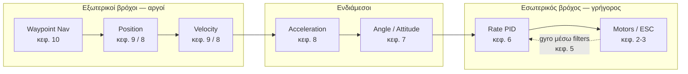
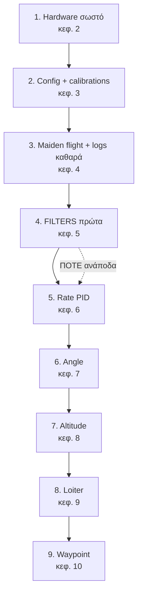

# Οδηγός Tuning ArduCopter

Πρακτικός οδηγός για σωστό **tuning** ενός multicopter με ArduPilot, στα ελληνικά με
διατήρηση της αγγλικής/επίσημης ορολογίας.

> **Έκδοση αναφοράς:** ArduCopter **4.8.0-dev**. Όλα τα ονόματα παραμέτρων, τα defaults
> και οι τιμές έχουν επαληθευτεί απευθείας από τον πηγαίο κώδικα αυτού του repository —
> όχι από μνήμη ή από τεκμηρίωση παλιότερης έκδοσης.
>
> Στην 4.7 έγινε **μεγάλη μετονομασία παραμέτρων** (και αλλαγή μονάδων από cm σε m).
> Αν πετάς 4.6 ή παλιότερα, δες το [Παράρτημα Α](A-Αντιστοίχιση-Παραμέτρων.md).

---

## Πώς να το διαβάσεις

Τα κεφάλαια είναι **κλιμακωτά**: κάθε κεφάλαιο χρησιμοποιεί μόνο έννοιες που έχουν ήδη
εξηγηθεί σε προηγούμενα. Μη τα διαβάσεις ανακατεμένα την πρώτη φορά.

| # | Κεφάλαιο | Τι μαθαίνεις |
|---|----------|--------------|
| [02](02-Hardware-Set-Up.md) | Hardware Set Up | Τι υλικό χρειάζεται και πώς συνδέεται |
| [03](03-Initial-Configuration.md) | Initial Configuration | Πρώτο στήσιμο παραμέτρων πριν πετάξεις |
| [04](04-Maiden-Test-Flight.md) | Maiden Test Flight | Πρώτο hover, κατέβασμα log, βασικοί έλεγχοι υγείας |
| [05](05-Gyro-Filter-Tuning.md) | Gyro Filter Tuning | Θόρυβος, low-pass, harmonic notch, FFT |
| [06](06-Rate-PID-Tuning.md) | Rate PID Tuning | Ο πυρήνας του tuning: P, I, D, FF, DFF |
| [07](07-Stabilisation-Mode-Tuning.md) | Stabilisation Mode Tuning | Angle controller, max acceleration, lean angle |
| [08](08-Altitude-Hold-Mode-Tuning.md) | Altitude Hold Mode Tuning | Throttle controller και κάθετος έλεγχος |
| [09](09-Loiter-Mode-Tuning.md) | Loiter Mode Tuning | Οριζόντιος έλεγχος ταχύτητας και θέσης |
| [10](10-Waypoint-Navigation-Tuning.md) | Waypoint Navigation Tuning | Κίνηση μεταξύ waypoints |
| [11](11-Tips-for-Tuning-Large-Drones.md) | Tips for Tuning Large Drones | Τι αλλάζει σε μεγάλα/βαριά drones |
| [Α](A-Αντιστοίχιση-Παραμέτρων.md) | Παράρτημα Α | Αντιστοίχιση ονομάτων 4.6 → 4.7+ |
| [00](00-Δομή-Περιεχομένων.md) | Δομή περιεχομένων | Το αρχικό table of contents |

---

## Η μεγάλη εικόνα: η αλυσίδα ελέγχου

Ο ArduCopter είναι **cascade controller**: κάθε controller δίνει στόχο (target) στον
επόμενο, πιο γρήγορο, πιο "μέσα". Το tuning γίνεται **από μέσα προς τα έξω**.

**Ο κανόνας που δεν παραβιάζεται:**

Αν κάνεις PID tuning πριν φτιάξεις τα filters, θα συντονίσεις το PID πάνω στον θόρυβο.
Αν κάνεις Loiter tuning πριν το Rate PID, θα κυνηγάς πρόβλημα που δεν είναι εκεί.

---

## Προειδοποίηση ασφάλειας

Το tuning απαιτεί πτήσεις με **μη τελειωμένο** tune. Πάντα:

- Πέτα σε ανοιχτό χώρο, χωρίς κόσμο, με ελεύθερη έξοδο διαφυγής.
- Κράτα διαθέσιμο **Stabilise** ή **AltHold** σε switch για άμεση επιστροφή σε απλό mode.
- Ξέρε πού είναι το **Emergency Motor Stop** (RC option 31) πριν απογειωθείς.
- Μην αλλάζεις πάνω από ένα πράγμα τη φορά, και κράτα σημειώσεις με το όνομα του log.
